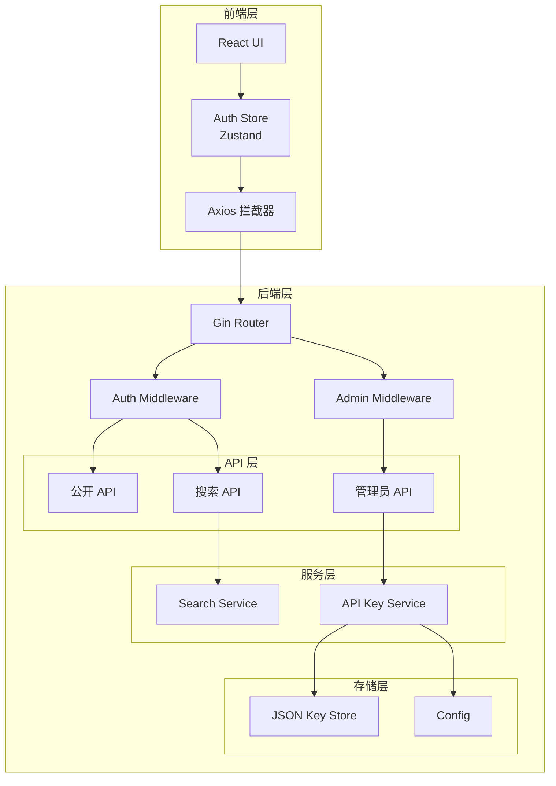
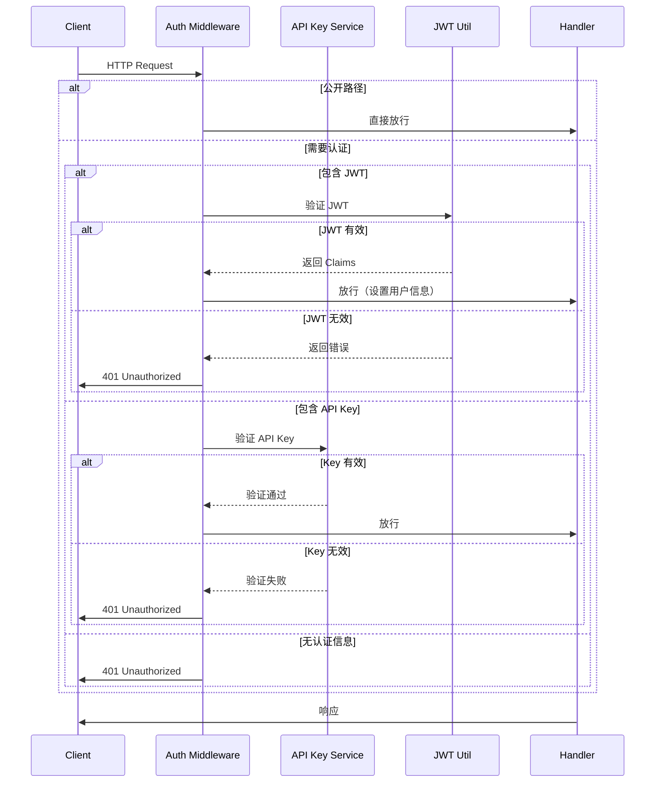

# 设计文档 - API Key 管理与认证系统

## 概述

本设计文档描述了 UniSearch 系统的 API Key 管理与双层认证机制的实现方案。系统将支持两种认证方式：

1. **API Key 认证**：面向普通用户，用于访问搜索功能
2. **JWT 认证**：面向管理员，用于访问后台管理功能

系统采用渐进式认证策略，优先检查 JWT，降级到 API Key，确保向后兼容性的同时提供灵活的访问控制。

### 设计目标

- **安全性**：使用加密安全的随机数生成器和 bcrypt 密码哈希
- **灵活性**：支持通过环境变量配置认证行为
- **简单性**：使用 JSON 文件存储，无需外部数据库
- **可扩展性**：清晰的模块划分，便于未来扩展

## 架构

### 系统架构图



### 认证流程图



## 组件与接口

### 后端组件

#### 1. 数据模型 (`backend/model/apikey.go`)

```go
package model

import "time"

// APIKey API密钥结构
type APIKey struct {
    Key         string    `json:"key"`          // 密钥，格式：sk-{40位十六进制}
    CreatedAt   time.Time `json:"created_at"`   // 创建时间
    ExpiresAt   time.Time `json:"expires_at"`   // 过期时间
    IsEnabled   bool      `json:"is_enabled"`   // 是否启用
    Description string    `json:"description"`  // 描述信息
}

// IsValid 检查密钥是否有效
func (k *APIKey) IsValid() bool {
    return k.IsEnabled && time.Now().Before(k.ExpiresAt)
}

// IsExpired 检查密钥是否已过期
func (k *APIKey) IsExpired() bool {
    return time.Now().After(k.ExpiresAt)
}
```

#### 2. 配置扩展 (`backend/config/config.go`)

在现有 `Config` 结构体中添加以下字段：

```go
// API Key 相关配置
APIKeyEnabled      bool          // 是否启用 API Key 认证
APIKeyDefaultTTL   time.Duration // API Key 默认有效期
APIKeyStorePath    string        // API Key 存储路径
AdminPasswordHash  string        // 管理员密码哈希（bcrypt）
```

环境变量映射：
- `API_KEY_ENABLED` → `APIKeyEnabled`
- `API_KEY_DEFAULT_TTL` → `APIKeyDefaultTTL`（单位：小时）
- `API_KEY_STORE_PATH` → `APIKeyStorePath`
- `ADMIN_PASSWORD_HASH` → `AdminPasswordHash`

#### 3. API Key 服务 (`backend/service/apikey_service.go`)

```go
package service

import (
    "crypto/rand"
    "encoding/hex"
    "encoding/json"
    "errors"
    "os"
    "sync"
    "time"
    "pansou/model"
)

// APIKeyService API密钥管理服务
type APIKeyService struct {
    storePath string
    keys      map[string]*model.APIKey
    mu        sync.RWMutex
}

// NewAPIKeyService 创建API密钥服务实例
func NewAPIKeyService(storePath string) (*APIKeyService, error)

// GenerateKey 生成新的API密钥
func (s *APIKeyService) GenerateKey(ttl time.Duration, description string) (*model.APIKey, error)

// ValidateKey 验证API密钥
func (s *APIKeyService) ValidateKey(key string) (bool, error)

// RevokeKey 撤销API密钥
func (s *APIKeyService) RevokeKey(key string) error

// ListKeys 列出所有API密钥
func (s *APIKeyService) ListKeys() ([]*model.APIKey, error)

// GetKey 获取指定密钥信息
func (s *APIKeyService) GetKey(key string) (*model.APIKey, error)

// load 从文件加载密钥数据
func (s *APIKeyService) load() error

// save 保存密钥数据到文件
func (s *APIKeyService) save() error
```

**核心实现要点**：

1. **密钥生成**：
   - 使用 `crypto/rand` 生成 20 字节随机数
   - 转换为 40 位十六进制字符串
   - 添加 `sk-` 前缀

2. **线程安全**：
   - 使用 `sync.RWMutex` 保护并发访问
   - 读操作使用 `RLock`，写操作使用 `Lock`

3. **持久化**：
   - JSON 格式存储
   - 每次修改立即写入文件
   - 启动时自动加载现有数据

#### 4. 认证中间件改造 (`backend/api/middleware.go`)

```go
// AuthMiddleware JWT和API Key双层认证中间件
func AuthMiddleware() gin.HandlerFunc {
    return func(c *gin.Context) {
        // 1. 检查是否启用认证
        if !config.AppConfig.AuthEnabled && !config.AppConfig.APIKeyEnabled {
            c.Next()
            return
        }

        // 2. 检查公开路径
        if isPublicPath(c.Request.URL.Path) {
            c.Next()
            return
        }

        // 3. 优先检查 JWT
        if token := extractBearerToken(c); token != "" {
            if claims, err := util.ValidateToken(token, config.AppConfig.AuthJWTSecret); err == nil {
                c.Set("username", claims.Username)
                c.Set("auth_type", "jwt")
                c.Next()
                return
            }
        }

        // 4. 降级检查 API Key
        if config.AppConfig.APIKeyEnabled {
            if apiKey := extractAPIKey(c); apiKey != "" {
                if valid, err := apiKeyService.ValidateKey(apiKey); err == nil && valid {
                    c.Set("auth_type", "apikey")
                    c.Next()
                    return
                }
            }
        }

        // 5. 认证失败
        c.JSON(401, gin.H{
            "error": "未授权：缺少有效的认证凭据",
            "code":  "AUTH_REQUIRED",
        })
        c.Abort()
    }
}

// AdminMiddleware 管理员专用中间件（仅允许JWT）
func AdminMiddleware() gin.HandlerFunc {
    return func(c *gin.Context) {
        // 1. 必须包含 JWT
        token := extractBearerToken(c)
        if token == "" {
            c.JSON(401, gin.H{
                "error": "未授权：需要管理员令牌",
                "code":  "ADMIN_TOKEN_REQUIRED",
            })
            c.Abort()
            return
        }

        // 2. 验证 JWT
        claims, err := util.ValidateToken(token, config.AppConfig.AuthJWTSecret)
        if err != nil {
            c.JSON(401, gin.H{
                "error": "未授权：令牌无效或已过期",
                "code":  "ADMIN_TOKEN_INVALID",
            })
            c.Abort()
            return
        }

        // 3. 检查管理员权限
        if !claims.IsAdmin {
            c.JSON(403, gin.H{
                "error": "禁止访问：需要管理员权限",
                "code":  "ADMIN_PERMISSION_REQUIRED",
            })
            c.Abort()
            return
        }

        c.Set("username", claims.Username)
        c.Set("is_admin", true)
        c.Next()
    }
}

// extractBearerToken 从请求头提取 Bearer Token
func extractBearerToken(c *gin.Context) string

// extractAPIKey 从请求头或查询参数提取 API Key
func extractAPIKey(c *gin.Context) string

// isPublicPath 检查是否为公开路径
func isPublicPath(path string) bool
```

#### 5. 管理员 API Handler (`backend/api/admin_handler.go`)

```go
package api

import (
    "github.com/gin-gonic/gin"
    "golang.org/x/crypto/bcrypt"
    "pansou/config"
    "pansou/util"
    "time"
)

// AdminLoginRequest 管理员登录请求
type AdminLoginRequest struct {
    Password string `json:"password" binding:"required"`
}

// AdminLoginResponse 管理员登录响应
type AdminLoginResponse struct {
    Token     string `json:"token"`
    ExpiresAt int64  `json:"expires_at"`
}

// APIKeyCreateRequest 创建API Key请求
type APIKeyCreateRequest struct {
    TTLHours    int    `json:"ttl_hours" binding:"required,min=1"`
    Description string `json:"description"`
}

// AdminLoginHandler 管理员登录
func AdminLoginHandler(c *gin.Context)

// ListAPIKeysHandler 列出所有API Keys
func ListAPIKeysHandler(c *gin.Context)

// CreateAPIKeyHandler 创建新API Key
func CreateAPIKeyHandler(c *gin.Context)

// DeleteAPIKeyHandler 删除API Key
func DeleteAPIKeyHandler(c *gin.Context)

// GetPluginsStatusHandler 获取插件状态
func GetPluginsStatusHandler(c *gin.Context)
```

**速率限制实现**：

```go
// 简单的内存速率限制器
type RateLimiter struct {
    attempts map[string][]time.Time
    mu       sync.Mutex
    maxAttempts int
    window   time.Duration
}

func (rl *RateLimiter) Allow(ip string) bool {
    rl.mu.Lock()
    defer rl.mu.Unlock()
    
    now := time.Now()
    cutoff := now.Add(-rl.window)
    
    // 清理过期记录
    attempts := rl.attempts[ip]
    valid := []time.Time{}
    for _, t := range attempts {
        if t.After(cutoff) {
            valid = append(valid, t)
        }
    }
    
    // 检查是否超限
    if len(valid) >= rl.maxAttempts {
        return false
    }
    
    // 记录本次尝试
    valid = append(valid, now)
    rl.attempts[ip] = valid
    return true
}
```

#### 6. 路由配置 (`backend/api/router.go`)

```go
// 在 SetupRouter 中添加管理员路由组
admin := api.Group("/admin")
admin.Use(AdminMiddleware()) // 应用管理员中间件
{
    admin.POST("/login", AdminLoginHandler)
    admin.GET("/keys", ListAPIKeysHandler)
    admin.POST("/keys", CreateAPIKeyHandler)
    admin.DELETE("/keys/:key", DeleteAPIKeyHandler)
    admin.GET("/plugins", GetPluginsStatusHandler)
}

// 更新 /api/health 接口
api.GET("/health", func(c *gin.Context) {
    c.JSON(200, gin.H{
        "status":       "ok",
        "auth_enabled": config.AppConfig.AuthEnabled || config.AppConfig.APIKeyEnabled,
        // ... 其他字段
    })
})
```

### 前端组件

#### 1. 认证状态管理 (`frontend/src/stores/authStore.ts`)

```typescript
import { create } from 'zustand';
import { persist } from 'zustand/middleware';

interface AuthState {
  // 状态
  token: string | null;
  apiKey: string | null;
  isAuthenticated: boolean;
  isAdmin: boolean;
  username: string | null;

  // 操作
  setToken: (token: string, username: string) => void;
  setApiKey: (apiKey: string) => void;
  logout: () => void;
  checkAuth: () => boolean;
}

export const useAuthStore = create<AuthState>()(
  persist(
    (set, get) => ({
      token: null,
      apiKey: null,
      isAuthenticated: false,
      isAdmin: false,
      username: null,

      setToken: (token, username) => {
        set({
          token,
          username,
          isAuthenticated: true,
          isAdmin: true,
          apiKey: null, // 清除 API Key
        });
      },

      setApiKey: (apiKey) => {
        set({
          apiKey,
          isAuthenticated: true,
          isAdmin: false,
          token: null, // 清除 Token
          username: null,
        });
      },

      logout: () => {
        set({
          token: null,
          apiKey: null,
          isAuthenticated: false,
          isAdmin: false,
          username: null,
        });
      },

      checkAuth: () => {
        const state = get();
        return !!(state.token || state.apiKey);
      },
    }),
    {
      name: 'auth-storage',
      partialize: (state) => ({
        token: state.token,
        apiKey: state.apiKey,
        username: state.username,
      }),
    }
  )
);
```

#### 2. API 拦截器改造 (`frontend/src/lib/api.ts`)

在现有 `ApiClient` 类中添加认证拦截器：

```typescript
private setupInterceptors(): void {
  // 请求拦截器 - 注入认证信息
  this.instance.interceptors.request.use(
    (config) => {
      const authStore = useAuthStore.getState();
      
      // 优先使用 JWT
      if (authStore.token) {
        config.headers.Authorization = `Bearer ${authStore.token}`;
      }
      // 降级使用 API Key
      else if (authStore.apiKey) {
        config.headers['X-API-Key'] = authStore.apiKey;
      }
      
      return config;
    },
    (error) => Promise.reject(error)
  );

  // 响应拦截器 - 处理 401
  this.instance.interceptors.response.use(
    (response) => response,
    (error: AxiosError) => {
      if (error.response?.status === 401) {
        // 清除认证状态
        useAuthStore.getState().logout();
        
        // 跳转到登录页（避免在登录页重复跳转）
        if (!window.location.pathname.includes('/login')) {
          window.location.href = '/login';
        }
      }
      return Promise.reject(error);
    }
  );
}
```

#### 3. 认证服务 (`frontend/src/services/authService.ts`)

```typescript
import { apiClient } from '@/lib/api';
import type { LoginResponse, VerifyResponse } from '@/types/api';

export class AuthService {
  /**
   * 管理员登录
   */
  static async adminLogin(password: string): Promise<LoginResponse> {
    const response = await apiClient.post<LoginResponse>('/admin/login', {
      password,
    });
    return response.data!;
  }

  /**
   * 验证 API Key
   */
  static async validateApiKey(apiKey: string): Promise<boolean> {
    try {
      // 尝试调用需要认证的接口
      await apiClient.get('/health', {
        headers: { 'X-API-Key': apiKey },
      });
      return true;
    } catch {
      return false;
    }
  }

  /**
   * 获取 API Keys 列表（管理员）
   */
  static async listApiKeys() {
    const response = await apiClient.get('/admin/keys');
    return response.data;
  }

  /**
   * 创建 API Key（管理员）
   */
  static async createApiKey(ttlHours: number, description: string) {
    const response = await apiClient.post('/admin/keys', {
      ttl_hours: ttlHours,
      description,
    });
    return response.data;
  }

  /**
   * 删除 API Key（管理员）
   */
  static async deleteApiKey(key: string) {
    await apiClient.delete(`/admin/keys/${key}`);
  }
}
```

#### 4. 类型定义扩展 (`frontend/src/types/api.ts`)

```typescript
// 管理员登录请求
export interface AdminLoginRequest {
  password: string;
}

// 管理员登录响应
export interface AdminLoginResponse {
  token: string;
  expires_at: number;
}

// API Key 信息
export interface APIKeyInfo {
  key: string;
  created_at: string;
  expires_at: string;
  is_enabled: boolean;
  description: string;
}

// 创建 API Key 请求
export interface CreateAPIKeyRequest {
  ttl_hours: number;
  description: string;
}
```

## 数据模型

### API Key 数据结构

```json
{
  "key": "sk-a1b2c3d4e5f6g7h8i9j0k1l2m3n4o5p6q7r8s9t0",
  "created_at": "2026-01-05T10:30:00Z",
  "expires_at": "2026-02-05T10:30:00Z",
  "is_enabled": true,
  "description": "测试用密钥"
}
```

### JWT Claims 结构

```go
type Claims struct {
    Username string `json:"username"`
    IsAdmin  bool   `json:"is_admin"`
    jwt.StandardClaims
}
```

### 存储文件格式

`api_keys.json`:
```json
[
  {
    "key": "sk-...",
    "created_at": "2026-01-05T10:30:00Z",
    "expires_at": "2026-02-05T10:30:00Z",
    "is_enabled": true,
    "description": "密钥1"
  },
  {
    "key": "sk-...",
    "created_at": "2026-01-04T15:20:00Z",
    "expires_at": "2026-01-11T15:20:00Z",
    "is_enabled": false,
    "description": "已禁用的密钥"
  }
]
```


## 用户界面设计

### 1. 登录页面 (`frontend/src/pages/Login.tsx`)

**布局结构**：

```
┌─────────────────────────────────────┐
│         UniSearch Logo              │
│                                     │
│  ┌─────────────┬─────────────┐     │
│  │   用户登录   │  管理员登录  │     │
│  └─────────────┴─────────────┘     │
│                                     │
│  [Tab 1: 用户登录]                  │
│  ┌───────────────────────────────┐ │
│  │ API Key:                      │ │
│  │ [sk-________________]         │ │
│  │                               │ │
│  │        [登录]                 │ │
│  └───────────────────────────────┘ │
│                                     │
│  [Tab 2: 管理员登录]                │
│  ┌───────────────────────────────┐ │
│  │ 密码:                         │ │
│  │ [••••••••]                    │ │
│  │                               │ │
│  │        [登录]                 │ │
│  └───────────────────────────────┘ │
└─────────────────────────────────────┘
```

**功能要求**：
- 使用 Shadcn/UI 的 Tabs 组件实现双模态切换
- API Key 输入框支持粘贴和自动格式验证
- 密码输入框支持显示/隐藏切换
- 登录按钮在输入为空时禁用
- 使用 Sonner 显示登录成功/失败提示
- 登录成功后根据角色跳转（用户→首页，管理员→后台）

**组件结构**：

```typescript
interface LoginPageProps {}

export function LoginPage() {
  const [activeTab, setActiveTab] = useState<'user' | 'admin'>('user');
  const [apiKey, setApiKey] = useState('');
  const [password, setPassword] = useState('');
  const [isLoading, setIsLoading] = useState(false);
  
  const authStore = useAuthStore();
  const navigate = useNavigate();

  const handleUserLogin = async () => {
    // 验证 API Key 格式
    // 调用 AuthService.validateApiKey
    // 成功后 authStore.setApiKey 并跳转
  };

  const handleAdminLogin = async () => {
    // 调用 AuthService.adminLogin
    // 成功后 authStore.setToken 并跳转
  };

  return (
    <div className="min-h-screen flex items-center justify-center">
      <Card className="w-full max-w-md">
        <CardHeader>
          <CardTitle>登录 UniSearch</CardTitle>
        </CardHeader>
        <CardContent>
          <Tabs value={activeTab} onValueChange={setActiveTab}>
            <TabsList className="grid w-full grid-cols-2">
              <TabsTrigger value="user">用户登录</TabsTrigger>
              <TabsTrigger value="admin">管理员登录</TabsTrigger>
            </TabsList>
            
            <TabsContent value="user">
              {/* API Key 输入表单 */}
            </TabsContent>
            
            <TabsContent value="admin">
              {/* 密码输入表单 */}
            </TabsContent>
          </Tabs>
        </CardContent>
      </Card>
    </div>
  );
}
```

### 2. 后台管理页面 (`frontend/src/pages/Admin.tsx`)

**布局结构**：

```
┌─────────────────────────────────────────────────────┐
│  [← 返回首页]              UniSearch 管理后台        │
├─────────────────────────────────────────────────────┤
│                                                     │
│  API Key 管理                    [+ 生成新 Key]     │
│  ┌───────────────────────────────────────────────┐ │
│  │ Key              │ 描述  │ 过期时间 │ 状态 │操作│ │
│  ├───────────────────────────────────────────────┤ │
│  │ sk-abc...        │ 测试  │ 2026-02  │ 启用 │[删]│ │
│  │ sk-def...        │ 生产  │ 2026-03  │ 启用 │[删]│ │
│  │ sk-ghi...        │ 过期  │ 2025-12  │ 禁用 │[删]│ │
│  └───────────────────────────────────────────────┘ │
│                                                     │
│  插件状态                                           │
│  ┌───────────────────────────────────────────────┐ │
│  │ 插件名称         │ 状态      │ 最后更新        │ │
│  ├───────────────────────────────────────────────┤ │
│  │ duoduo          │ ● 活跃    │ 2分钟前         │ │
│  │ hdr4k           │ ● 活跃    │ 5分钟前         │ │
│  │ panta           │ ○ 不活跃  │ 1小时前         │ │
│  └───────────────────────────────────────────────┘ │
└─────────────────────────────────────────────────────┘
```

**功能要求**：
- 使用 Shadcn/UI 的 Table 组件展示数据
- Key 列显示前缀和后缀，中间用省略号（如 `sk-abc...xyz`）
- 支持复制完整 Key 到剪贴板
- 过期的 Key 显示为灰色/禁用状态
- 删除操作需要二次确认（使用 AlertDialog）
- 生成新 Key 弹出对话框，选择有效期和输入描述
- 插件状态实时刷新（可选：使用轮询或 WebSocket）

**生成 Key 对话框**：

```typescript
interface CreateKeyDialogProps {
  open: boolean;
  onOpenChange: (open: boolean) => void;
  onSuccess: () => void;
}

export function CreateKeyDialog({ open, onOpenChange, onSuccess }: CreateKeyDialogProps) {
  const [ttlHours, setTtlHours] = useState(720); // 默认30天
  const [description, setDescription] = useState('');
  const [isLoading, setIsLoading] = useState(false);

  const handleCreate = async () => {
    setIsLoading(true);
    try {
      await AuthService.createApiKey(ttlHours, description);
      toast.success('API Key 创建成功');
      onSuccess();
      onOpenChange(false);
    } catch (error) {
      toast.error('创建失败：' + error.message);
    } finally {
      setIsLoading(false);
    }
  };

  return (
    <Dialog open={open} onOpenChange={onOpenChange}>
      <DialogContent>
        <DialogHeader>
          <DialogTitle>生成新 API Key</DialogTitle>
        </DialogHeader>
        <div className="space-y-4">
          <div>
            <Label>有效期（小时）</Label>
            <Select value={ttlHours.toString()} onValueChange={(v) => setTtlHours(Number(v))}>
              <SelectTrigger>
                <SelectValue />
              </SelectTrigger>
              <SelectContent>
                <SelectItem value="168">7 天</SelectItem>
                <SelectItem value="720">30 天</SelectItem>
                <SelectItem value="2160">90 天</SelectItem>
                <SelectItem value="8760">1 年</SelectItem>
              </SelectContent>
            </Select>
          </div>
          <div>
            <Label>描述（可选）</Label>
            <Input
              value={description}
              onChange={(e) => setDescription(e.target.value)}
              placeholder="例如：生产环境密钥"
            />
          </div>
        </div>
        <DialogFooter>
          <Button variant="outline" onClick={() => onOpenChange(false)}>
            取消
          </Button>
          <Button onClick={handleCreate} disabled={isLoading}>
            {isLoading ? '生成中...' : '生成'}
          </Button>
        </DialogFooter>
      </DialogContent>
    </Dialog>
  );
}
```

### 3. 导航栏增强 (`frontend/src/components/Navbar.tsx`)

在现有导航栏中添加认证相关入口：

```typescript
export function Navbar() {
  const authStore = useAuthStore();
  const navigate = useNavigate();

  const handleLogout = () => {
    authStore.logout();
    toast.success('已退出登录');
    navigate('/');
  };

  return (
    <nav className="...">
      {/* 现有导航内容 */}
      
      <div className="flex items-center gap-4">
        {authStore.isAuthenticated ? (
          <>
            {authStore.isAdmin && (
              <Button
                variant="ghost"
                onClick={() => navigate('/admin')}
              >
                后台管理
              </Button>
            )}
            {!authStore.isAdmin && (
              <Button
                variant="ghost"
                onClick={() => navigate('/api-key-settings')}
              >
                API Key 设置
              </Button>
            )}
            <Button variant="ghost" onClick={handleLogout}>
              退出登录
            </Button>
          </>
        ) : (
          <Button onClick={() => navigate('/login')}>
            登录
          </Button>
        )}
      </div>
    </nav>
  );
}
```

### 4. 路由保护 (`frontend/src/App.tsx`)

```typescript
import { Navigate } from 'react-router-dom';
import { useAuthStore } from '@/stores/authStore';

// 管理员路由保护组件
function AdminRoute({ children }: { children: React.ReactNode }) {
  const { isAdmin } = useAuthStore();
  
  if (!isAdmin) {
    return <Navigate to="/login" replace />;
  }
  
  return <>{children}</>;
}

// 路由配置
function App() {
  return (
    <Routes>
      <Route path="/" element={<Home />} />
      <Route path="/login" element={<LoginPage />} />
      <Route
        path="/admin"
        element={
          <AdminRoute>
            <AdminPage />
          </AdminRoute>
        }
      />
      {/* 其他路由 */}
    </Routes>
  );
}
```

## 错误处理

### 后端错误码

| 错误码 | HTTP 状态 | 描述 | 场景 |
|--------|----------|------|------|
| `AUTH_REQUIRED` | 401 | 缺少认证凭据 | 未提供 JWT 或 API Key |
| `AUTH_TOKEN_MISSING` | 401 | 缺少认证令牌 | JWT 为空 |
| `AUTH_TOKEN_INVALID_FORMAT` | 401 | 令牌格式错误 | JWT 格式不正确 |
| `AUTH_TOKEN_INVALID` | 401 | 令牌无效或已过期 | JWT 验证失败 |
| `APIKEY_INVALID` | 401 | API Key 无效 | Key 不存在或已禁用 |
| `APIKEY_EXPIRED` | 401 | API Key 已过期 | Key 超过有效期 |
| `ADMIN_TOKEN_REQUIRED` | 401 | 需要管理员令牌 | 访问管理接口但未提供 JWT |
| `ADMIN_TOKEN_INVALID` | 401 | 管理员令牌无效 | JWT 验证失败 |
| `ADMIN_PERMISSION_REQUIRED` | 403 | 需要管理员权限 | JWT 有效但非管理员 |
| `ADMIN_LOGIN_FAILED` | 401 | 登录失败 | 密码错误 |
| `RATE_LIMIT_EXCEEDED` | 429 | 请求过于频繁 | 超过速率限制 |
| `APIKEY_GENERATION_FAILED` | 500 | 密钥生成失败 | 随机数生成错误 |
| `APIKEY_STORAGE_ERROR` | 500 | 存储错误 | 文件读写失败 |

### 前端错误处理策略

1. **网络错误**：
   - 显示友好的错误提示
   - 提供重试按钮
   - 记录错误日志（开发环境）

2. **认证错误**：
   - 401：清除认证状态，跳转登录页
   - 403：显示权限不足提示
   - 429：显示速率限制提示，建议稍后重试

3. **业务错误**：
   - 根据错误码显示具体提示
   - 使用 Sonner Toast 显示错误信息
   - 关键操作失败时保留用户输入

### 错误处理示例

```typescript
// 后端
func AdminLoginHandler(c *gin.Context) {
    var req AdminLoginRequest
    if err := c.ShouldBindJSON(&req); err != nil {
        c.JSON(400, gin.H{
            "error": "请求参数错误",
            "code":  "INVALID_REQUEST",
        })
        return
    }

    // 速率限制检查
    if !rateLimiter.Allow(c.ClientIP()) {
        c.JSON(429, gin.H{
            "error": "请求过于频繁，请稍后再试",
            "code":  "RATE_LIMIT_EXCEEDED",
        })
        return
    }

    // 验证密码
    err := bcrypt.CompareHashAndPassword(
        []byte(config.AppConfig.AdminPasswordHash),
        []byte(req.Password),
    )
    if err != nil {
        c.JSON(401, gin.H{
            "error": "密码错误",
            "code":  "ADMIN_LOGIN_FAILED",
        })
        return
    }

    // 生成 JWT
    token, err := util.GenerateToken(
        "admin",
        true,
        config.AppConfig.AuthJWTSecret,
        config.AppConfig.AuthTokenExpiry,
    )
    if err != nil {
        c.JSON(500, gin.H{
            "error": "令牌生成失败",
            "code":  "TOKEN_GENERATION_FAILED",
        })
        return
    }

    c.JSON(200, gin.H{
        "token":      token,
        "expires_at": time.Now().Add(config.AppConfig.AuthTokenExpiry).Unix(),
    })
}

// 前端
async function handleAdminLogin() {
  try {
    setIsLoading(true);
    const response = await AuthService.adminLogin(password);
    authStore.setToken(response.token, 'admin');
    toast.success('登录成功');
    navigate('/admin');
  } catch (error: any) {
    if (error.code === 'RATE_LIMIT_EXCEEDED') {
      toast.error('请求过于频繁，请稍后再试');
    } else if (error.code === 'ADMIN_LOGIN_FAILED') {
      toast.error('密码错误，请重试');
    } else {
      toast.error('登录失败：' + error.message);
    }
  } finally {
    setIsLoading(false);
  }
}
```

## 测试策略

### 单元测试

**后端单元测试**（使用 Go testing 包）：

1. **API Key Service 测试**：
   - 测试密钥生成格式正确性
   - 测试密钥验证逻辑
   - 测试过期密钥处理
   - 测试并发读写安全性
   - 测试文件持久化

2. **中间件测试**：
   - 测试公开路径放行
   - 测试 JWT 验证流程
   - 测试 API Key 验证流程
   - 测试认证降级逻辑
   - 测试管理员权限检查

3. **Handler 测试**：
   - 测试登录成功/失败场景
   - 测试速率限制
   - 测试 API Key CRUD 操作

**前端单元测试**（使用 Vitest + React Testing Library）：

1. **Store 测试**：
   - 测试状态更新逻辑
   - 测试持久化功能
   - 测试 logout 清理

2. **组件测试**：
   - 测试登录表单交互
   - 测试路由保护
   - 测试错误提示显示

### 集成测试

1. **认证流程测试**：
   - 用户使用 API Key 访问搜索接口
   - 管理员登录并管理 API Keys
   - Token 过期后自动跳转登录

2. **端到端测试**：
   - 完整的管理员工作流（登录→创建Key→删除Key→登出）
   - 完整的用户工作流（输入Key→搜索→查看结果）

### 测试配置

**后端测试命令**：
```bash
# 运行所有测试
go test ./...

# 运行特定包测试
go test ./service -v

# 运行覆盖率测试
go test -cover ./...
```

**前端测试命令**：
```bash
# 运行所有测试
pnpm test

# 运行特定测试文件
pnpm test authStore.test.ts

# 运行覆盖率测试
pnpm test:coverage
```


## 正确性属性

*属性（Property）是一个特征或行为，应该在系统的所有有效执行中保持为真——本质上是关于系统应该做什么的形式化陈述。属性是人类可读规范和机器可验证正确性保证之间的桥梁。*

### 验收标准可测试性分析

#### 需求 1: API Key 数据模型
1.1. THE System SHALL 定义 APIKey 结构体，包含 Key、CreatedAt、ExpiresAt、IsEnabled 和 Description 字段
- 思考：这是关于数据结构定义的要求，可以通过检查结构体字段来验证
- 可测试性：yes - example

1.2. WHEN 生成 API Key 时，THE System SHALL 使用 `sk-` 前缀加 40 位十六进制字符的格式
- 思考：这是关于所有生成的 Key 都应该遵循的格式规则，可以生成随机 Key 并验证格式
- 可测试性：yes - property

1.3. THE System SHALL 支持为每个 API Key 设置有效期（ExpiresAt）
- 思考：这是功能性要求，可以通过创建 Key 并检查 ExpiresAt 字段来验证
- 可测试性：yes - example

1.4. THE System SHALL 支持启用/禁用 API Key（IsEnabled 字段）
- 思考：这是功能性要求，可以通过修改 IsEnabled 字段并验证状态来测试
- 可测试性：yes - example

1.5. THE System SHALL 允许为 API Key 添加可选的描述信息
- 思考：这是功能性要求，可以通过创建带描述的 Key 来验证
- 可测试性：yes - example

#### 需求 2: 系统配置扩展
2.1-2.4. WHEN 系统启动时，THE System SHALL 从环境变量读取配置
- 思考：这是关于配置加载的要求，可以设置环境变量并验证配置值
- 可测试性：yes - example

2.5. IF 必需的环境变量不存在，THEN THE System SHALL 报错或生成随机值并打印警告
- 思考：这是错误处理要求，可以测试缺少环境变量时的行为
- 可测试性：yes - example

#### 需求 3: API Key 生成与管理
3.1. WHEN 管理员请求生成新 Key 时，THE Key_Service SHALL 使用 crypto/rand 生成高强度随机密钥
- 思考：这是关于所有生成的 Key 都应该是随机的，可以生成多个 Key 并验证它们不重复
- 可测试性：yes - property

3.2. WHEN 验证 API Key 时，THE Key_Service SHALL 检查 Key 是否存在、已启用且未过期
- 思考：这是关于所有 Key 验证都应该遵循的规则，可以生成各种状态的 Key 并验证
- 可测试性：yes - property

3.3. WHEN 管理员撤销 Key 时，THE Key_Service SHALL 删除或禁用该 Key
- 思考：这是关于撤销操作的效果，可以撤销 Key 后验证其状态
- 可测试性：yes - property

3.4. WHEN 管理员请求 Key 列表时，THE Key_Service SHALL 返回所有 API Keys 的信息
- 思考：这是关于列表操作的完整性，可以创建多个 Key 后验证列表包含所有 Key
- 可测试性：yes - property

3.5. THE Key_Service SHALL 使用线程安全的 JSON 文件存储来持久化 Key 数据
- 思考：这是关于并发安全性的要求，可以通过并发读写测试来验证
- 可测试性：yes - property

#### 需求 4: 双层认证中间件
4.1. WHEN 请求包含有效 JWT 时，THE Auth_Middleware SHALL 解析 User claims 并放行
- 思考：这是关于所有有效 JWT 请求都应该被放行的规则
- 可测试性：yes - property

4.2. WHEN 请求不包含 JWT 但包含有效 API Key 时，THE Auth_Middleware SHALL 验证 API Key 并放行
- 思考：这是关于 API Key 认证降级的规则
- 可测试性：yes - property

4.3. WHEN 检查 API Key 时，THE Auth_Middleware SHALL 从 X-API-Key 请求头或 URL 参数 key 中读取
- 思考：这是关于 Key 提取位置的规则，可以测试两种方式都能正确提取
- 可测试性：yes - property

4.4. IF JWT 和 API Key 均无效，THEN THE Auth_Middleware SHALL 返回 401 Unauthorized
- 思考：这是错误处理规则，可以测试无效认证时的响应
- 可测试性：yes - property

4.5. THE Admin_Middleware SHALL 仅允许包含管理员权限的有效 JWT 访问
- 思考：这是关于管理员权限检查的规则
- 可测试性：yes - property

#### 需求 5: 管理员登录与认证
5.1. WHEN 管理员提交登录密码时，THE System SHALL 使用 bcrypt 与 ADMIN_PASSWORD_HASH 进行比对
- 思考：这是关于密码验证方法的要求
- 可测试性：yes - example

5.2. WHEN 密码验证成功时，THE System SHALL 颁发包含管理员权限的 JWT
- 思考：这是关于成功登录后的行为
- 可测试性：yes - example

5.3. WHEN 登录失败时，THE System SHALL 返回 401 错误
- 思考：这是关于错误处理的规则
- 可测试性：yes - example

5.4. THE System SHALL 在登录接口实现内存速率限制，防止暴力破解
- 思考：这是关于速率限制的要求，可以测试连续请求是否被限制
- 可测试性：yes - property

5.5. THE System SHALL 在 JWT 中包含管理员角色标识
- 思考：这是关于 JWT 内容的要求
- 可测试性：yes - example

#### 需求 6-12: API 接口和 UI 要求
- 思考：这些主要是关于接口存在性和 UI 行为的要求，大多数是具体的功能点
- 可测试性：大部分是 yes - example，少数 UI 交互是 no

#### 需求 13: 密码学安全要求
13.1. WHEN 生成 API Key 时，THE System SHALL 使用 crypto/rand 生成随机数
- 思考：这是关于随机性的要求，可以验证使用了正确的库
- 可测试性：yes - example

13.2. WHEN 验证管理员密码时，THE System SHALL 使用 bcrypt 进行哈希比对
- 思考：这是关于加密方法的要求
- 可测试性：yes - example

13.3-13.4. 配置安全要求
- 可测试性：yes - example

#### 需求 14: API 文档生成
- 思考：这是关于文档生成的要求，不是代码功能测试
- 可测试性：no

#### 需求 15: JSON 持久化存储
15.1. THE Key_Service SHALL 使用 JSON 文件格式存储 API Keys
- 思考：这是关于序列化的要求，最好通过 round-trip 测试
- 可测试性：yes - property

15.2. THE Key_Service SHALL 使用互斥锁确保并发读写安全
- 思考：这是关于并发安全性的要求
- 可测试性：yes - property

15.3. WHEN 系统启动时，THE Key_Service SHALL 从 API_KEY_STORE_PATH 加载现有 Keys
- 思考：这是关于加载功能的要求
- 可测试性：yes - example

15.4. WHEN Key 数据变更时，THE Key_Service SHALL 立即写入文件
- 思考：这是关于持久化时机的要求
- 可测试性：yes - property

15.5. IF 存储文件不存在，THEN THE Key_Service SHALL 创建新文件并初始化为空数组
- 思考：这是关于初始化的要求
- 可测试性：yes - example

### 属性反思与去重

经过分析，以下属性可以合并或简化：

1. **API Key 格式验证** (1.2) 和 **随机性验证** (3.1) 可以合并为一个综合属性
2. **Key 验证逻辑** (3.2) 已经很完整，无需拆分
3. **认证中间件的多个验收标准** (4.1-4.4) 可以合并为认证流程的综合属性
4. **持久化相关** (15.1, 15.4) 可以通过 round-trip 属性统一验证

### 核心正确性属性

#### 属性 1: API Key 格式一致性
*对于任意*生成的 API Key，其格式必须为 `sk-` 前缀加 40 位十六进制字符，且每次生成的 Key 都应该是唯一的（通过加密安全随机数生成器保证）。

**验证需求**: 1.2, 3.1

#### 属性 2: API Key 验证完整性
*对于任意* API Key，验证过程必须检查三个条件：Key 存在于存储中、IsEnabled 为 true、且当前时间在 ExpiresAt 之前。只有三个条件都满足时验证才通过。

**验证需求**: 3.2

#### 属性 3: Key 撤销幂等性
*对于任意* API Key，多次撤销操作应该产生相同的结果（Key 被禁用或删除），且不会产生错误。

**验证需求**: 3.3

#### 属性 4: Key 列表完整性
*对于任意*时刻，ListKeys 操作返回的 Key 列表应该包含所有已创建且未被删除的 Key，且列表中不应包含重复项。

**验证需求**: 3.4

#### 属性 5: 认证降级正确性
*对于任意*请求，认证中间件应该按照以下优先级处理：(1) 公开路径直接放行，(2) 有效 JWT 则放行，(3) 有效 API Key 则放行，(4) 否则返回 401。这个顺序对所有请求都应该一致。

**验证需求**: 4.1, 4.2, 4.4

#### 属性 6: API Key 提取位置等价性
*对于任意* API Key，无论它是通过 `X-API-Key` 请求头还是 URL 参数 `key` 传递，认证结果应该是相同的。

**验证需求**: 4.3

#### 属性 7: 管理员权限隔离性
*对于任意*管理员接口请求，只有包含 `IsAdmin=true` 的有效 JWT 才能访问，API Key 认证不应该被接受。

**验证需求**: 4.5

#### 属性 8: 速率限制有效性
*对于任意* IP 地址，在时间窗口内的登录尝试次数超过阈值后，后续请求应该被拒绝并返回 429 状态码，直到时间窗口重置。

**验证需求**: 5.4

#### 属性 9: 持久化 Round-Trip 一致性
*对于任意* API Key 集合，将其保存到 JSON 文件后再加载回来，应该得到等价的 Key 集合（所有字段值相同）。

**验证需求**: 15.1, 15.4

#### 属性 10: 并发读写安全性
*对于任意*并发的读写操作序列，Key Service 应该保证数据一致性，不会出现数据竞争、丢失更新或读取到不完整的数据。

**验证需求**: 3.5, 15.2

#### 属性 11: 认证状态持久化一致性
*对于任意*认证状态（token 或 apiKey），在 authStore 中设置后刷新页面，应该能够从 localStorage 恢复相同的认证状态。

**验证需求**: 8.3

#### 属性 12: 401 响应自动登出
*对于任意* API 请求，如果收到 401 响应，系统应该自动清除认证状态并跳转到登录页面（除非已经在登录页面）。

**验证需求**: 9.4

