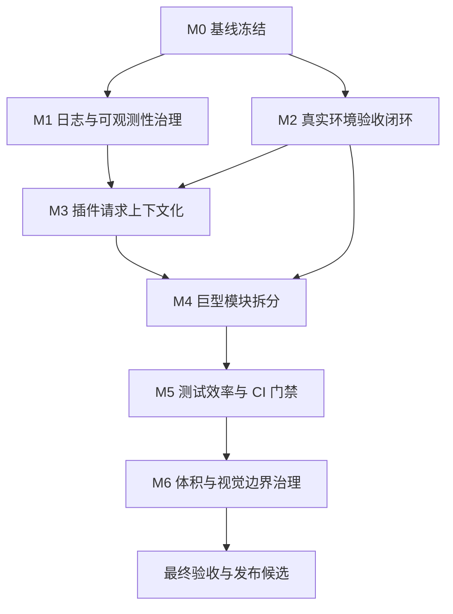

# UniSearch 二期优化开发计划

> **给后续执行者：** 建议使用 `superpowers:subagent-driven-development` 分任务实施，或使用 `superpowers:executing-plans` 在当前会话中按阶段执行。所有步骤使用复选框跟踪，每完成一个阶段必须运行对应本地验证，并更新 `.Codex/operations-log.md` 与 `.Codex/verification-report.md`。

**目标：** 基于 `docs/2026-06-07-next-optimization-roadmap.md`，分阶段完成 UniSearch 二期优化，使项目从“本地质量脚本绿色”推进到“生产可观测、真实环境可验收、插件架构更可维护、测试反馈更快”的状态。

**架构：** 先建立可观测性和真实环境验收护栏，再改造插件请求上下文和拆分巨型模块，最后收敛测试效率、CI 门禁、前端体积和视觉边界。所有高风险变更都保持小步提交，并以本地验证结果作为阶段退出条件。

**技术栈：** Go 1.24、Gin、GORM、Redis、MySQL、React 18、React Router 7、Vite 6、TypeScript、Zustand、Vitest、Playwright、Docker、GitHub Actions。

---

## 1. 计划来源与当前基线

**计划来源：**

- `docs/2026-06-07-next-optimization-roadmap.md`
- `.Codex/context-summary-二期优化方向分析.md`
- `.Codex/verification-report.md`

**当前已通过验证：**

- `scripts/tests/backend-race.sh`：通过。
- `scripts/tests/frontend-focused.sh`：通过，8 个测试文件、72 个测试通过。
- `scripts/tests/local-quality.sh`：通过。
- 前端全量 Vitest：87 个测试文件、378 个测试通过，耗时 85.20 秒。
- 前端生产构建：主入口 gzip 126.12 KB，CSS gzip 39.43 KB，`Admin` chunk gzip 55.31 KB。

**当前主要风险：**

- 后端日志散落且存在重复日志、敏感字段输出和未使用 JWT 调试中间件。
- 插件执行当前靠按插件锁隔离请求态，`BaseAsyncPlugin` 仍保留全局状态和 setter。
- `backend/api/admin_handler.go`、`frontend/src/index.css`、`backend/plugin/weibo/weibo.go` 等文件过大。
- 未发现 Playwright E2E 配置；Docker、Redis、MySQL 真实环境验证尚未成为固定入口。
- 前端全量测试通过但慢测集中在后台管理和热门页。
- 产品视觉原则与现有渐变、玻璃、强动效实现之间仍需明确边界。

## 2. 开发原则

- **先护栏后重构**：没有 E2E、Docker 和真实 Redis/MySQL 验证前，不推进大面积插件或 UI 重构。
- **先测试后实现**：每个行为变更必须先补失败测试或回归测试。
- **不替换核心栈**：本轮不替换 Gin、GORM、React、Vite、Zustand、Vitest。
- **兼容迁移**：插件接口迁移先保留适配层，不一次性改完全部插件。
- **证据驱动**：日志、测试耗时、构建体积、E2E 结果都要记录到 `.Codex/operations-log.md`。
- **小步提交**：每个任务独立可验证，提交信息使用中文 Conventional Commit 风格。

## 3. 文件责任图

### 后端可观测性

- `backend/api/router.go`：路由初始化、Gin 中间件挂载。
- `backend/api/middleware.go`：CORS、访问日志、JWT、管理员和搜索鉴权中间件。
- `backend/api/middleware/jwt_auth.go`：当前未被路由引用的 JWT 调试中间件，二期应删除或合并。
- `backend/util/logger/`：建议新增，统一结构化日志、脱敏和日志级别。
- `backend/service/search_metrics.go`：搜索链路事件和缓存指标入口。
- `backend/plugin/http_helpers.go`：插件公共 HTTP 日志入口。

### 真实环境验收

- `frontend/playwright.config.ts`：建议新增，定义 E2E 运行环境。
- `frontend/e2e/`：建议新增，存放首页搜索、热门榜单、登录恢复、资源详情和后台插件管理 E2E。
- `scripts/tests/release-candidate.sh`：建议新增，串联完整质量脚本、E2E、Docker 和真实缓存/数据库验证。
- `scripts/tests/docker-smoke.sh`：建议新增，构建镜像并验证 `unisearch` 与 `unisearch-migrate`。
- `scripts/tests/integration-env.sh`：建议新增，启动临时 MySQL/Redis 并运行迁移和缓存验证。
- `docker-compose.yml`：复用或扩展临时依赖服务配置。

### 插件请求上下文

- `backend/plugin/plugin.go`：定义新插件上下文接口和兼容适配入口。
- `backend/plugin/baseasyncplugin.go`：移除核心路径中的请求态 setter 依赖，封装运行时状态。
- `backend/service/search_executor.go`：将执行器改为传入请求上下文。
- `backend/plugin/testutil/contract.go`：扩展插件契约测试。
- `backend/plugin/*/*_test.go`：代表插件补充并发和契约测试。

### 巨型模块拆分

- `backend/api/admin_handler.go`：拆分为 API Key、系统信息、插件测试、自定义插件 CRUD、批量操作等文件。
- `backend/service/plugin_admin_service.go`：建议新增，承接插件管理业务逻辑。
- `frontend/src/index.css`：拆分为变量、基础样式、表面样式、动画和页面级样式。
- `frontend/src/components/trending/HotHeroCarousel.tsx`：确认无页面引用后删除或恢复真实入口。
- `frontend/src/components/trending/HotHighlightGrid.tsx`：确认无页面引用后删除或恢复真实入口。

### 测试效率与 CI

- `frontend/vite.config.ts`：收敛全局测试超时和测试配置。
- `frontend/src/components/admin/__tests__/`：拆分慢测、抽取夹具。
- `.github/workflows/ci.yml`：补充 race 和构建体积门禁。
- `scripts/tests/frontend-focused.sh`：继续维护前端高风险聚焦测试集。
- `scripts/tests/backend-race.sh`：扩展 race 覆盖包。

### 前端体积与视觉边界

- `frontend/vite.config.ts`：构建体积归因和 chunk 预算。
- `frontend/src/index.css`：CSS 体积治理。
- `frontend/src/lib/brandTheme.ts`：品牌令牌和视觉例外记录。
- `frontend/src/components/ui/glass-surface*.ts`：玻璃表面变体收敛。
- `PRODUCT.md`：记录品牌渐变、玻璃表面和动效的允许场景。

## 4. 里程碑计划

| 里程碑 | 建议周期 | 目标 | 退出条件 |
| --- | --- | --- | --- |
| M0 基线冻结 | 0.5 天 | 记录当前测试、构建、日志和体积基线 | `.Codex/operations-log.md` 记录完整基线 |
| M1 日志与可观测性治理 | 2 天 | 统一日志、脱敏、请求 ID、消除重复日志 | 后端测试和 race 通过，日志不泄露敏感字段 |
| M2 真实环境验收闭环 | 2 到 3 天 | 建立 Playwright、Docker、Redis/MySQL 验证入口 | E2E、Docker smoke、集成环境验证可本地运行 |
| M3 插件请求上下文化 | 3 到 4 天 | 将代表插件迁移到请求上下文接口 | 代表插件并发测试和 race 通过 |
| M4 巨型模块拆分 | 3 到 5 天 | 拆分后台 handler、CSS 和过期组件 | 聚焦测试与生产构建通过，文件职责更清晰 |
| M5 测试效率与 CI 门禁 | 2 天 | 降低慢测耗时，CI 增加 race 和体积门禁 | 前端聚焦测试耗时下降，CI 配置覆盖关键门禁 |
| M6 体积与视觉边界治理 | 2 到 3 天 | 控制入口体积和视觉例外 | 主入口 gzip 小于 130 KB，视觉规则写入文档 |

## 5. 任务依赖图



## 6. 阶段详细计划

### M0：基线冻结

**目标：** 在任何实现前记录当前状态，避免后续无法判断优化是否有效。

**任务拆分：**

- [x] M0.1 记录当前 Git 状态和已存在未提交改动。
- [x] M0.2 运行完整本地质量脚本。
- [x] M0.3 记录前端慢测清单和构建体积。
- [x] M0.4 记录当前日志风险点。

**执行步骤：**

- [x] 运行 Git 状态检查。

```bash
git status --short --branch
```

预期：输出当前分支和未提交文件；不得回滚用户既有改动。

- [x] 运行完整质量脚本。

```bash
scripts/tests/local-quality.sh
```

预期：后端测试、后端 race、后端构建、前端类型检查、前端 lint、前端聚焦测试、前端全量测试、前端生产构建全部通过。

- [x] 记录慢测与构建体积。

```bash
cd frontend
./node_modules/.bin/vitest run --reporter=verbose
./node_modules/.bin/vite build
```

预期：记录耗时超过 3 秒的测试文件和生产构建 gzip 体积。

- [x] 搜索日志风险点。

```bash
rg -n "log\\.Printf|fmt\\.Printf|Authorization|Token|API Key|cookie|Search error|DEBUG" backend frontend/src
```

预期：形成日志风险清单，记录到 `.Codex/operations-log.md`。

**交付物：**

- `.Codex/operations-log.md` 中新增 M0 基线记录。
- 慢测清单、构建体积、日志风险清单。

### M1：日志与可观测性治理

**目标：** 统一后端日志入口，默认生产日志脱敏，避免重复 Gin 访问日志。

**任务拆分：**

- [x] M1.1 为日志脱敏工具写测试。
- [x] M1.2 新增统一 logger 工具。
- [x] M1.3 改造 Gin router，去掉重复日志。
- [x] M1.4 删除或合并未使用 JWT 调试中间件。
- [x] M1.5 将搜索事件和插件日志接入统一 logger。

**关键文件：**

- 新增：`backend/util/logger/logger.go`
- 新增：`backend/util/logger/logger_test.go`
- 修改：`backend/api/router.go`
- 修改：`backend/api/middleware.go`
- 修改或删除：`backend/api/middleware/jwt_auth.go`
- 修改：`backend/service/search_metrics.go`
- 修改：`backend/plugin/http_helpers.go`

**执行步骤：**

- [x] 写日志脱敏测试。

建议覆盖：

- `Authorization: Bearer abcdef...` 输出为 `Authorization: Bearer abc***`。
- API Key 只保留前 4 位和后 4 位。
- Cookie、Redis 密码、TMDB token 直接输出 `<redacted>`。
- 普通关键词保留，但长度超过 80 字符时截断。

运行：

```bash
cd backend
go test ./util/logger -run TestRedactFields -count=1
```

预期：新增测试先失败，因为 logger 工具尚未实现。

- [x] 实现 `backend/util/logger`。

建议接口：

```go
package logger

type Level string

const (
	LevelDebug Level = "debug"
	LevelInfo  Level = "info"
	LevelWarn  Level = "warn"
	LevelError Level = "error"
)

type Field struct {
	Key   string
	Value interface{}
}

func Redact(key string, value interface{}) interface{}
func Info(event string, fields ...Field)
func Warn(event string, fields ...Field)
func Error(event string, fields ...Field)
func Debug(enabled bool, event string, fields ...Field)
```

运行：

```bash
cd backend
go test ./util/logger -count=1
```

预期：logger 测试通过。

- [x] 改造路由初始化。

建议方向：

- `gin.Default()` 改为 `gin.New()`。
- 显式挂载 `gin.Recovery()` 或自定义 recovery。
- 保留一个统一访问日志中间件。

验证：

```bash
cd backend
go test ./api -run 'Test.*Router|Test.*Middleware|Test.*Auth' -count=1
```

预期：API 路由和中间件测试通过。

- [x] 合并或删除 `backend/api/middleware/jwt_auth.go`。

验收方式：

```bash
rg -n "JWTAuth\\(|middleware\\.JWTAuth|ExtractBearerToken" backend
```

预期：如果删除，搜索不到未引用符号；如果保留，必须有路由引用和测试覆盖，且不输出 token/header。

- [x] 改造搜索和插件日志。

建议将 `search_metrics.go` 的 `logSearchEvent` 改为统一 logger，插件 debug 日志使用配置开关控制。

验证：

```bash
cd backend
go test ./service ./plugin ./api -count=1
go test -race ./service ./util/cache -count=1
```

**退出标准：**

- 后端测试和 race 通过。
- 默认日志不输出完整 token、Authorization header、API Key、Cookie、TMDB token、Redis 密码。
- 单次请求不出现 Gin 默认日志与自定义访问日志重复输出。

### M2：真实环境验收闭环

**目标：** 建立发布候选级别的真实环境验证入口。

**任务拆分：**

- [x] M2.1 新增 Playwright 配置。
- [x] M2.2 编写公共首页搜索 E2E。
- [x] M2.3 编写热门榜单跳搜索 E2E。
- [x] M2.4 编写登录后恢复搜索 E2E。
- [x] M2.5 编写后台插件管理 E2E。
- [x] M2.6 新增 Docker smoke 脚本。
- [x] M2.7 新增 Redis/MySQL 临时集成验证脚本。
- [x] M2.8 新增发布候选验证脚本。

**关键文件：**

- 新增：`frontend/playwright.config.ts`
- 新增：`frontend/e2e/home-search.spec.ts`
- 新增：`frontend/e2e/trending-search.spec.ts`
- 新增：`frontend/e2e/auth-resume-search.spec.ts`
- 新增：`frontend/e2e/admin-plugin.spec.ts`
- 新增：`scripts/tests/docker-smoke.sh`
- 新增：`scripts/tests/integration-env.sh`
- 新增：`scripts/tests/release-candidate.sh`
- 修改：`frontend/package.json`
- 修改：`README.md`

**执行步骤：**

- [x] 安装并配置 Playwright。

```bash
cd frontend
pnpm add -D @playwright/test
pnpm exec playwright install chromium
```

预期：`frontend/package.json` 新增 Playwright devDependency。

- [x] 新增 Playwright 配置。

建议配置：

```ts
import { defineConfig, devices } from "@playwright/test";

export default defineConfig({
  testDir: "./e2e",
  timeout: 30_000,
  expect: { timeout: 5_000 },
  use: {
    baseURL: "http://127.0.0.1:5173",
    trace: "retain-on-failure",
    screenshot: "only-on-failure",
  },
  projects: [
    { name: "chromium", use: { ...devices["Desktop Chrome"] } },
    { name: "mobile", use: { ...devices["Pixel 7"] } },
  ],
  webServer: {
    command: "pnpm dev --host 127.0.0.1",
    url: "http://127.0.0.1:5173",
    reuseExistingServer: true,
    timeout: 60_000,
  },
});
```

- [x] 编写首页搜索 E2E。

核心断言：

- 首页可输入关键词。
- 提交搜索后进入 `/search`。
- 匿名场景跳转登录时保留搜索意图。

运行：

```bash
cd frontend
pnpm exec playwright test e2e/home-search.spec.ts
```

- [x] 编写 Docker smoke 脚本。

脚本应验证：

- 镜像可以构建。
- `/app/backend/unisearch` 存在。
- `/app/backend/unisearch-migrate -help` 可执行。

运行：

```bash
scripts/tests/docker-smoke.sh
```

本轮验证：脚本入口已新增统一 Docker 守护进程预检；当前本机 Docker/OrbStack 守护进程未启动，命令以“Docker 守护进程不可用，请先启动 Docker Desktop 或 OrbStack 后重试”停止，待本地 Docker 启动后复跑容器级验收。

- [x] 编写 Redis/MySQL 临时集成验证脚本。

运行：

```bash
scripts/tests/integration-env.sh
```

本轮验证：脚本已能在 Docker 不可用时通过统一预检停止，未创建临时容器；待本地 Docker 启动后复跑迁移级验收。

- [x] 编写发布候选脚本。

建议顺序：

```bash
scripts/tests/local-quality.sh
scripts/tests/docker-smoke.sh
scripts/tests/integration-env.sh
cd frontend && pnpm exec playwright test
```

本轮验证：`scripts/tests/release-candidate.sh` 已串联完整质量检查并运行到 Docker smoke 阶段；`scripts/tests/local-quality.sh` 完整通过，随后因当前 Docker 守护进程不可用而停止。

**退出标准：**

- Playwright 至少覆盖 4 条核心路径。
- Docker smoke 已具备本地运行入口和守护进程预检；当前机器 Docker 未启动，容器构建验收待复跑。
- 发布候选脚本可以串联完整验证入口；当前机器 Docker 未启动，完整发布候选闭环待复跑。
- README 增加发布候选验证说明。

**本轮验证状态（2026-06-07）：**

- `cd frontend && pnpm exec playwright test`：通过，桌面和移动端共 8 条 E2E 通过。
- `scripts/tests/release-candidate.sh`：本地质量检查通过，随后在 Docker smoke 预检阶段停止，原因是 Docker/OrbStack 守护进程未启动。
- `frontend/vite.config.ts` 已排除 `e2e/**`、`playwright-report/**` 和 `test-results/**`，避免 Vitest 全量单元测试误收 Playwright E2E 文件。

### M3：插件请求上下文化

**目标：** 将插件执行从共享实例请求态迁移到独立请求上下文，降低锁依赖。

**任务拆分：**

- [ ] M3.1 新增插件请求上下文类型和兼容接口。
- [ ] M3.2 为执行器写上下文并发失败测试。
- [ ] M3.3 改造执行器传入上下文。
- [ ] M3.4 封装插件运行时状态。
- [ ] M3.5 迁移 3 个代表插件。
- [ ] M3.6 扩展插件契约测试。

**关键文件：**

- 修改：`backend/plugin/plugin.go`
- 修改：`backend/plugin/baseasyncplugin.go`
- 修改：`backend/service/search_executor.go`
- 修改：`backend/service/search_executor_test.go`
- 修改：`backend/plugin/testutil/contract.go`
- 修改：`backend/plugin/pan666/pan666.go`
- 修改：`backend/plugin/huban/huban.go`
- 修改：`backend/plugin/javdb/javdb.go`

**执行步骤：**

- [ ] 新增上下文类型。

建议接口：

```go
type PluginSearchContext struct {
	RequestID    string
	Keyword      string
	MainCacheKey string
	Ext          map[string]interface{}
	StartedAt    time.Time
}

type ContextSearchPlugin interface {
	AsyncSearchPlugin
	SearchWithContext(ctx context.Context, req PluginSearchContext) ([]model.SearchResult, error)
}
```

- [ ] 写并发失败测试。

测试目标：

- 同一个插件实例同时执行关键词 A 和 B。
- 插件内部读取到的 `Keyword`、`MainCacheKey` 必须与本次请求一致。
- 不依赖 `SetMainCacheKey` 和 `SetCurrentKeyword`。

运行：

```bash
cd backend
go test ./service -run TestPluginSearchExecutorUsesRequestContext -count=1
```

预期：测试先失败。

- [ ] 改造执行器。

建议行为：

- 如果插件实现 `ContextSearchPlugin`，优先调用 `SearchWithContext`。
- 否则走旧接口并保留按插件锁。
- 旧接口路径加日志标记，便于后续迁移统计。

验证：

```bash
cd backend
go test ./service -run 'TestPluginSearchExecutor' -count=1
go test -race ./service -run 'TestPluginSearchExecutor' -count=1
```

- [ ] 迁移代表插件。

试点选择：

- `pan666`：轻量 HTML/链接解析插件。
- `huban`：有测试覆盖的插件。
- `javdb`：复杂详情页插件，验证上下文和日志治理。

验证：

```bash
cd backend
go test ./plugin/pan666 ./plugin/huban ./plugin/javdb ./service -count=1
go test -race ./service ./plugin/pan666 ./plugin/huban ./plugin/javdb -count=1
```

**退出标准：**

- 代表插件使用上下文接口。
- 未迁移插件仍可通过兼容路径工作。
- race 测试不报告请求态竞争。

### M4：巨型模块与死代码治理

**目标：** 减少大文件维护成本，清理无真实入口的组件。

**任务拆分：**

- [ ] M4.1 拆分 `backend/api/admin_handler.go`。
- [ ] M4.2 抽取插件管理 service。
- [ ] M4.3 拆分 `frontend/src/index.css`。
- [ ] M4.4 审查并处理 `HotHeroCarousel` 与 `HotHighlightGrid`。
- [ ] M4.5 拆分 3 个大插件。

**关键文件：**

- 修改：`backend/api/admin_handler.go`
- 新增：`backend/api/admin_apikey_handler.go`
- 新增：`backend/api/admin_system_handler.go`
- 新增：`backend/api/admin_plugin_handler.go`
- 新增：`backend/api/admin_plugin_batch_handler.go`
- 新增：`backend/service/plugin_admin_service.go`
- 修改：`backend/api/router_admin.go`
- 修改：`frontend/src/index.css`
- 新增：`frontend/src/styles/base.css`
- 新增：`frontend/src/styles/surfaces.css`
- 新增：`frontend/src/styles/animations.css`
- 新增：`frontend/src/styles/pages.css`

**执行步骤：**

- [ ] 拆分后台 handler 前先跑 API 测试。

```bash
cd backend
go test ./api -count=1
```

- [ ] 将 API Key handler 移到独立文件。

迁移函数：

- `ListAPIKeysHandler`
- `CreateAPIKeyHandler`
- `DeleteAPIKeyHandler`
- `UpdateAPIKeyHandler`
- `BatchExtendAPIKeysHandler`
- `BatchCreateAPIKeysHandler`
- `BatchDeleteAPIKeysHandler`

验证：

```bash
cd backend
go test ./api -run 'Test.*APIKey|Test.*Admin' -count=1
```

- [ ] 将插件管理逻辑移到独立 handler 和 service。

迁移函数：

- `TestPluginHandler`
- `TestURLHandler`
- `CreatePluginHandler`
- `DeletePluginHandler`
- `UpdatePluginHandler`
- `SetPluginStatusHandler`
- `BatchSetPluginStatusHandler`
- `BatchDeletePluginsHandler`

验证：

```bash
cd backend
go test ./api -run 'Test.*Plugin' -count=1
```

- [ ] 拆分 CSS。

建议入口：

```css
@import "./styles/base.css";
@import "./styles/surfaces.css";
@import "./styles/animations.css";
@import "./styles/pages.css";
```

验证：

```bash
cd frontend
./node_modules/.bin/vite build
./node_modules/.bin/vitest run src/pages/__tests__/Home.test.tsx src/pages/__tests__/HotPage.test.tsx
```

- [ ] 审查只被测试引用的组件。

```bash
rg -n "HotHeroCarousel|HotHighlightGrid" frontend/src
```

决策：

- 若无页面入口，删除组件和对应测试。
- 若后续需要恢复入口，在 `HotPage` 中重新挂载并补充页面测试。

**退出标准：**

- `admin_handler.go` 明显瘦身，单文件低于 800 行。
- CSS 拆分后生产构建通过。
- 无真实入口组件不再保留孤立测试。

### M5：测试效率与 CI 门禁

**目标：** 降低慢测反馈成本，并让 CI 与本地质量门禁一致。

**任务拆分：**

- [ ] M5.1 生成慢测基线。
- [ ] M5.2 拆分管理页慢测。
- [ ] M5.3 抽取管理页测试夹具工厂。
- [ ] M5.4 收敛全局 Vitest 超时。
- [ ] M5.5 CI 增加后端 race。
- [ ] M5.6 CI 增加构建体积检查。

**关键文件：**

- 修改：`frontend/vite.config.ts`
- 修改：`frontend/src/components/admin/__tests__/**`
- 新增：`frontend/src/components/admin/__tests__/adminTestFixtures.ts`
- 修改：`.github/workflows/ci.yml`
- 新增：`scripts/tests/frontend-size-budget.mjs`

**执行步骤：**

- [ ] 记录慢测基线。

```bash
cd frontend
./node_modules/.bin/vitest run --reporter=verbose
```

记录超过 3 秒的测试文件和用例。

- [ ] 抽取测试夹具。

建议 `adminTestFixtures.ts` 提供：

- `createPluginFixture`
- `createChannelFixture`
- `renderPluginManagementView`
- `renderChannelManagementView`
- `mockAdminWorkspaceApi`

验证：

```bash
cd frontend
./node_modules/.bin/vitest run src/components/admin/__tests__/PluginManagementView.test.tsx src/components/admin/__tests__/ChannelManagementView.test.tsx
```

- [ ] 增加体积预算脚本。

预算建议：

- 主入口 gzip：130 KB 上限。
- CSS gzip：45 KB 警戒线。
- `Admin` chunk gzip：60 KB 警戒线。

运行：

```bash
cd frontend
./node_modules/.bin/vite build
node ../scripts/tests/frontend-size-budget.mjs
```

- [ ] 更新 CI。

后端 job 增加：

```bash
go test -race ./service ./util/cache -count=1
```

前端 job 增加：

```bash
node ../scripts/tests/frontend-size-budget.mjs
```

**退出标准：**

- 前端聚焦测试总耗时低于当前基线。
- 全局 `testTimeout` 不再承担常规慢测兜底。
- CI 覆盖 race 和体积预算。

### M6：体积与视觉边界治理

**目标：** 控制前端入口体积，并明确品牌渐变、玻璃和动效例外规则。

**任务拆分：**

- [ ] M6.1 做构建体积归因。
- [ ] M6.2 延后加载非首屏动效。
- [ ] M6.3 收敛玻璃和渐变令牌。
- [ ] M6.4 更新 `PRODUCT.md` 视觉例外规则。
- [ ] M6.5 增加公共页视觉冒烟验证。

**关键文件：**

- 修改：`frontend/vite.config.ts`
- 修改：`frontend/src/routes/AppRoutes.tsx`
- 修改：`frontend/src/index.css`
- 修改：`frontend/src/lib/brandTheme.ts`
- 修改：`frontend/src/components/ui/glass-surface-variants.ts`
- 修改：`PRODUCT.md`
- 新增：`frontend/e2e/visual-smoke.spec.ts`

**执行步骤：**

- [ ] 记录构建体积。

```bash
cd frontend
./node_modules/.bin/vite build
```

记录 `index`、`motion-vendor`、`Admin`、CSS gzip。

- [ ] 延后加载首页非关键动效。

候选：

- `CinematicFooter`
- `AnimatedGridPattern`
- `CoolMode`
- 仅装饰用途的 motion 组件

验证：

```bash
cd frontend
./node_modules/.bin/vitest run src/routes/__tests__/AppRoutes.test.tsx src/pages/__tests__/Home.test.tsx
./node_modules/.bin/vite build
```

- [ ] 更新视觉例外规则。

`PRODUCT.md` 需明确：

- 首页品牌标题允许保留蓝青渐变。
- 核心能力图标允许使用小面积渐变。
- 大面积背景、卡片主体、主要按钮默认不使用渐变。
- 玻璃效果只允许用于弹窗、浮层和轻量表面，不作为主视觉。

- [ ] 增加视觉冒烟 E2E。

覆盖视口：

- 390px 移动端：首页、搜索页、热门页。
- 1280px 桌面端：首页、搜索页、后台登录页。

运行：

```bash
cd frontend
pnpm exec playwright test e2e/visual-smoke.spec.ts
```

**退出标准：**

- 主入口 gzip 低于 130 KB，最好接近或低于 120 KB。
- CSS gzip 有下降数据或明确保留原因。
- 视觉例外写入 `PRODUCT.md`，避免后续设计方向反复。

## 7. 并行策略

### 可并行

- M1 日志治理与 M2 E2E/Docker 验证可并行。
- M5 测试效率中的夹具抽取可与 M4 后台 handler 拆分并行，但合并前必须跑完整前端聚焦测试。
- M6 体积归因可在 M4 CSS 拆分前先做基线记录。

### 不建议并行

- M3 插件上下文化不要在 M2 验证护栏未建立前大面积推进。
- M4 CSS 拆分不要和 M6 视觉策略调整混在一个提交。
- CI 门禁调整不要和测试重写混在一个提交，避免失败原因难以定位。

## 8. 提交策略

建议分支：

```bash
git switch -c codex/next-optimization-development
```

建议提交粒度：

- `docs: 新增二期优化开发计划`
- `refactor: 统一后端日志与脱敏入口`
- `test: 增加发布候选真实环境验证`
- `refactor: 引入插件请求上下文`
- `refactor: 拆分后台管理处理器`
- `test: 优化后台管理慢测夹具`
- `ci: 增加 race 与前端体积门禁`
- `perf: 收敛前端入口体积和视觉令牌`

提交前检查：

```bash
git diff --stat
scripts/tests/local-quality.sh
```

## 9. 最终验收计划

最终验收必须运行：

```bash
scripts/tests/local-quality.sh
```

```bash
cd backend
go test -race ./service ./plugin ./util/cache -count=1
```

```bash
scripts/tests/docker-smoke.sh
scripts/tests/integration-env.sh
```

```bash
cd frontend
pnpm exec playwright test
```

最终验收必须记录：

- 前端全量测试耗时。
- 前端聚焦测试耗时。
- 主入口、CSS、`Admin`、`motion-vendor` gzip 体积。
- E2E 通过路径清单。
- Docker 镜像验证结果。
- Redis/MySQL 临时环境验证结果。

## 10. 风险与回滚计划

| 风险 | 影响 | 预防措施 | 回滚方式 |
| --- | --- | --- | --- |
| 统一日志后缺少排障信息 | 线上定位变慢 | 保留 debug 级别字段，默认关闭但可开关启用 | 回退日志中间件改动，保留脱敏函数 |
| 插件上下文迁移影响搜索源 | 部分插件不可用 | 先保留兼容接口，只迁移代表插件 | 回退代表插件到旧接口，保留按插件锁 |
| E2E 不稳定 | 发布候选验证抖动 | 首期只纳入发布候选脚本，不进入普通 PR 强制门禁 | 暂时从发布脚本移除不稳定用例 |
| CSS 拆分导致视觉漂移 | 公共页体验回退 | 先补视觉冒烟，再拆分 CSS | 回退 CSS 拆分提交 |
| 慢测拆分弱化业务断言 | 漏掉集成缺陷 | 保留少量完整用户路径测试 | 恢复原完整路径测试 |
| 体积预算过严 | CI 频繁失败 | 先警告后失败，记录两周基线 | 放宽预算并保留体积报告 |

## 11. 交付物清单

- 统一日志与脱敏工具。
- Playwright E2E 配置和核心用户流用例。
- Docker smoke 和 Redis/MySQL 集成验证脚本。
- 插件请求上下文接口与代表插件迁移。
- 拆分后的后台管理 handler 和插件管理 service。
- 拆分后的前端 CSS 结构。
- 慢测夹具和体积预算脚本。
- 更新后的 CI workflow。
- 更新后的 `PRODUCT.md` 视觉例外规则。
- 更新后的 `.Codex/operations-log.md` 和 `.Codex/verification-report.md`。

## 12. 自检结果

- 已覆盖二期方案中的 P0/P1/P2 全部方向。
- 每个里程碑均包含关键文件、执行步骤、验证命令和退出标准。
- 未要求替换核心技术栈。
- 未把大面积 UI 改造放在 E2E 护栏之前。
- 未使用“待补充”“以后实现”等占位式任务。
