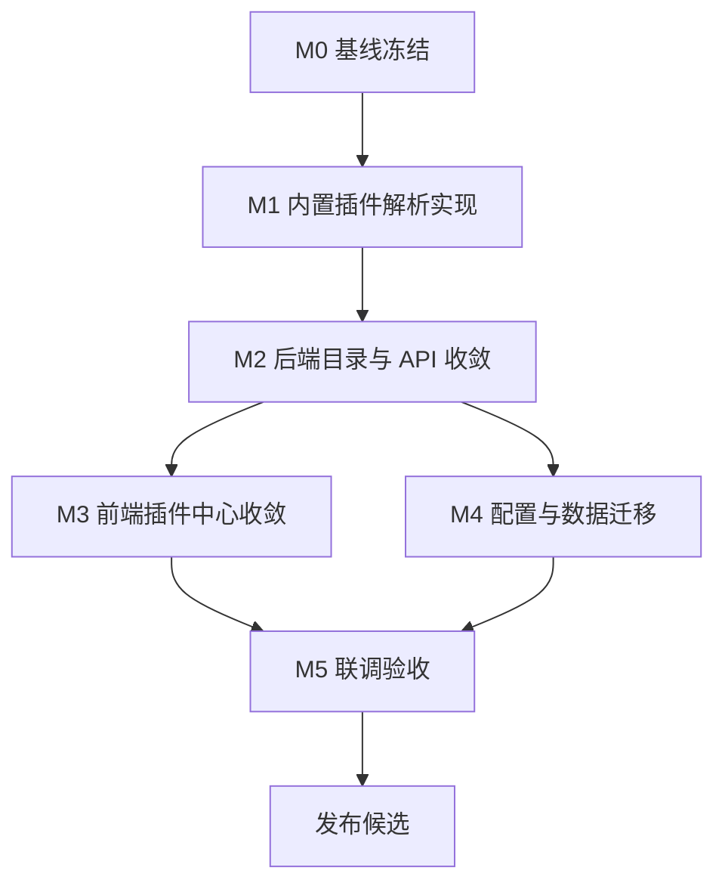

# 内置插件中心收敛开发计划

> **给后续执行者：** 本计划基于 `docs/superpowers/plans/2026-06-08-built-in-plugin-center-only.md` 制定，用于排期、评审、验收和风险控制。具体到函数、测试代码和文件级操作时，以该实施方案文档为执行细则。

**目标：** 将插件中心当前的 `52API`、`kanjuba` 两个自定义插件迁移为代码内置插件，并下线插件导入能力，使后台插件中心只展示和管理由源码注册、环境变量启用的内置插件。

**开发策略：** 先补内置插件解析能力，再收敛后端目录和管理 API，最后删除前端导入入口并清理旧配置。每个阶段都以本地自动化验证作为退出条件，不允许依赖远程 CI 或人工外包验证。

**技术栈：** Go、Gin、GORM、项目内 `plugin.BaseAsyncPlugin`、React、TypeScript、Vitest、Testing Library、pnpm。

---

## 1. 计划来源与当前基线

### 1.1 计划来源

- `docs/superpowers/plans/2026-06-08-built-in-plugin-center-only.md`
- `.Codex/context-summary-内置插件中心收敛方案.md`
- `.Codex/operations-log.md`
- 插件中心截图：`52API`、`kanjuba` 当前显示为“自定义 + 本地已安装”。

### 1.2 当前基线

当前 `backend/custom_plugins.json` 中存在两个启用的自定义插件：

- `kanjuba`：`http://app.ishen520.com/api.php/v1.vod?wd=考研`
- `52API`：`https://www.52api.cn/api/pan_sou`

当前实现链路：

- 插件中心目录由 `backend/service/plugin_catalog_service.go` 合并内置插件、自定义插件和远程市场目录。
- 远程市场导入由 `POST /api/admin/plugin-center/install` 写入 `custom_plugins.json`。
- 自定义插件新增、编辑、删除由 `backend/api/admin_handler.go` 写入 `custom_plugins.json`。
- 搜索执行链路只执行 `PluginManager` 中的内置 `AsyncSearchPlugin`。
- 自定义插件测试只做 URL 连通性检查，不解析搜索结果。

### 1.3 已识别风险

- `kanjuba` 当前 URL 探测返回域名售卖 HTML，不是稳定 JSON 搜索结果。
- `52API` 需要正确请求密钥，缺少 key 时返回 403，连续试探会触发频率限制。
- 前端已有完整导入、自定义新增、自定义编辑、自定义删除交互和测试覆盖，删除时需要同步测试。
- 数据库中可能已有 `plugin_states` 旧自定义状态，需要迁移为 `builtin`。
- `kule` 当前是禁用自定义插件，本次不迁移；如果后续仍需要，应单独做内置插件任务。

---

## 2. 开发范围

### 2.1 范围内

- 新增 `kanjuba` 内置插件。
- 新增 `52API` 内置插件，支持 `PLUGIN_52API_KEY` 环境变量。
- 将插件中心目录收敛为只读取 `PluginManager.GetPlugins()`。
- 移除远程市场导入 API。
- 移除自定义 URL 插件新增、编辑、删除和 URL 测试 API。
- 移除前端“导入 URL 插件”“添加 URL 插件”“一键导入”“测试URL”“删除自定义插件”等入口。
- 更新前后端测试。
- 清理配置、README 和旧 JSON 依赖。
- 提供旧数据迁移和回滚步骤。

### 2.2 范围外

- 不迁移禁用的 `kule` 插件。
- 不新增可视化插件开发器。
- 不保留远程插件市场。
- 不做自定义插件向后兼容。
- 不改造整体搜索架构。

---

## 3. 开发原则

- **内置插件唯一来源**：插件中心只展示源码注册的内置插件。
- **先真实搜索后删入口**：必须先完成 `52API`、`kanjuba` 的真实搜索插件实现，再删除旧自定义入口。
- **测试先行**：每个行为变更先补测试，再改实现。
- **小步提交**：每个里程碑独立可验证。
- **配置显式化**：`52API` 的 key 只通过环境变量配置，不写入源码或 JSON。
- **本地验证闭环**：所有验收都通过本地命令完成。

---

## 4. 文件责任图

### 4.1 后端插件实现

- `backend/plugin/kanjuba/kanjuba.go`：看剧吧内置插件实现。
- `backend/plugin/kanjuba/kanjuba_test.go`：看剧吧响应解析和插件契约测试。
- `backend/plugin/api52/api52.go`：52API 内置插件实现。
- `backend/plugin/api52/api52_test.go`：52API key、限频错误和响应解析测试。
- `backend/main.go`：新增两个插件空导入。

### 4.2 后端插件中心

- `backend/service/plugin_catalog_service.go`：改为只构建内置插件目录。
- `backend/api/plugin_center_handler.go`：保留 catalog，删除 install。
- `backend/api/router_admin.go`：移除导入、自定义插件 CRUD、URL 测试路由。
- `backend/api/admin_handler.go`：测试、启停、批量启停只支持内置插件。
- `backend/model/plugin_catalog.go`：删除或废弃安装请求模型。
- `backend/service/admin_tag_service.go`：移除自定义插件标签同步。

### 4.3 前端插件中心

- `frontend/src/hooks/usePluginManageController.ts`：删除导入、新增、删除、URL 测试和自定义编辑请求。
- `frontend/src/hooks/usePluginManageDialogState.ts`：删除新增自定义插件状态。
- `frontend/src/components/admin/PluginManagementView.tsx`：页面级插件中心删除导入入口。
- `frontend/src/components/admin/PluginManageWorkspace.tsx`：工作台删除添加和一键导入入口。
- `frontend/src/components/admin/PluginManageDialog.tsx`：弹窗管理删除新增、编辑、删除自定义插件弹窗。
- `frontend/src/components/admin/PluginAddDialog.tsx`：删除或停止引用。
- `frontend/src/components/admin/pluginManageDialogShared.ts`：删除新增表单与 URL 测试类型。
- `frontend/src/components/admin/pluginManageStateUtils.ts`：删除自定义插件追加、删除、编辑工具。
- `frontend/src/types/api.ts`：删除导入、自定义插件 CRUD、URL 测试请求类型。

### 4.4 配置与文档

- `.env`、`backend/.env`：追加启用插件和 `PLUGIN_52API_KEY`。
- `.env.example`、`backend/.env.example`：更新内置插件配置模板。
- `README.md`：说明插件中心只支持内置插件。
- `backend/custom_plugins.json`：迁移后清空或删除。
- `backend/plugin_market.default.json`：删除或停止加载。
- `.Codex/custom_plugins.migration.backup.json`：迁移前备份。

---

## 5. 里程碑计划

| 里程碑 | 建议周期 | 目标 | 退出条件 |
| --- | --- | --- | --- |
| M0 基线冻结 | 0.5 天 | 记录当前插件中心、自定义配置、接口和测试基线 | `.Codex/operations-log.md` 记录完整基线 |
| M1 内置插件解析实现 | 1.5 到 2 天 | 新增 `kanjuba` 和 `52API` 内置插件 | 两个插件单测和 manifest 契约通过 |
| M2 后端目录与 API 收敛 | 1 到 1.5 天 | 插件中心只返回内置目录，删除导入和自定义 CRUD API | 后端 api/service 测试通过，旧导入路由 404 |
| M3 前端插件中心收敛 | 1.5 到 2 天 | 删除导入、自定义新增、编辑、删除入口 | 前端插件中心组件测试和 lint 通过 |
| M4 配置与数据迁移 | 0.5 到 1 天 | 清理旧 JSON、环境变量和 README | 配置模板、README、迁移备份完成 |
| M5 联调验收 | 0.5 到 1 天 | 完成本地后端、前端和接口冒烟 | 全量本地验证通过 |

---

## 6. 任务依赖图



---

## 7. 阶段详细计划

### M0：基线冻结

**目标：** 在实现前锁定当前行为，避免迁移后无法判断是否真正完成“仅内置插件中心”。

**任务拆分：**

- [x] M0.1 记录 Git 状态，不回滚上一轮 `sidhub` 相关改动。
- [x] M0.2 记录 `backend/custom_plugins.json` 当前内容。
- [x] M0.3 调用插件中心 catalog 接口，保存当前 `52API`、`kanjuba` 的 `plugin_type`、`status`、`available_actions`。
- [x] M0.4 记录当前前端插件中心存在的导入入口。
- [x] M0.5 记录当前后端测试和前端插件中心测试状态。

**本地命令：**

```bash
git status --short --branch
```

```bash
cd backend
go test ./api ./service -count=1
```

```bash
cd frontend
pnpm test -- PluginManagementView PluginManageDialog
```

**退出条件：**

- `.Codex/operations-log.md` 中记录基线。
- 明确当前旧自定义插件配置和前端导入入口。

### M1：内置插件解析实现

**目标：** 让 `52API`、`kanjuba` 成为真实 `AsyncSearchPlugin`，而不是仅可连通的 URL 条目。

**任务拆分：**

- [x] M1.1 新增 `backend/plugin/kanjuba` 包。
- [x] M1.2 为看剧吧 MacCMS vod JSON 响应编写 fixture 单测。
- [x] M1.3 实现看剧吧请求构造、响应解析和链接转换。
- [x] M1.4 新增 `backend/plugin/api52` 包。
- [x] M1.5 为 52API key 缺失、403、502、正常响应编写单测。
- [x] M1.6 实现 52API key 读取、请求构造、响应解析、错误分类和轻量缓存。
- [x] M1.7 在 `backend/main.go` 注册两个插件空导入。
- [x] M1.8 更新 `ENABLED_PLUGINS` 与 `PLUGIN_COUNT`。

**关键验收：**

- `kanjuba` 插件 manifest ID 为 `search.kanjuba`。
- `52API` 插件 manifest ID 为 `search.52api`。
- `52API` 未配置 `PLUGIN_52API_KEY` 时返回明确中文错误。
- 两个插件都返回标准 `model.SearchResult` 和 `model.Link`。

**本地命令：**

```bash
cd backend
go test ./plugin/kanjuba ./plugin/api52 -count=1
```

```bash
cd backend
go test ./plugin/... -count=1
```

**退出条件：**

- 新增插件单测通过。
- 插件 manifest 契约通过。
- 不依赖 `custom_plugins.json` 也能注册两个插件。

### M2：后端目录与 API 收敛

**目标：** 后端插件中心只输出内置插件目录，动态导入和自定义插件配置 API 全部下线。

**任务拆分：**

- [x] M2.1 修改 `PluginCatalogService.ListCatalog`，忽略 `source` 参数并只返回 local 内置目录。
- [x] M2.2 删除 `InstallCatalogItem` 路径或让其不再被路由使用。
- [x] M2.3 删除 `POST /api/admin/plugin-center/install` 路由。
- [x] M2.4 删除 `POST /api/admin/plugins`、`PUT /api/admin/plugins/:pluginName`、`DELETE /api/admin/plugins/:pluginName` 路由。
- [x] M2.5 删除 `POST /api/admin/test-url` 路由。
- [x] M2.6 `TestPluginHandler` 只对内置插件执行真实搜索测试。
- [x] M2.7 `SetPluginStatusHandler` 和 `BatchSetPluginStatusHandler` 只匹配内置插件。
- [x] M2.8 移除自定义插件标签同步逻辑。
- [x] M2.9 更新后端 api/service 测试。

**关键验收：**

- `/api/admin/plugin-center/catalog?source=all` 不返回 `plugin_type: "custom"`。
- `/api/admin/plugin-center/catalog?source=remote` 稳定返回本地内置目录，或明确忽略 `source`。
- `POST /api/admin/plugin-center/install` 返回 404。
- `POST /api/admin/test-url` 返回 404。
- `POST /api/admin/plugins` 返回 404。

**本地命令：**

```bash
cd backend
go test ./api ./service -count=1
```

```bash
cd backend
go test ./... -count=1
```

**退出条件：**

- 后端全量测试通过。
- 旧导入和自定义插件配置路由不再暴露。
- 插件中心响应里的 `52API`、`kanjuba` 均为 `builtin`。

### M3：前端插件中心收敛

**目标：** 前端只展示内置插件的查看、筛选、测试和启停能力，删除导入和自定义配置入口。

**任务拆分：**

- [x] M3.1 删除页面级“导入 URL 插件”按钮。
- [x] M3.2 删除弹窗/工作台“添加 URL 插件”按钮。
- [x] M3.3 删除远程市场来源筛选，或将来源筛选固定为本地内置。
- [x] M3.4 删除远程待导入卡片和“一键导入”动作。
- [x] M3.5 删除 `PluginAddDialog` 引用和相关状态。
- [x] M3.6 删除自定义插件删除和批量删除入口。
- [x] M3.7 删除自定义 URL 编辑表单；详情改为只读。
- [x] M3.8 收敛 `usePluginManageController`，移除导入、新增、编辑、删除和 URL 测试请求。
- [x] M3.9 收敛 TypeScript API 类型。
- [x] M3.10 更新前端测试。

**保留能力：**

- 插件搜索和筛选。
- 状态筛选。
- 分类和能力筛选。
- 插件标签筛选。
- 插件详情。
- 单插件测试。
- 批量测试。
- 启停和批量启停。

**本地命令：**

```bash
cd frontend
pnpm test -- PluginManagementView PluginManageDialog
```

```bash
cd frontend
pnpm lint
```

**退出条件：**

- 页面中不再出现“导入 URL 插件”“添加 URL 插件”“一键导入”“测试URL”“删除插件”。
- 插件启停、测试、筛选、详情测试通过。
- TypeScript 和 lint 通过。

### M4：配置与数据迁移

**目标：** 清理旧自定义插件配置和远程市场配置，使部署说明与新架构一致。

**任务拆分：**

- [x] M4.1 备份 `backend/custom_plugins.json` 到 `.Codex/custom_plugins.migration.backup.json`。
- [x] M4.2 清空或删除 `backend/custom_plugins.json`。
- [x] M4.3 删除或停止加载 `backend/plugin_market.default.json`。
- [x] M4.4 从 `.env.example` 和 `backend/.env.example` 移除 `CUSTOM_PLUGINS_PATH`、`PLUGIN_MARKET_*`。
- [x] M4.5 新增 `PLUGIN_52API_KEY` 示例。
- [x] M4.6 更新 README 的插件配置说明。
- [x] M4.7 提供 `plugin_states` 数据迁移 SQL。

**迁移 SQL：**

```sql
UPDATE plugin_states
SET plugin_type = 'builtin'
WHERE plugin_name IN ('52API', '52api', 'kanjuba');
```

**本地命令：**

```bash
rg -n "CUSTOM_PLUGINS_PATH|PLUGIN_MARKET|custom_plugins|plugin-center/install|test-url" .env.example backend/.env.example README.md backend frontend/src
```

**退出条件：**

- 配置模板不再引导用户配置自定义插件。
- README 明确新增插件必须写代码并注册空导入。
- 旧配置已备份，回滚路径明确。

### M5：联调验收

**目标：** 从本地接口、前端页面和搜索链路确认迁移完成。

**任务拆分：**

- [x] M5.1 运行后端全量测试。
- [x] M5.2 运行前端插件中心测试和 lint。
- [x] M5.3 通过后端 handler/service 测试检查插件目录。
- [x] M5.4 验证旧导入 API 均为 404。
- [x] M5.5 验证 `52API`、`kanjuba` 在插件中心显示为内置。
- [x] M5.6 验证前端插件中心没有导入入口。
- [x] M5.7 未提供真实 `PLUGIN_52API_KEY` 和可用看剧吧地址，本轮以 fixture、错误分支和目录单测完成替代验证。

**本地命令：**

```bash
cd backend
go test ./... -count=1
```

```bash
cd frontend
pnpm test
pnpm lint
```

```bash
curl -sS 'http://localhost:8888/api/admin/plugin-center/catalog?source=all'
```

**退出条件：**

- 后端全量测试通过。
- 前端测试和 lint 通过。
- catalog 响应没有 `custom` 插件。
- 前端不展示任何导入入口。
- `.Codex/verification-report.md` 更新最终验收结论。

---

## 8. 开发排期建议

| 天数 | 上午 | 下午 | 退出条件 |
| --- | --- | --- | --- |
| 第 1 天 | M0 基线冻结；M1 看剧吧测试与实现 | M1 52API 测试与实现 | 两个插件单测通过 |
| 第 2 天 | M1 注册和配置；M2 后端目录测试 | M2 后端 API 收敛 | 后端 api/service 测试通过 |
| 第 3 天 | M3 前端状态和 hook 收敛 | M3 页面和弹窗 UI 删除入口 | 前端插件中心测试通过 |
| 第 4 天 | M4 配置和 README 清理 | M5 联调验收和验证报告 | 全量验证通过 |

如果 `kanjuba` 真实接口需要额外确认，M1 增加 0.5 到 1 天用于接口确认和冒烟测试。

---

## 9. 验收清单

### 9.1 后端验收

- [x] `backend/plugin/kanjuba` 存在并通过单测。
- [x] `backend/plugin/api52` 存在并通过单测。
- [x] `backend/main.go` 注册两个插件。
- [x] `ENABLED_PLUGINS` 包含 `kanjuba` 与 `52API`。
- [x] catalog 响应中 `52API`、`kanjuba` 的 `plugin_type` 为 `builtin`。
- [x] catalog 响应中不存在 `plugin_type: "custom"`。
- [x] 旧导入和自定义插件 CRUD API 返回 404。

### 9.2 前端验收

- [x] 插件中心不展示“导入 URL 插件”。
- [x] 插件工作台不展示“添加 URL 插件”。
- [x] 插件卡片不展示“一键导入”。
- [x] 插件详情不展示自定义 URL 编辑入口。
- [x] 批量操作不展示“批量删除”。
- [x] 启停、测试、筛选、详情仍可用。

### 9.3 文档与配置验收

- [x] README 说明插件只能通过代码新增。
- [x] `.env.example` 和 `backend/.env.example` 包含 `PLUGIN_52API_KEY`。
- [x] 配置模板不再包含 `CUSTOM_PLUGINS_PATH`。
- [x] 配置模板不再包含 `PLUGIN_MARKET_*`。
- [x] 旧 `custom_plugins.json` 已备份。

---

## 10. 本地验证矩阵

| 验证项 | 命令 | 通过标准 |
| --- | --- | --- |
| 看剧吧插件单测 | `cd backend && go test ./plugin/kanjuba -count=1` | PASS |
| 52API 插件单测 | `cd backend && go test ./plugin/api52 -count=1` | PASS |
| 后端插件包测试 | `cd backend && go test ./plugin/... -count=1` | PASS |
| 后端 API 和服务测试 | `cd backend && go test ./api ./service -count=1` | PASS |
| 后端全量测试 | `cd backend && go test ./... -count=1` | PASS |
| 前端插件中心测试 | `cd frontend && pnpm test -- PluginManagementView PluginManageDialog` | PASS |
| 前端 lint | `cd frontend && pnpm lint` | PASS |
| 前端全量测试 | `cd frontend && pnpm test` | PASS |
| 配置残留扫描 | `rg -n "CUSTOM_PLUGINS_PATH|PLUGIN_MARKET|plugin-center/install|test-url" .env.example backend/.env.example README.md backend frontend/src` | 只允许迁移说明或回滚说明出现 |

---

## 11. 风险应对

| 风险 | 影响 | 应对 |
| --- | --- | --- |
| `kanjuba` 接口不可用 | 插件无法真实搜索 | 先实现 MacCMS vod JSON 解析器和单测；真实 URL 作为执行前确认项 |
| `52API` 缺少 key | 插件测试或搜索失败 | 使用 `PLUGIN_52API_KEY` 显式配置；未配置时返回清晰错误 |
| `52API` 触发频率限制 | 冒烟测试不稳定 | 单测使用 fixture；真实冒烟低频执行 |
| 前端删除入口影响测试较多 | 开发时间增加 | 先改测试期望，再删 hook 和 UI |
| 旧数据库状态仍为 custom | 插件启停展示异常 | 提供 `plugin_states` 迁移 SQL |
| 历史客户端仍调用导入 API | 返回 404 | README 标注破坏性变更，发布说明记录下线范围 |

---

## 12. 回滚计划

如果发布后发现内置插件中心不可用，按以下步骤回滚：

1. 回滚新增的 `backend/plugin/kanjuba`、`backend/plugin/api52` 和 `backend/main.go` 空导入。
2. 回滚后端插件中心目录服务和路由改动。
3. 回滚前端插件中心 UI、hook 和类型改动。
4. 恢复旧自定义插件配置：

```bash
cp .Codex/custom_plugins.migration.backup.json backend/custom_plugins.json
```

5. 恢复 `CUSTOM_PLUGINS_PATH` 和 `PLUGIN_MARKET_*` 配置。
6. 运行后端和前端验证：

```bash
cd backend
go test ./... -count=1
```

```bash
cd frontend
pnpm test -- PluginManagementView PluginManageDialog
pnpm lint
```

---

## 13. 交付物清单

- 两个内置插件实现：
  - `backend/plugin/kanjuba`
  - `backend/plugin/api52`
- 后端插件中心收敛改造。
- 前端插件中心收敛改造。
- 环境变量模板更新。
- README 插件配置说明更新。
- 旧自定义插件配置备份。
- `.Codex/operations-log.md` 开发和验证记录。
- `.Codex/verification-report.md` 最终验证报告。

---

## 14. 提交建议

建议按里程碑提交：

```bash
git commit -m "feat: 将 52API 和看剧吧实现为内置插件"
git commit -m "refactor: 插件中心仅返回内置插件目录"
git commit -m "refactor: 移除前端插件导入入口"
git commit -m "docs: 更新内置插件中心开发计划和配置说明"
```
