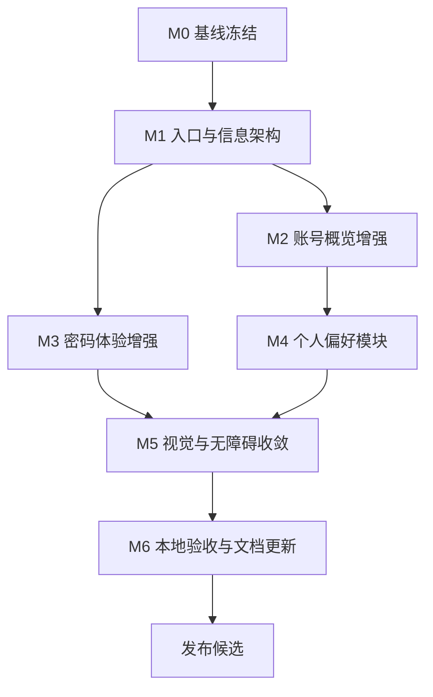

# 个人中心页面优化开发计划

> **给后续执行者：** 本计划基于当前 `/account` 页面审查结果制定。API Key 已确认为废弃内容，后续个人中心不得恢复、扩展或新增任何 API Key 绑定、查询、额度展示相关入口。实施时必须保持小步提交，先补测试再改实现，并将本地验证结果记录到 `.Codex/operations-log.md` 与 `.Codex/verification-report.md`。

**目标：** 将当前“账号概览 + 修改密码”页面升级为更完整的个人中心工作台，补齐管理员个人中心入口、账号状态概览、密码修改体验、个人搜索偏好、加载错误状态与响应式信息架构。

**开发策略：** 先冻结当前行为和测试基线，再调整导航入口与页面信息架构，随后分阶段增强安全设置、账号概览和个人偏好，最后完成视觉一致性、无障碍语义与自动化验证。

**技术栈：** React、TypeScript、React Router、Zustand、Axios、Framer Motion、Tailwind CSS、lucide-react、Vitest、Testing Library、pnpm、Go、Gin、GORM。

---

## 1. 计划来源与当前基线

### 1.1 计划来源

- `frontend/src/pages/AccountPage.tsx`
- `frontend/src/components/account/AccountWorkspaceShell.tsx`
- `frontend/src/components/account/AccountHeroBanner.tsx`
- `frontend/src/components/account/AccountOverviewPanel.tsx`
- `frontend/src/components/account/AccountOverviewHighlights.tsx`
- `frontend/src/components/account/AccountOverviewShowcase.tsx`
- `frontend/src/components/account/AccountSecurityPanel.tsx`
- `frontend/src/components/account/accountTypes.ts`
- `frontend/src/components/account/passwordValidation.ts`
- `frontend/src/pages/__tests__/AccountPage.test.tsx`
- `frontend/src/components/Navbar.tsx`
- `frontend/src/components/MobileMenu.tsx`
- `frontend/src/routes/AppRoutes.tsx`
- `backend/api/router.go`
- `backend/api/controller/auth_controller.go`
- `backend/api/user_handler.go`
- `backend/model/user.go`

### 1.2 当前个人中心链路

页面访问链路：

1. 用户通过导航菜单进入 `/account`。
2. `AppRoutes` 使用 `ProtectedRoute` 包裹 `AccountPage`。
3. `AccountPage` 首次挂载时请求 `GET /api/user/me`。
4. 页面展示欢迎区、账号工作台侧栏、账号概览模块。
5. 用户可切换到“修改密码”模块，提交 `POST /api/user/change-password`。

当前页面能力：

- 展示用户名、角色、最近登录时间、创建时间。
- 展示身份说明、活跃状态、快捷动作和安全提示。
- 支持当前密码、新密码、确认密码输入。
- 支持新密码长度校验、确认密码一致性校验。
- 支持资料加载失败和密码修改结果 toast。
- 已有页面级单元测试覆盖模块切换、加载失败、密码校验和成功提交。

### 1.3 已有优点

- 页面已拆分为清晰的账号组件，职责边界较明确。
- 账号页走受保护路由，不会暴露给未登录用户。
- 密码校验逻辑已抽到 `passwordValidation.ts`，可继续扩展。
- 页面使用统一的玻璃表面样式，与现有前台视觉风格一致。
- 已有 `AccountPage.test.tsx`，后续可以直接扩展回归用例。

### 1.4 主要问题

| 优先级 | 问题 | 影响 |
| --- | --- | --- |
| P0 | 管理员菜单只显示后台管理，缺少明显的个人中心入口 | 管理员修改个人密码和查看账号资料的路径不直观 |
| P1 | 个人中心仅有“账号概览”和“修改密码”两个模块 | 页面更像轻量设置页，不像完整个人工作台 |
| P1 | 密码修改体验偏基础，缺少显示密码、强度提示、提交状态细节 | 用户容易输错，错误定位成本较高 |
| P1 | 账号概览信息密度不足，没有展示账号启用状态、更新时间等可用字段 | 用户无法快速判断账号状态和资料新鲜度 |
| P2 | 加载失败只有 toast，没有页面内错误态和重试入口 | 网络异常时用户只能刷新页面 |
| P2 | Hero、侧栏、概览卡存在信息重复 | 首屏空间消耗偏高，实际操作入口不够突出 |
| P2 | 导航模块更接近 tabs，但语义仍是按钮列表 | 键盘和读屏体验可继续优化 |
| P3 | 个人偏好缺失，例如搜索默认视图、默认排序、复制格式偏好 | 用户无法把高频搜索体验固化为自己的默认设置 |

---

## 2. 开发范围

### 2.1 范围内

- 调整桌面端和移动端登录菜单，让管理员也能进入个人中心。
- 将个人中心导航扩展为“账号概览、偏好设置、安全设置”三类模块。
- 优化账号概览字段，展示账号状态、角色、最近登录、创建时间、更新时间。
- 优化加载、空状态和错误状态，提供页面内重试入口。
- 增强密码修改体验：显示/隐藏密码、强度提示、禁用无效提交、成功后清空表单。
- 新增个人搜索偏好界面，先以前端持久化或既有用户配置接口为落地点。
- 优化页面信息架构，减少重复文本，提高首屏可操作内容密度。
- 改善无障碍语义，将模块切换升级为更明确的 tablist、tab、tabpanel 结构。
- 补齐前端单元测试和必要的后端契约测试。

### 2.2 范围外

- 不恢复任何 API Key 页面、入口、绑定、解绑、额度展示或登录能力。
- 不新增邮箱、手机号、头像上传或第三方登录。
- 不重做完整账号体系和角色模型。
- 不引入新的 UI 组件库。
- 不改造后台用户管理的核心表格能力。
- 不进行大规模主题重构，只在个人中心范围内统一视觉节奏。

---

## 3. 开发原则

- **废弃能力不回流**：API Key 属于废弃内容，个人中心不再承载相关能力。
- **用户路径优先**：管理员和普通用户都应能快速进入自己的账号设置。
- **接口契约先行**：新增账号字段或偏好字段前先确认后端响应契约。
- **测试先行**：导航入口、模块切换、密码校验、偏好保存必须先补测试。
- **渐进增强**：先复用现有组件和样式，再补少量必要抽象。
- **中文一致性**：新增文档、注释、页面提示、测试描述保持简体中文。
- **本地验证闭环**：所有验收通过本地 Vitest、Go 测试和必要构建完成。

---

## 4. 文件责任图

### 4.1 前端页面与组件

- `frontend/src/pages/AccountPage.tsx`：个人中心状态编排、接口请求、模块切换和提交逻辑。
- `frontend/src/components/account/AccountWorkspaceShell.tsx`：个人中心布局、模块导航和主体容器。
- `frontend/src/components/account/AccountHeroBanner.tsx`：账号首屏摘要，后续应压缩重复信息。
- `frontend/src/components/account/AccountOverviewPanel.tsx`：账号概览模块入口。
- `frontend/src/components/account/AccountOverviewHighlights.tsx`：账号字段卡片展示。
- `frontend/src/components/account/AccountOverviewShowcase.tsx`：说明卡和快捷动作。
- `frontend/src/components/account/AccountSecurityPanel.tsx`：密码修改表单和提示。
- 建议新增 `frontend/src/components/account/AccountPreferencesPanel.tsx`：个人搜索偏好模块。
- 建议新增 `frontend/src/components/account/AccountInlineState.tsx`：个人中心加载、错误、空状态组件。

### 4.2 前端状态、服务和类型

- `frontend/src/components/account/accountTypes.ts`：账号资料、模块枚举、偏好类型。
- `frontend/src/components/account/passwordValidation.ts`：密码长度、确认密码、强度提示规则。
- `frontend/src/stores/authStore.ts`：当前登录用户缓存和登出行为。
- `frontend/src/lib/api.ts`：账号接口请求拦截和错误处理。
- 建议新增 `frontend/src/stores/accountPreferenceStore.ts`：个人偏好本地持久化。

### 4.3 导航与路由

- `frontend/src/routes/AppRoutes.tsx`：确认 `/account` 继续走受保护路由。
- `frontend/src/components/Navbar.tsx`：桌面端用户菜单入口。
- `frontend/src/components/MobileMenu.tsx`：移动端用户菜单入口。
- `frontend/src/components/SiteFooter.tsx`：页脚个人中心入口。

### 4.4 后端账号接口

- `backend/api/router.go`：当前用户路由注册。
- `backend/api/controller/auth_controller.go`：`GET /api/user/me` 当前用户资料。
- `backend/api/user_handler.go`：`POST /api/user/change-password` 修改密码。
- `backend/model/user.go`：用户字段来源。
- 如需服务端保存个人偏好，后续单独评估新增用户偏好模型和迁移。

### 4.5 测试入口

- `frontend/src/pages/__tests__/AccountPage.test.tsx`：个人中心主流程测试。
- `frontend/src/components/account/__tests__/passwordValidation.test.ts`：密码规则测试。
- `frontend/src/components/__tests__/Navbar.test.tsx`：桌面端菜单入口测试。
- `frontend/src/components/__tests__/MobileMenu.test.tsx`：移动端菜单入口测试。
- 建议新增 `frontend/src/stores/__tests__/accountPreferenceStore.test.ts`：偏好持久化测试。
- `backend/api/account_auth_flow_test.go`：当前用户资料和修改密码契约测试。

---

## 5. 里程碑计划

| 里程碑 | 建议周期 | 目标 | 退出条件 |
| --- | --- | --- | --- |
| M0 基线冻结 | 0.5 天 | 记录当前个人中心行为、接口和测试覆盖 | 当前测试可重复运行，API Key 废弃约束写入计划 |
| M1 入口与信息架构 | 0.5 到 1 天 | 管理员和普通用户都能进入个人中心，模块结构清晰 | 导航测试通过，个人中心模块切换测试通过 |
| M2 账号概览增强 | 1 天 | 补齐账号状态、更新时间、加载错误和重试 | 概览字段和错误态测试通过 |
| M3 密码体验增强 | 1 天 | 提升密码输入、强度提示和提交反馈 | 密码校验、显示隐藏、提交状态测试通过 |
| M4 个人偏好模块 | 1 到 1.5 天 | 提供搜索默认视图、排序、复制格式等偏好设置 | 偏好保存、恢复、重置测试通过 |
| M5 视觉与无障碍收敛 | 0.5 到 1 天 | 压缩重复信息，统一 tab 语义和响应式布局 | 无障碍查询和视觉回归检查通过 |
| M6 本地验收与文档更新 | 0.5 天 | 完成质量验证、报告和交付说明 | 本地测试、构建、验证报告通过 |

---

## 6. 任务依赖图



---

## 7. 阶段详细计划

### M0：基线冻结

**目标：** 固化当前页面行为，避免优化过程中误恢复废弃能力或破坏现有改密链路。

**任务拆分：**

- [ ] M0.1 记录当前 Git 状态，识别已有未提交改动。
- [ ] M0.2 运行个人中心相关前端测试，记录基线结果。
- [ ] M0.3 运行当前用户资料和修改密码相关后端测试，记录基线结果。
- [ ] M0.4 在操作日志中明确“API Key 已废弃，不纳入个人中心”的约束。

**本地命令：**

```bash
git status --short --branch
```

```bash
cd frontend
pnpm test -- AccountPage passwordValidation Navbar MobileMenu
```

```bash
cd backend
go test ./api -run 'TestAccount|TestChangePassword|TestCurrentUser' -count=1
```

**退出条件：**

- 已记录当前测试结果。
- 已确认计划不包含 API Key 相关能力。

### M1：入口与信息架构

**目标：** 让所有已登录用户都能清晰进入个人中心，并把页面模块升级为可扩展结构。

**任务拆分：**

- [ ] M1.1 调整桌面端用户菜单，管理员同时显示“个人中心”和“后台管理”。
- [ ] M1.2 调整移动端用户菜单，管理员同时显示“个人中心”和“后台管理”。
- [ ] M1.3 将 `AccountSection` 扩展为 `overview | preferences | security`。
- [ ] M1.4 将侧栏导航改为语义化 tab 结构，并保持现有视觉风格。
- [ ] M1.5 为新模块切换补充页面测试。

**验收标准：**

- 普通用户和管理员都能从桌面端菜单进入 `/account`。
- 普通用户和管理员都能从移动端菜单进入 `/account`。
- 页面模块切换不刷新页面、不丢失已加载资料。
- 不新增 `/apikey` 或类似废弃入口。

### M2：账号概览增强

**目标：** 让账号概览能回答“我是谁、账号是否正常、资料是否新鲜、最近是否活跃”。

**任务拆分：**

- [ ] M2.1 扩展 `AccountProfile`，接入 `is_enabled`、`updated_at` 等后端已有字段。
- [ ] M2.2 将概览卡调整为“用户名、角色、账号状态、最近登录、创建时间、更新时间”。
- [ ] M2.3 增加资料加载错误的页面内错误态和“重新加载”按钮。
- [ ] M2.4 增加加载骨架态，避免只显示“加载中...”文本。
- [ ] M2.5 更新 `AccountPage.test.tsx` 覆盖成功、失败、重试和禁用状态展示。

**验收标准：**

- 网络失败时页面内可见错误说明和重试入口。
- 账号禁用状态能清晰展示，不只依赖角色标签。
- 日期格式统一使用中文本地化展示。

### M3：密码体验增强

**目标：** 降低用户修改密码时的输入错误和不确定感。

**任务拆分：**

- [ ] M3.1 在三个密码输入框增加显示/隐藏按钮。
- [ ] M3.2 新增密码强度提示，至少区分“过短、可用、较强”。
- [ ] M3.3 禁用无效提交，按钮文案跟随保存状态变化。
- [ ] M3.4 成功后清空表单，并保留明确成功提示。
- [ ] M3.5 后端错误按当前密码错误、参数错误、服务错误展示更具体中文提示。
- [ ] M3.6 更新密码校验单元测试和页面交互测试。

**验收标准：**

- 用户可在不离开键盘的情况下完成密码修改。
- 密码不一致、过短、为空时均有页面内或 toast 提示。
- 保存中不会重复提交。

### M4：个人偏好模块

**目标：** 让用户可以配置高频搜索体验，形成个人中心的实际使用价值。

**任务拆分：**

- [ ] M4.1 新增“偏好设置”模块入口。
- [ ] M4.2 提供默认搜索结果视图：列表或卡片。
- [ ] M4.3 提供默认排序偏好：相关度、时间、来源聚合等项目已有排序能力。
- [ ] M4.4 提供复制格式偏好，优先复用系统复制模板语义。
- [ ] M4.5 提供“一键恢复默认”操作。
- [ ] M4.6 第一阶段可使用前端持久化；如需跨设备同步，再单独评估后端用户偏好接口。

**验收标准：**

- 刷新页面后偏好仍然生效。
- 恢复默认后偏好状态与 UI 展示一致。
- 偏好模块不依赖任何 API Key 能力。

### M5：视觉与无障碍收敛

**目标：** 保持当前 Apple 风格和玻璃表面基调，同时提升信息密度与可访问性。

**任务拆分：**

- [ ] M5.1 压缩 hero 文案，减少与概览卡重复的角色和状态描述。
- [ ] M5.2 将快捷动作集中为明确按钮组，例如“修改密码”“编辑偏好”“返回搜索”。
- [ ] M5.3 优化移动端导航，避免模块按钮占用过高首屏空间。
- [ ] M5.4 将模块导航补齐 `tablist`、`tab`、`tabpanel` 语义。
- [ ] M5.5 校验按钮文本在移动端不溢出。
- [ ] M5.6 检查深色主题下卡片边框、文字层级和焦点态。

**验收标准：**

- 首屏能同时看到账号摘要和至少一个主要操作入口。
- 键盘 Tab 顺序符合视觉顺序。
- 深色主题下文本对比度和焦点态清晰。

### M6：本地验收与文档更新

**目标：** 形成可重复验证闭环，确保交付不依赖远程 CI。

**任务拆分：**

- [ ] M6.1 运行前端个人中心、导航、偏好相关测试。
- [ ] M6.2 运行后端当前用户和改密相关测试。
- [ ] M6.3 运行前端构建或项目既有质量脚本。
- [ ] M6.4 更新 `.Codex/verification-report.md`，写入评分和结论。
- [ ] M6.5 如新增用户偏好说明，补充到 README 或对应用户文档。

**本地命令：**

```bash
cd frontend
pnpm test -- AccountPage passwordValidation Navbar MobileMenu
```

```bash
cd frontend
pnpm build
```

```bash
cd backend
go test ./api ./service -count=1
```

---

## 8. 验收清单

### 功能验收

- [ ] 普通用户可从桌面端和移动端进入个人中心。
- [ ] 管理员可从桌面端和移动端进入个人中心。
- [ ] 个人中心包含账号概览、偏好设置、安全设置。
- [ ] 账号概览展示账号状态、角色、最近登录、创建时间、更新时间。
- [ ] 资料加载失败时有页面内错误态和重试按钮。
- [ ] 密码修改支持显示/隐藏、强度提示和重复提交防护。
- [ ] 个人偏好可保存、恢复和重置。
- [ ] 页面不出现任何 API Key 相关入口、文案或设置项。

### 测试验收

- [ ] `AccountPage.test.tsx` 覆盖模块切换、资料加载、错误重试、密码提交、偏好保存。
- [ ] `passwordValidation.test.ts` 覆盖长度、确认密码和强度提示。
- [ ] `Navbar.test.tsx` 覆盖管理员和普通用户菜单入口。
- [ ] `MobileMenu.test.tsx` 覆盖管理员和普通用户移动端入口。
- [ ] 后端当前用户资料和修改密码测试通过。

### 设计验收

- [ ] 页面在桌面端、平板端和移动端均无文本溢出。
- [ ] 深色主题下卡片、按钮、输入框和焦点态清晰。
- [ ] 模块切换具备明确选中态。
- [ ] 首屏不堆叠重复信息。
- [ ] 操作入口使用图标和清晰按钮，不使用冗余说明文字堆叠。

---

## 9. 风险与处理

| 风险 | 影响 | 处理策略 |
| --- | --- | --- |
| 用户偏好缺少服务端存储 | 多设备不同步 | 第一阶段使用本地持久化，后续单独设计用户偏好接口 |
| 管理员菜单新增个人中心入口后菜单变长 | 小屏拥挤 | 桌面端分组展示，移动端保持纵向列表 |
| 账号字段后端响应与前端类型不一致 | 页面展示异常 | 先补类型和测试，再接入字段 |
| 密码体验增强引入表单复杂度 | 测试维护成本增加 | 将密码可见性和强度判断拆成小函数或小组件 |
| API Key 废弃内容被误恢复 | 产品方向回退 | 在验收清单和测试中明确不得出现 API Key 入口 |

---

## 10. 回滚方案

- 导航入口改动可单独回滚 `Navbar.tsx` 和 `MobileMenu.tsx`。
- 个人中心模块扩展可回滚到原 `overview | security` 两模块。
- 偏好设置如出现异常，可关闭模块入口并保留本地数据，不影响账号概览和改密。
- 密码表单增强如出现交互回归，可保留原接口调用，回滚显示/隐藏和强度提示组件。
- 所有回滚不得恢复 API Key 入口。

---

## 11. 推荐实施顺序

1. M0 + M1：先解决入口和结构问题，风险低、收益明确。
2. M3：优先增强密码修改体验，直接改善账号安全设置流程。
3. M2：补齐账号概览字段和错误重试，让页面状态更可靠。
4. M4：新增偏好设置，形成个人中心的长期使用价值。
5. M5 + M6：统一视觉、语义和验证报告，准备发布候选。

