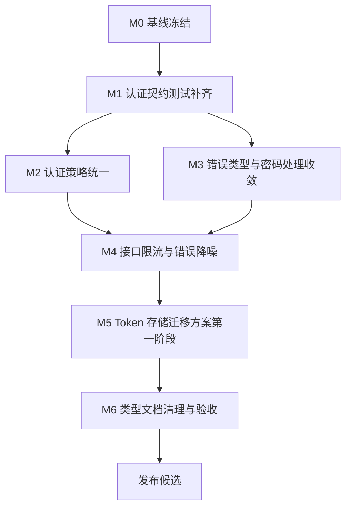

# 登录注册逻辑与校验规则优化开发计划

> **给后续执行者：** 本计划基于当前登录注册链路审查结果制定。后续实施必须保持小步提交，每个阶段先补测试再改实现，并将本地验证结果记录到 `.Codex/operations-log.md` 与 `.Codex/verification-report.md`。

**目标：** 统一登录、注册、用户名查重、Token 刷新相关的校验契约，降低认证接口滥用风险，修复前后端规则漂移和类型文档漂移，并补齐关键自动化测试。

**开发策略：** 先冻结当前行为并补契约测试，再抽取认证策略与错误类型，随后补接口限流和 Token 存储迁移方案，最后清理类型文档和验证脚本。

**技术栈：** Go、Gin、GORM、bcrypt、JWT、React、TypeScript、Zustand、Axios、Vitest、Testing Library、pnpm。

---

## 1. 计划来源与当前基线

### 1.1 计划来源

- `backend/api/controller/auth_controller.go`
- `backend/service/auth_service.go`
- `backend/api/refresh_token_handler.go`
- `backend/api/admin_handler.go`
- `backend/config/config.go`
- `frontend/src/pages/LoginPage.tsx`
- `frontend/src/pages/RegisterPage.tsx`
- `frontend/src/services/authService.ts`
- `frontend/src/stores/authStore.ts`
- `frontend/src/types/api.ts`
- `frontend/src/pages/__tests__/AuthEntryPages.test.tsx`

### 1.2 当前登录注册链路

注册链路：

1. `RegisterPage` 执行前端非空、确认密码、长度和用户名实时查重。
2. `AuthService.register` 请求 `POST /api/auth/register`。
3. `AuthController.Register` 执行 JSON 绑定、用户名和密码 trim、配置化长度校验。
4. `AuthService.Register` 再次执行非空、长度、软删除用户名查重、bcrypt 加密和用户创建。
5. 注册成功后控制器复用登录流程，返回 `access_token`、`expires_at`、`username`。

登录链路：

1. `LoginPage` 执行用户名和密码非空校验。
2. `AuthService.userLogin` 请求 `POST /api/auth/login`，可附带 `remember_me` 和设备指纹。
3. `AuthController.Login` 执行 JSON 绑定、trim 和非空校验。
4. `AuthService.Login` 查询用户、bcrypt 比对密码、检查禁用状态、签发 JWT。
5. 勾选“记住我”时，控制器生成 refresh token 并返回给前端。

刷新链路：

1. 前端 `authRefreshManager` 在非认证接口 401 后触发单飞刷新。
2. `POST /api/auth/refresh` 解密 refresh token，校验设备指纹。
3. 后端撤销旧 refresh token，生成新 access token 和新 refresh token。
4. 前端将新 token 写入 Zustand 持久化状态。

### 1.3 已有优点

- 后端服务层有二次校验，不完全依赖前端。
- 密码使用 bcrypt 哈希。
- 用户查询和查重使用 GORM 参数化查询。
- 登录失败对“用户不存在”和“密码错误”返回统一消息。
- 注册查重使用 `Unscoped`，避免软删除账号被重新注册接管。
- refresh token 已实现轮转。
- 前端刷新 access token 使用单飞机制，避免并发重复刷新。

### 1.4 主要问题

| 优先级 | 问题 | 影响 |
| --- | --- | --- |
| P0 | 普通登录、注册、用户名查重接口缺少限流 | 容易被撞库、枚举用户名或滥用注册 |
| P0 | access token 和 refresh token 持久化在 `localStorage` | XSS 场景下 token 暴露面较大 |
| P1 | 前端校验规则硬编码，后端规则来自环境变量 | 配置变化后前端与后端提示不一致 |
| P1 | 密码被 `TrimSpace` 后再注册和登录 | 用户输入的首尾空格会被静默改变 |
| P1 | 生产密钥缺失时会生成临时 JWT 和 refresh token 密钥 | 重启后 token 失效，生产环境配置错误不够显式 |
| P1 | refresh token 验证失败返回内部失败原因 | 错误信息过细，增加攻击者反馈 |
| P2 | 控制器通过字符串 contains 判断服务层错误 | 可维护性差，错误文案变化会影响分支 |
| P2 | 注册响应类型和文档仍描述旧 `{ user_id, username }` | 类型契约误导后续开发和测试 |
| P2 | 注册自动登录、查重、配置化长度测试不足 | 后续改动容易引入回归 |

---

## 2. 开发范围

### 2.1 范围内

- 新增认证策略读取能力，统一用户名和密码长度规则。
- 统一前后端注册校验、登录校验、账号查重提示。
- 将服务层认证错误改为哨兵错误或结构化错误。
- 为普通登录、注册、用户名查重、refresh token 刷新增补限流策略。
- 调整密码处理规则：用户名 trim，密码不静默 trim。
- 修正注册响应类型、注释和测试 mock。
- 补齐后端注册、登录、查重、限流、refresh token 错误测试。
- 补齐前端注册查重、自动登录、动态规则、错误提示测试。
- 给 token 存储迁移提供分阶段方案。
- 收紧生产密钥缺失时的启动校验。

### 2.2 范围外

- 不重做完整账号体系。
- 不新增邮箱、手机号或验证码注册。
- 不引入第三方身份提供商。
- 不改造 RBAC 角色模型。
- 不迁移现有用户表结构，除非后续实现 Token 存储迁移时单独评估。
- 不改变搜索、插件、后台管理的业务权限模型。

---

## 3. 开发原则

- **后端策略是唯一事实来源**：前端只展示和预校验，最终以后端认证策略为准。
- **测试先行**：每个行为变更必须先补失败测试或回归测试。
- **错误可分类但不泄露细节**：内部日志保留原因，外部响应保持稳定、克制。
- **小步迁移 token 存储**：先修复高收益低风险项，再规划 Cookie 迁移。
- **本地验证闭环**：所有验收通过本地 Go 测试、Vitest 和必要构建完成。
- **中文文档和提示**：所有新增文档、注释、用户提示保持简体中文。

---

## 4. 文件责任图

### 4.1 后端认证入口

- `backend/api/controller/auth_controller.go`：注册、登录、用户名查重、Token 校验入口。
- `backend/api/refresh_token_handler.go`：refresh token 刷新、撤销和兼容登录处理。
- `backend/api/router_auth.go`：认证路由注册。
- `backend/api/admin_handler.go`：现有内存限流器，可抽取复用。

### 4.2 后端认证服务

- `backend/service/auth_service.go`：用户注册、登录、查重、JWT 校验。
- `backend/service/refresh_token_service.go`：refresh token 创建、校验、撤销、清理。
- `backend/model/user.go`：用户表约束。
- `backend/model/refresh_token.go`：refresh token 表约束。
- `backend/util/crypto.go`：bcrypt 哈希和比对。
- `backend/util/jwt.go`：JWT 生成和校验。

### 4.3 后端配置

- `backend/config/config.go`：认证长度、JWT 密钥、refresh token 密钥和 TTL。
- `.env.example`：补充生产密钥和认证策略说明。
- `backend/.env.example`：补充后端本地认证配置说明。

### 4.4 前端认证体验

- `frontend/src/pages/RegisterPage.tsx`：注册表单、实时查重、前端预校验、注册后自动登录。
- `frontend/src/pages/LoginPage.tsx`：登录表单、记住我、登录后恢复搜索。
- `frontend/src/services/authService.ts`：认证 API 客户端。
- `frontend/src/stores/authStore.ts`：认证状态持久化。
- `frontend/src/lib/api.ts`：请求注入 token、401 刷新和登出逻辑。
- `frontend/src/lib/authRefreshManager.ts`：access token 单飞刷新。
- `frontend/src/types/api.ts`：认证请求和响应类型。

### 4.5 测试入口

- `backend/api/account_auth_flow_test.go`：账号认证主流程集成测试。
- 建议新增 `backend/api/auth_controller_test.go`：注册、登录、查重、限流测试。
- 建议新增 `backend/service/auth_service_test.go`：服务层错误类型、密码处理、查重测试。
- `frontend/src/pages/__tests__/AuthEntryPages.test.tsx`：登录注册页面交互测试。
- 建议新增或扩展 `frontend/src/services/__tests__/authService.test.ts`：认证服务请求契约测试。

---

## 5. 里程碑计划

| 里程碑 | 建议周期 | 目标 | 退出条件 |
| --- | --- | --- | --- |
| M0 基线冻结 | 0.5 天 | 固化当前认证行为和测试基线 | 操作日志记录当前接口、测试和类型漂移 |
| M1 认证契约测试补齐 | 1 天 | 先用测试锁定现有和目标行为 | 后端与前端新增测试能表达待修复问题 |
| M2 认证策略统一 | 1 到 1.5 天 | 后端提供策略，前端移除硬编码 | 前后端长度提示和请求行为一致 |
| M3 错误类型与密码处理收敛 | 1 天 | 使用结构化错误，密码不静默 trim | 注册、登录、查重测试通过 |
| M4 接口限流与错误降噪 | 1 到 1.5 天 | 普通登录、注册、查重、刷新接口有防滥用护栏 | 限流测试和错误响应测试通过 |
| M5 Token 存储迁移方案落地第一阶段 | 1 到 2 天 | 降低 localStorage 暴露面，准备 Cookie 迁移 | 兼容当前前端，新增迁移文档和测试 |
| M6 类型文档清理与验收 | 0.5 天 | 清理响应类型、注释、配置模板和验证脚本 | 本地质量脚本通过，审查报告通过 |

---

## 6. 任务依赖图



---

## 7. 阶段详细计划

### M0：基线冻结

**目标：** 记录当前行为，避免后续优化时无法判断兼容影响。

**任务拆分：**

- [x] M0.1 记录当前 Git 状态。
- [x] M0.2 记录 `/api/auth/register`、`/api/auth/login`、`/api/auth/check-username` 当前响应契约。
- [x] M0.3 记录前端注册页和登录页当前交互行为。
- [x] M0.4 记录当前测试覆盖缺口。

**本地命令：**

```bash
git status --short --branch
```

```bash
cd backend
go test ./api ./service -count=1
```

```bash
cd frontend
pnpm test -- AuthEntryPages
```

**退出条件：**

- `.Codex/operations-log.md` 记录基线。
- 明确当前注册接口实际返回的是登录数据，而不是旧注册数据。

### M1：认证契约测试补齐

**目标：** 在改实现前锁定目标行为。

**任务拆分：**

- [x] M1.1 为注册成功后自动登录补后端测试。
- [x] M1.2 为用户名查重补后端测试，覆盖存在、不存在、长度非法、空值。
- [x] M1.3 为配置化长度补后端测试。
- [x] M1.4 为前端注册页补实时查重测试。
- [x] M1.5 为前端注册自动登录补成功响应测试。
- [x] M1.6 为 `AuthService.register` 补响应类型契约测试。

**验收标准：**

- 注册成功响应包含 `access_token`、`expires_at`、`username`。
- 用户名查重返回布尔可用状态。
- 前端不会继续依赖旧 `{ user_id, username }` 响应。

**本地命令：**

```bash
cd backend
go test ./api -run 'TestAuth|TestRegister|TestCheckUsername' -count=1
```

```bash
cd frontend
pnpm test -- AuthEntryPages authService
```

### M2：认证策略统一

**目标：** 让前端从后端读取认证校验策略，移除写死长度。

**任务拆分：**

- [x] M2.1 新增后端公开认证策略响应结构，至少包含用户名最小/最大长度、密码最小/最大长度。
- [x] M2.2 将策略挂到现有公开系统设置接口，或新增 `/api/auth/policy`。
- [x] M2.3 前端注册页读取认证策略并用于校验、查重触发和提示文本。
- [x] M2.4 账户密码修改相关校验同步使用同一策略，或明确保留默认策略并记录原因。
- [x] M2.5 更新类型定义和测试 mock。

**验收标准：**

- 修改后端长度配置后，前端提示和查重触发条件随之变化。
- 没有新的前端硬编码 `3-32`、`6-64` 文案。
- 后端仍是最终校验来源。

**本地命令：**

```bash
cd backend
go test ./api ./service -count=1
```

```bash
cd frontend
pnpm test -- AuthEntryPages passwordValidation systemSettingsService
```

### M3：错误类型与密码处理收敛

**目标：** 降低字符串错误分支和密码静默修改带来的维护风险。

**任务拆分：**

- [x] M3.1 在 `service` 层定义认证错误，例如 `ErrUsernameExists`、`ErrInvalidCredentials`、`ErrAccountDisabled`、`ErrAuthPolicyViolation`。
- [x] M3.2 控制器用 `errors.Is` 判断错误类型，删除 `strings.Contains` 分支。
- [x] M3.3 注册和登录时只 trim 用户名，不 trim 密码。
- [x] M3.4 前端提交时只 trim 用户名，不修改密码。
- [x] M3.5 更新用户提示，明确首尾空格属于密码内容。

**验收标准：**

- 密码 ` secret ` 和 `secret` 被视为不同密码。
- 用户名仍会 trim，避免误注册 ` alice `。
- 错误文案变化不会破坏控制器分支。

**本地命令：**

```bash
cd backend
go test ./service ./api -run 'TestAuth|TestRegister|TestLogin' -count=1
```

```bash
cd frontend
pnpm test -- AuthEntryPages
```

### M4：接口限流与错误降噪

**目标：** 给公开认证接口补防滥用护栏，并收敛外部错误信息。

**任务拆分：**

- [x] M4.1 抽取 `RateLimiter` 到独立文件或服务，避免继续依附后台 handler。
- [x] M4.2 为普通登录增加 IP + 用户名维度限流。
- [x] M4.3 为注册增加 IP 维度和用户名维度限流。
- [x] M4.4 为用户名查重增加轻量限流和失败降级。
- [x] M4.5 为 refresh token 刷新增补限流。
- [x] M4.6 将 refresh token 验证失败外部响应统一为“刷新令牌无效或已过期”，详细原因只写日志。
- [x] M4.7 给限流响应补前端友好提示。

**验收标准：**

- 普通登录连续失败超过阈值返回 429。
- 用户名查重接口无法被无限频率调用。
- refresh token 错误不向客户端拼接内部失败原因。
- 后台登录现有限流行为不回退。

**本地命令：**

```bash
cd backend
go test ./api -run 'TestRateLimit|TestRefresh|TestLogin' -count=1
```

```bash
cd frontend
pnpm test -- AuthEntryPages
```

### M5：Token 存储迁移方案第一阶段

**目标：** 在不一次性打断现有登录体验的前提下，降低 token 暴露面。

**任务拆分：**

- [x] M5.1 编写 Token 存储迁移说明，明确当前风险、目标状态和分阶段路径。
- [ ] M5.2 优先缩短 access token 生命周期或支持配置化更短 TTL。
- [ ] M5.3 评估将 refresh token 迁移到 httpOnly、Secure、SameSite Cookie。
- [x] M5.4 若先不迁移 Cookie，则至少将 refresh token 存储与 access token 逻辑分离，减少误用。
- [x] M5.5 增加登出时撤销 refresh token 的前端测试和后端测试。

**目标状态建议：**

- access token 可保留在内存态或短期状态中。
- refresh token 由服务端通过 httpOnly Cookie 管理。
- `/api/auth/refresh` 不再需要前端 JS 读取 refresh token。
- 跨站请求策略和 CORS 策略同步收敛。

**验收标准：**

- 第一阶段不破坏现有登录、刷新和登出。
- 文档明确 Cookie 迁移需要的接口、CORS 和部署配置改动。
- 后续迁移有明确回滚路径。

**本地命令：**

```bash
cd backend
go test ./api ./service -run 'TestRefresh|TestRevoke|TestLogin' -count=1
```

```bash
cd frontend
pnpm test -- authRefreshManager authStore AuthEntryPages
```

### M6：类型文档清理与最终验收

**目标：** 清理漂移文档和类型，完成本地验收。

**任务拆分：**

- [x] M6.1 修正 `frontend/src/types/api.ts` 中注册响应说明。
- [x] M6.2 修正前后端注释中过时的固定长度描述。
- [x] M6.3 更新 `.env.example` 与 `backend/.env.example` 的认证配置说明。
- [x] M6.4 更新 README 中登录注册相关说明。
- [ ] M6.5 生成 `.Codex/verification-report.md`，包含评分和结论。

**验收标准：**

- 文档、类型、测试 mock 与真实接口契约一致。
- 本地后端测试、前端聚焦测试和必要构建通过。
- 审查报告综合评分不低于 90 分。

**本地命令：**

```bash
scripts/tests/local-quality.sh
```

```bash
cd frontend
pnpm test -- AuthEntryPages authRefreshManager authStore authService
```

```bash
cd backend
go test ./api ./service ./util -count=1
```

---

## 8. 推荐实施顺序

1. 先做 M0 和 M1，不改变实现，只补测试和记录基线。
2. 再做 M2 和 M3，解决规则漂移、错误分支和密码处理。
3. 接着做 M4，补限流和错误降噪。
4. 最后做 M5 和 M6，处理 token 存储迁移准备、类型文档和最终验收。

不建议先做 Cookie 迁移，因为它会牵涉 CORS、反向代理、前端刷新逻辑和部署配置，风险高于规则统一和限流。

---

## 9. 风险与回滚

| 风险 | 触发场景 | 缓解策略 | 回滚方案 |
| --- | --- | --- | --- |
| 动态认证策略接口不可用 | 前端加载注册页时请求失败 | 前端使用后端默认策略兜底，并提示稍后重试 | 恢复旧硬编码校验 |
| 密码不 trim 影响旧用户 | 用户曾依赖首尾空格被去除 | 发布说明明确行为变化，登录失败提示检查输入 | 临时恢复登录 trim，但注册保持新规则 |
| 限流误伤 NAT 用户 | 多用户共用出口 IP | 使用 IP + 用户名组合，避免单纯 IP 限制过严 | 调高阈值或临时关闭查重限流 |
| Cookie 迁移影响跨域部署 | 前后端不同域名或代理配置不完整 | 先输出迁移文档和本地验证，再单独实施 | 保留 localStorage 兼容路径 |
| 错误类型改造漏分支 | 控制器未覆盖某类服务错误 | 先补服务层和控制器测试 | 恢复原错误分支并保留测试 |

---

## 10. 发布检查清单

- [ ] `/api/auth/register` 契约测试通过。
- [ ] `/api/auth/login` 成功、失败、禁用、限流测试通过。
- [ ] `/api/auth/check-username` 可用、占用、非法、限流测试通过。
- [ ] `/api/auth/refresh` 成功、轮转、失败降噪、限流测试通过。
- [ ] 前端注册页动态规则、查重、防重复提交、自动登录测试通过。
- [ ] 前端登录页记住我、401 刷新、登录后恢复搜索测试通过。
- [ ] `frontend/src/types/api.ts` 与真实响应一致。
- [ ] `.env.example` 和 README 已更新。
- [ ] `.Codex/verification-report.md` 已记录最终评分和结论。

---

## 11. 本地最终验证命令

```bash
git status --short --branch
```

```bash
cd backend
go test ./api ./service ./util -count=1
```

```bash
cd frontend
pnpm test -- AuthEntryPages authRefreshManager authStore authService passwordValidation
```

```bash
scripts/tests/local-quality.sh
```

---

## 12. 建议提交拆分

- `test(auth): 补齐登录注册契约测试`
- `feat(auth): 统一认证策略与前端校验规则`
- `refactor(auth): 使用结构化认证错误`
- `fix(auth): 保留密码原始输入并收敛错误提示`
- `feat(auth): 为公开认证接口增加限流`
- `docs(auth): 补充 token 存储迁移方案`
- `docs(auth): 修正登录注册类型与配置说明`
