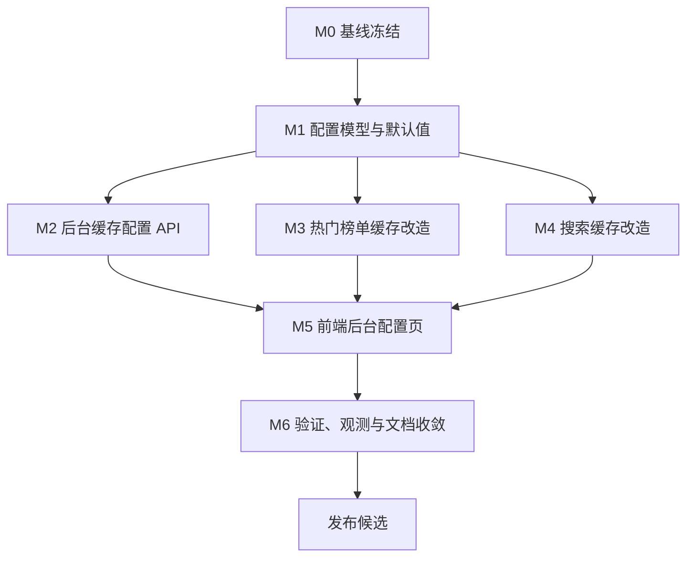

# 热门榜单与搜索缓存后台配置开发计划

> **给后续执行者：** 本计划基于 `docs/2026-06-13-hot-ranking-and-search-cache-plan.md` 制定。目标不是新增一套孤立配置系统，而是复用当前 `system_settings`、后台系统设置页、Redis 缓存封装和热门榜单服务，完成“后台可配置 + 环境变量兜底 + 本地可验证”的闭环。

**目标：** 将热门榜单缓存和搜索缓存从环境变量主导调整为后台配置优先。默认每天北京时间 00:00 预热热门榜单每个有效选项组合前 50 条到 Redis，保存 24 小时；用户搜索结果保存 1 小时；管理员可在后台配置缓存开关、TTL、预热时间、预热条数、写入队列、worker 数和预热并发。

**开发策略：** 先补配置模型与契约测试，再接入后端运行时配置读取，然后改造热门榜单预热与搜索缓存 key，最后补后台配置页面和本地验证报告。

**技术栈：** Go、Gin、GORM、Redis、React、TypeScript、Axios、Vitest、Testing Library、Tailwind CSS、pnpm。

---

## 1. 计划来源与当前基线

### 1.1 计划来源

- `docs/2026-06-13-hot-ranking-and-search-cache-plan.md`
- `backend/model/system_settings.go`
- `backend/service/system_settings_service.go`
- `backend/api/system_settings_handler.go`
- `backend/api/router_admin.go`
- `backend/service/search_cache.go`
- `backend/service/search_executor.go`
- `backend/service/hot_ranking_cache.go`
- `backend/service/hot_ranking_preloader.go`
- `backend/service/hot_ranking_service.go`
- `backend/util/cache/redis_cache.go`
- `backend/util/cache/cache_key.go`
- `backend/config/config.go`
- `frontend/src/pages/Admin.tsx`
- `frontend/src/components/admin/SystemSettingsView.tsx`
- `frontend/src/components/admin/SystemInfoView.tsx`
- `frontend/src/services/systemSettingsService.ts`

### 1.2 当前缓存链路

搜索缓存链路：

1. 用户请求 `/api/search`。
2. `SearchService` 归一化搜索参数。
3. TG 搜索和插件搜索分别生成 Redis key。
4. 未强制刷新时先读 Redis。
5. 未命中后执行真实搜索。
6. 搜索完成后通过异步队列写 Redis。

热门榜单缓存链路：

1. 用户请求 `/api/hot`。
2. `HotRankingService` 归一化并校验查询。
3. 仅第一页标准查询进入 Redis 缓存读写。
4. 未命中时请求 TMDB 并写入 Redis。
5. `HotRankingPreloader` 支持启动后和定时预热，但当前默认时间为 `10:00`，预热组合与缓存条数还未满足目标方案。

后台配置链路：

1. 后台已有 `system_settings` 单表。
2. 后台已有 `/admin/system-settings` 查询与更新接口。
3. 前端已有 `SystemSettingsView` 和 `SystemInfoView`。
4. 当前缓存配置主要来自环境变量和系统信息展示，还没有后台可编辑配置。

### 1.3 已有优点

- Redis 封装已支持 `SetWithTTL`、`DeleteByPattern`、连接失败降级。
- 搜索缓存写入已有异步队列和优雅关闭逻辑。
- 热门榜单 key 已包含模式、周期、分类、排序、时间、语言、地区等关键维度。
- 后台系统设置已有服务、接口、前端页面和测试基础。
- Docker Compose 已提供 Redis 7、AOF、`allkeys-lru` 淘汰策略。

### 1.4 主要问题

| 优先级 | 问题 | 影响 |
| --- | --- | --- |
| P0 | 缓存配置不能在后台修改 | 运营无法调整 TTL、预热时间、预热条数和缓存开关 |
| P0 | 热门榜单默认预热时间和 TTL 不符合目标方案 | 无法保证每天 0 点刷新并保存 24 小时 |
| P0 | 热门榜单预热组合未覆盖全部有效选项 | 部分热门页选项仍会冷启动请求 TMDB |
| P1 | 搜索缓存 key 未纳入频道集合和有效 `ext` | 不同请求可能共用同一缓存结果 |
| P1 | 搜索缓存 TTL 只来自 Redis 环境变量 | 后台调整无法即时生效 |
| P1 | 热门榜单调度器缺少配置热更新机制 | 后台修改预热时间后旧定时器可能继续运行 |
| P2 | 系统信息页只展示旧本地缓存配置 | 与实际 Redis 缓存策略不一致 |
| P2 | 缺少“立即预热”和“清理热门榜单缓存”操作 | 配置变更后无法快速回填缓存 |

---

## 2. 开发范围

### 2.1 范围内

- 扩展 `system_settings`，新增缓存配置字段。
- 为缓存配置提供后端读取、更新、校验和默认值合并逻辑。
- 新增或扩展管理员缓存配置接口。
- 后台系统设置页新增“缓存配置”分区。
- 系统信息页展示 Redis 缓存配置和热门榜单预热状态。
- 热门榜单预热默认调整为北京时间 00:00。
- 热门榜单预热覆盖 56 个有效组合。
- 热门榜单每个组合默认缓存前 50 条，TTL 24 小时。
- 搜索缓存默认 TTL 1 小时，并支持后台配置。
- 修正 TG 搜索和插件搜索缓存 key 维度。
- 提供“立即预热热门榜单”和“清理热门榜单缓存”后台操作。
- 补齐 Go 测试、Vitest 测试和本地验证文档。

### 2.2 范围外

- 不更换 Redis 客户端库。
- 不引入独立配置中心或新第三方依赖。
- 不重做后台整体布局。
- 不缓存搜索响应的前端展示视图。
- 不扩展热门榜单分页缓存到 `page > 1`。
- 不修改 TMDB 数据源选择策略。
- 不实现 Redis 集群、哨兵或多级分布式缓存。

---

## 3. 开发原则

- **后台配置优先**：数据库配置是运行时事实来源，环境变量只做首次默认值和兜底。
- **配置可回退**：后台配置异常时可恢复环境变量默认值。
- **小步可验证**：每个阶段先补测试，再改实现。
- **运行不中断**：Redis 不可用时继续实时查询，不阻断搜索和热门榜单主流程。
- **缓存键完整**：所有会影响搜索原始结果的维度必须进入缓存 key。
- **展示层过滤后置**：云盘类型、媒体类型等展示过滤不进入搜索缓存 key。
- **中文一致性**：新增文档、提示、测试描述、错误信息使用简体中文。

---

## 4. 文件责任图

### 4.1 后端配置模型与服务

- `backend/model/system_settings.go`：新增缓存配置字段。
- `backend/database/migration.go`：确认 `SystemSettings` 自动迁移覆盖新增字段。
- `backend/service/system_settings_service.go`：新增缓存配置读取、更新、校验、默认值合并。
- 建议新增 `backend/service/cache_config_service.go`：封装运行时缓存配置快照，避免业务层直接依赖系统设置细节。

### 4.2 后端缓存与热门榜单

- `backend/service/search_cache.go`：写入 Redis 时读取搜索缓存 TTL；保留异步队列。
- `backend/service/search_executor.go`：传入频道集合、插件集合和有效 `ext` 生成缓存 key。
- `backend/util/cache/cache_key.go`：扩展 TG 和插件缓存 key 生成函数。
- `backend/service/hot_ranking_cache.go`：读取后台配置的热门榜单 TTL。
- `backend/service/hot_ranking_preloader.go`：扩展任务组合、预热条数、并发、超时和调度时间。
- `backend/service/hot_ranking_service.go`：支持前 50 条缓存裁剪与请求兜底写入。
- `backend/cmd/bootstrap/server.go`：支持预热调度器按配置启动与配置变更后重建。

### 4.3 后端 API

- `backend/api/system_settings_handler.go`：新增缓存配置查询与更新处理。
- `backend/api/router_admin.go`：注册缓存配置、立即预热、清理缓存接口。
- `backend/api/admin_handler.go` 或独立 handler：系统信息返回 Redis 状态和缓存配置摘要。
- 建议接口：
  - `GET /api/admin/system-settings/cache`
  - `PUT /api/admin/system-settings/cache`
  - `POST /api/admin/system-settings/cache/hot-ranking/preload`
  - `DELETE /api/admin/system-settings/cache/hot-ranking`

### 4.4 前端后台页面

- `frontend/src/services/systemSettingsService.ts`：新增缓存配置 API 类型和请求方法。
- `frontend/src/components/admin/SystemSettingsView.tsx`：新增“缓存配置”表单分区。
- 建议新增 `frontend/src/components/admin/CacheSettingsPanel.tsx`：缓存配置表单、保存、重置、操作按钮。
- `frontend/src/components/admin/SystemInfoView.tsx`：展示 Redis 状态、搜索缓存 TTL、热门榜单预热状态。
- `frontend/src/pages/Admin.tsx`：保持当前系统设置入口，不额外新增一级后台页面，除非页面复杂度明显上升。

### 4.5 测试入口

- `backend/service/system_settings_service_test.go`：缓存配置默认值、更新、校验。
- `backend/service/hot_ranking_preloader_test.go`：预热组合、条数、TTL、调度时间。
- `backend/service/hot_ranking_cache_test.go`：TTL 和 key。
- `backend/service/search_cache_test.go`：搜索 TTL、队列、关闭。
- `backend/util/cache/cache_key_test.go`：频道集合和有效 `ext` key 维度。
- `backend/api/system_settings_handler_test.go`：管理员缓存配置接口。
- `frontend/src/components/admin/__tests__/SystemSettingsView.test.tsx`：缓存配置表单。
- 建议新增 `frontend/src/components/admin/__tests__/CacheSettingsPanel.test.tsx`。
- `frontend/src/components/admin/__tests__/SystemInfoView.test.tsx`：缓存配置展示。

---

## 5. 里程碑计划

| 里程碑 | 建议周期 | 目标 | 退出条件 |
| --- | --- | --- | --- |
| M0 基线冻结 | 0.5 天 | 固化当前缓存、后台设置和测试基线 | 当前测试结果记录完成，已识别未提交改动 |
| M1 配置模型与默认值 | 1 天 | `system_settings` 支持缓存字段，环境变量可初始化默认值 | 服务层配置测试通过 |
| M2 后台缓存配置 API | 1 天 | 管理员可查询和保存缓存配置 | 后端接口测试通过 |
| M3 热门榜单缓存改造 | 1.5 天 | 0 点预热、56 个组合、前 50 条、24 小时 TTL | 热门榜单服务与预热测试通过 |
| M4 搜索缓存改造 | 1 天 | 搜索 TTL 后台可配，缓存 key 维度完整 | 搜索缓存与 key 测试通过 |
| M5 前端后台配置页 | 1 到 1.5 天 | 管理员可在后台查看、修改、立即预热、清理缓存 | 前端组件测试通过 |
| M6 验证、观测与文档收敛 | 0.5 到 1 天 | 完成本地验证、报告和文档更新 | Go、pnpm 测试与验证报告通过 |

---

## 6. 任务依赖图



---

## 7. 阶段详细计划

### M0：基线冻结

**目标：** 记录当前缓存行为和后台设置能力，避免后续改造时无法判断回归。

**任务拆分：**

- [ ] M0.1 记录当前 Git 状态，识别已有未提交改动。
- [ ] M0.2 运行搜索缓存、热门榜单、系统设置相关 Go 测试。
- [ ] M0.3 运行后台系统设置、系统信息相关前端测试。
- [ ] M0.4 记录现有环境变量默认值和后台系统设置字段。

**本地命令：**

```bash
git status --short --branch
```

```bash
cd backend
go test ./service ./util/cache ./api -run 'Test.*Cache|TestHotRanking|TestSystemSettings' -count=1
```

```bash
cd frontend
pnpm test -- SystemSettingsView SystemInfoView
```

**退出条件：**

- 当前测试结果已记录。
- 已确认 `system_settings` 当前字段和缓存相关环境变量。
- 已确认本阶段不修改业务代码。

### M1：配置模型与默认值

**目标：** 建立后台可配置缓存项的数据契约，并保证默认行为与方案一致。

**任务拆分：**

- [x] M1.1 在 `SystemSettings` 增加缓存配置字段。
- [x] M1.2 在系统设置默认创建逻辑中填入默认值。
- [x] M1.3 新增缓存配置输入结构体和输出结构体。
- [x] M1.4 实现配置校验：TTL、预热时间、预热条数、并发、worker、队列长度。
- [x] M1.5 实现环境变量到数据库默认值的合并策略。
- [x] M1.6 明确配置上下限。

**建议字段上下限：**

| 配置项 | 最小值 | 最大值 |
| --- | --- | --- |
| `search_cache_ttl_seconds` | 60 | 86400 |
| `cache_write_queue_size` | 1 | 10000 |
| `cache_write_workers` | 1 | 64 |
| `hot_ranking_preload_limit` | 1 | 100 |
| `hot_ranking_cache_ttl_seconds` | 300 | 604800 |
| `hot_ranking_preload_concurrency` | 1 | 16 |
| `hot_ranking_preload_timeout_seconds` | 5 | 300 |

**测试要求：**

- 默认配置应为：热门榜单 00:00、50 条、24 小时；搜索缓存 1 小时。
- 非法时间格式应被拒绝。
- 非法 TTL、并发、条数应被拒绝。
- 部分字段更新不得覆盖未提交字段。

**退出条件：**

- `system_settings` 自动迁移可覆盖新增字段。
- 服务层测试通过。
- 默认值与方案文档一致。

### M2：后台缓存配置 API

**目标：** 管理员可以通过后端接口读取、保存和操作缓存配置。

**任务拆分：**

- [x] M2.1 新增 `GET /api/admin/system-settings/cache`。
- [x] M2.2 新增 `PUT /api/admin/system-settings/cache`。
- [x] M2.3 新增 `POST /api/admin/system-settings/cache/hot-ranking/preload`。
- [x] M2.4 新增 `DELETE /api/admin/system-settings/cache/hot-ranking`。
- [x] M2.5 返回 Redis 连接状态、配置来源、最近预热结果。
- [x] M2.6 统一错误响应文案。

**接口草案：**

```json
{
  "cache_enabled": true,
  "search_cache_ttl_seconds": 3600,
  "cache_write_queue_size": 256,
  "cache_write_workers": 4,
  "hot_ranking_cache_enabled": true,
  "hot_ranking_preload_enabled": true,
  "hot_ranking_preload_time": "00:00",
  "hot_ranking_preload_limit": 50,
  "hot_ranking_cache_ttl_seconds": 86400,
  "hot_ranking_preload_concurrency": 2,
  "hot_ranking_preload_timeout_seconds": 30
}
```

**测试要求：**

- 非管理员不能访问缓存配置接口。
- 空请求体或非法字段返回 400。
- 合法更新后再次查询能看到新值。
- 立即预热接口应调用预热服务。
- 清理接口应调用 Redis 前缀删除。

**退出条件：**

- 后端 API 测试通过。
- Swagger 或 README 如有接口说明需同步更新。

### M3：热门榜单缓存改造

**目标：** 热门榜单按后台配置进行预热、读取、写入和裁剪返回。

**任务拆分：**

- [x] M3.1 将预热时间默认调整为 `00:00`。
- [x] M3.2 扩展预热任务生成，覆盖 56 个有效组合。
- [x] M3.3 热门榜单预热使用后台配置的条数，默认 50。
- [x] M3.4 热门榜单写 Redis 使用后台配置 TTL，默认 24 小时。
- [x] M3.5 `page=1 && page_size<=limit` 时优先读取预热缓存并裁剪。
- [x] M3.6 配置变更后重建预热调度器。
- [x] M3.7 记录最近一次预热结果，供后台展示。

**测试要求：**

- 预热任务数量为 56。
- `trend` 不生成 `month/year` 任务。
- `popular` 生成 4 个周期、4 个分类、3 种排序。
- 预热写入条数为后台配置值。
- TTL 为后台配置值。
- `page_size=20` 可从 50 条缓存裁剪返回。
- Redis 不可用时不阻断实时查询。

**退出条件：**

- 热门榜单服务、缓存和预热测试通过。
- 默认行为符合 0 点、50 条、24 小时。

### M4：搜索缓存改造

**目标：** 用户搜索缓存默认 1 小时，并修正 key 维度避免串味。

**任务拆分：**

- [x] M4.1 搜索缓存写入支持自定义 TTL。
- [x] M4.2 搜索缓存读取后台配置中的 `search_cache_ttl_seconds`。
- [x] M4.3 TG 缓存 key 纳入频道集合。
- [x] M4.4 插件缓存 key 纳入实际插件集合和有效 `ext` 白名单字段。
- [x] M4.5 明确 `cloud_types`、展示过滤不进入缓存 key。
- [x] M4.6 保留 `forceRefresh=true` 跳过读缓存、完成后写缓存的行为。

**建议有效 `ext` 白名单：**

- `title_en`
- `sidhub_base_url`
- 后续新增字段必须显式登记，避免把调试字段或无关字段放大缓存碎片。

**测试要求：**

- 不同频道集合生成不同 TG key。
- 相同频道集合不同顺序生成相同 TG key。
- 不同有效 `ext` 生成不同插件 key。
- 无关 `ext` 字段不影响插件 key。
- 搜索缓存 TTL 默认 3600 秒。
- 后台调整 TTL 后新写入缓存使用新 TTL。

**退出条件：**

- 搜索缓存和 key 测试通过。
- 旧缓存通过版本号隔离，不污染新缓存。

### M5：前端后台配置页

**目标：** 管理员可以在后台完成缓存配置查看、修改、立即预热和清理缓存。

**任务拆分：**

- [x] M5.1 在 `systemSettingsService.ts` 增加缓存配置类型和 API 方法。
- [x] M5.2 新增 `CacheSettingsPanel` 或扩展 `SystemSettingsView`。
- [x] M5.3 表单支持缓存开关、搜索 TTL、热门榜单 TTL、预热时间、预热条数、并发、超时。
- [x] M5.4 增加“立即预热热门榜单”按钮。
- [x] M5.5 增加“清理热门榜单缓存”按钮和确认弹窗。
- [x] M5.6 `SystemInfoView` 展示 Redis 状态和当前缓存配置摘要。
- [x] M5.7 保存成功后刷新配置缓存并提示用户。

**交互要求：**

- 时间输入使用 `HH:mm`。
- TTL 展示用“秒/分钟/小时”辅助说明，提交仍使用秒。
- 危险操作需要二次确认。
- 保存失败时保留用户输入并展示后端错误。

**测试要求：**

- 首次进入后台能加载缓存配置。
- 修改字段后提交正确 payload。
- 非法输入阻止提交并显示提示。
- 立即预热按钮调用对应接口。
- 清理缓存按钮需要确认后调用接口。

**退出条件：**

- 前端后台配置测试通过。
- 页面视觉与现有后台设计一致。

### M6：验证、观测与文档收敛

**目标：** 完成本地验证闭环，确保开发计划可交付。

**任务拆分：**

- [x] M6.1 运行后端缓存相关测试。
- [x] M6.2 运行前端后台相关测试。
- [x] M6.3 运行本地质量脚本。
- [x] M6.4 更新 `.env.example` 和 `README.md` 中缓存配置说明。
- [x] M6.5 生成 `.Codex/verification-report.md`。
- [x] M6.6 在 `.Codex/operations-log.md` 记录验证命令与结果。

**本地命令：**

```bash
cd backend
go test ./service ./util/cache ./api ./database -count=1
```

```bash
cd frontend
pnpm test -- SystemSettingsView SystemInfoView CacheSettingsPanel
```

```bash
scripts/tests/local-quality.sh
```

**退出条件：**

- 本地测试全部通过。
- 验证报告评分达到通过标准。
- 文档、配置模板和用户可见文案均为简体中文。

---

## 8. 验收标准

- 默认配置下，热门榜单每日北京时间 00:00 自动预热。
- 默认预热覆盖 56 个有效榜单组合。
- 每个组合缓存前 50 条，Redis TTL 为 24 小时。
- 用户搜索结果缓存 TTL 为 1 小时。
- 管理员可在后台修改缓存开关、TTL、预热时间、预热条数、队列、worker 和预热并发。
- 后台保存配置后，新搜索请求使用新 TTL。
- 后台保存预热时间后，预热调度器使用新时间。
- 管理员可手动触发热门榜单立即预热。
- 管理员可清理热门榜单 Redis 缓存。
- 不同频道集合、不同有效 `ext` 不会共用同一搜索缓存 key。
- Redis 不可用时搜索和热门榜单实时路径仍可运行。

---

## 9. 风险与应对

| 风险 | 影响 | 应对 |
| --- | --- | --- |
| 后台配置误填 | 缓存过期过快、过慢或任务过多 | 后端设置上下限，前端同步校验 |
| 预热任务触发 TMDB 限流 | 热门榜单预热失败 | 控制并发，失败记录到后台状态，请求时兜底实时拉取 |
| 调度器重复启动 | 多个 0 点任务并行 | 配置变更时先取消旧调度器，再创建新调度器 |
| 搜索 key 维度过多 | Redis key 数量快速膨胀 | 只纳入影响原始搜索结果的白名单字段 |
| 搜索 key 维度不足 | 缓存串味 | 覆盖频道集合、插件集合、有效 `ext` 测试 |
| Redis 内存压力增加 | 热点缓存被淘汰 | 固定热门榜单 50 条，搜索 TTL 1 小时，继续依赖 LRU |
| 前端配置与后端默认值漂移 | 用户看到的配置不真实 | 前端只展示后端返回值，不硬编码默认配置 |

---

## 10. 回滚方案

1. 关闭后台缓存总开关，停止读写 Redis 缓存。
2. 清空新增后台缓存配置字段，让系统回落到环境变量默认值。
3. 将 `HOT_RANKING_PRELOAD_ENABLED=false`，暂停热门榜单预热。
4. 将搜索缓存 TTL 恢复为 `REDIS_TTL=3600`。
5. 如缓存 key 改造出现异常，提升缓存版本号隔离旧数据并临时关闭读缓存。
6. 前端后台配置页可临时隐藏缓存配置分区，不影响后端实时查询路径。

---

## 11. 交付清单

- 后端模型、服务、API、缓存逻辑改造。
- 前端后台缓存配置页面与系统信息展示。
- `.env.example` 与 README 缓存配置说明。
- Go 单元测试和接口测试。
- Vitest 组件与服务测试。
- `.Codex/operations-log.md` 操作记录。
- `.Codex/verification-report.md` 验证报告。

---

## 12. 结论

本开发计划将缓存能力拆为“配置模型、后台接口、热门榜单预热、搜索缓存、前端管理、验证收敛”六条主线。实施后，默认策略满足热门榜单 0 点预热、前 50 条、24 小时保存，以及搜索结果 1 小时缓存；同时管理员可以在后台调整关键参数，环境变量只作为兜底配置，整体更适合后续运营和维护。
