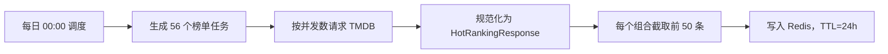
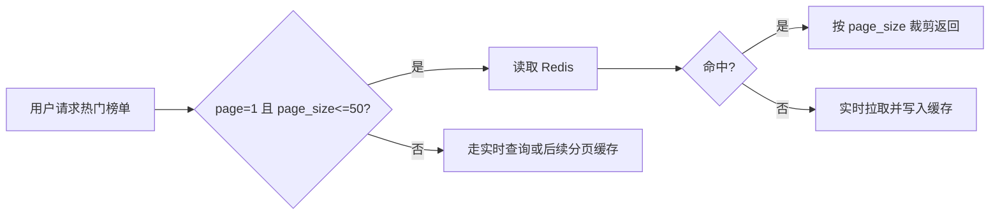
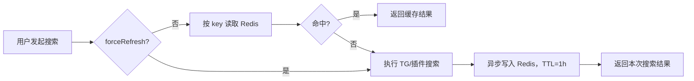
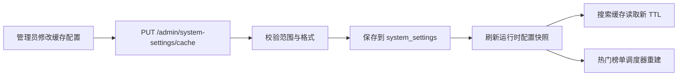

# 热门榜单与搜索缓存方案

生成时间：2026-06-13

## 1. 背景

当前项目已经具备 Redis 搜索缓存、热门榜单缓存、插件内存缓存和前端短 TTL 缓存。现阶段需要把两个核心策略固定为明确契约：

1. 热门榜单默认每天 0 点将每个可选榜单组合的前 50 条数据写入 Redis，缓存 24 小时。
2. 用户每次搜索后的搜索内容写入 Redis，缓存 1 小时。
3. 缓存策略必须支持在后台管理页面配置，环境变量只作为部署默认值和兜底来源。

本方案只描述落地设计，不改变现有接口语义；代码实现时应保持本地可验证。

## 2. 目标

- 热门榜单接口默认优先命中 Redis，避免首页和热门页在高峰期重复请求 TMDB。
- 每天北京时间 00:00 自动刷新热门榜单缓存，保证当天首次访问也尽量命中缓存。
- 热门榜单缓存固定保存前 50 条，满足首页、热门页默认展示和快速搜索入口需求。
- 搜索结果缓存统一保存 1 小时，覆盖 TG 搜索和插件搜索结果。
- 管理员可在后台调整缓存开关、TTL、预热时间、预热条数、写入队列和并发参数。
- Redis 不可用时保持现有降级能力：服务继续运行，只是不使用缓存。

## 3. 范围

### 3.1 热门榜单缓存范围

热门榜单查询模型包含以下维度：

- 模式：`trend`、`popular`
- 周期：`day`、`week`、`month`、`year`
- 分类：`all`、`movie`、`tv`、`anime`
- 排序：`popularity.desc`、`primary_release_date.desc`、`vote_average.desc`

由于当前模型约束中 `trend` 只支持 `day` 和 `week`，因此预热组合分为两组：

- 趋势榜：`trend` × `day/week` × `all/movie/tv/anime`
- 热门榜：`popular` × `day/week/month/year` × `all/movie/tv/anime` × `popularity.desc/primary_release_date.desc/vote_average.desc`

总预热任务数：

- 趋势榜：2 × 4 = 8
- 热门榜：4 × 4 × 3 = 48
- 合计：56 个缓存任务

### 3.2 搜索缓存范围

搜索缓存覆盖当前后端服务层的两类搜索：

- TG 搜索结果缓存：`tg:search:{hash}`
- 插件搜索结果缓存：`plugin:search:{hash}`

缓存内容应是服务层可复用的原始搜索结果集合，而不是前端展示后的局部视图；前端筛选、云盘类型过滤和展示排序仍由响应构建阶段处理。

## 4. 缓存策略

### 4.1 热门榜单 Redis 缓存

默认缓存参数：

- 预热时间：每天北京时间 `00:00`
- 缓存条数：每个组合前 `50` 条
- 缓存 TTL：`24h`
- 缓存页码：只缓存 `page=1`
- 缓存键版本：继续使用 `hot-ranking:v2`

建议新增或调整配置：

```env
HOT_RANKING_PRELOAD_ENABLED=true
HOT_RANKING_PRELOAD_TIME=00:00
HOT_RANKING_PRELOAD_LIMIT=50
HOT_RANKING_CACHE_TTL=24h
```

兼容策略：

- 如果继续保留现有分周期 TTL 配置，应将默认值统一调整为 `24h`。
- 如果引入 `HOT_RANKING_CACHE_TTL`，它应优先于 `HOT_RANKING_CACHE_TTL_DAY/WEEK/MONTH/YEAR`。
- `page_size <= 50` 的第一页请求直接从前 50 条缓存裁剪返回。
- `page_size > 50` 或 `page > 1` 的请求不使用默认预热缓存，按实时请求或后续扩展分页缓存处理。

### 4.2 搜索结果 Redis 缓存

默认缓存参数：

- 缓存 TTL：`1h`
- 配置来源：`REDIS_TTL=3600`
- 缓存写入：保持异步写队列，避免搜索请求等待 Redis 写入完成。
- 强制刷新：当请求携带刷新参数时跳过读缓存，但搜索完成后仍写入新缓存。

建议配置：

```env
REDIS_TTL=3600
CACHE_WRITE_QUEUE_SIZE=256
CACHE_WRITE_WORKERS=4
```

建议 key 维度修正：

- TG 搜索 key 应包含标准化关键词和频道集合，避免不同频道组合命中同一缓存。
- 插件搜索 key 应包含标准化关键词、实际插件集合，以及会影响抓取结果的 `ext` 白名单字段。
- 云盘类型、媒体类型等纯展示层过滤不进入搜索缓存 key，继续在响应构建阶段处理。

### 4.3 后台可配置缓存项

缓存配置应纳入现有后台系统设置能力，复用 `system_settings` 和 `/admin/system-settings` 管理入口。环境变量继续提供部署默认值；数据库配置一旦存在，应优先生效。

建议新增后台配置字段：

| 字段 | 类型 | 默认值 | 说明 |
| --- | --- | --- | --- |
| `cache_enabled` | bool | `true` | 搜索与热门榜单 Redis 缓存总开关 |
| `search_cache_ttl_seconds` | int | `3600` | 用户搜索结果缓存 TTL，默认 1 小时 |
| `cache_write_queue_size` | int | `256` | 搜索缓存异步写队列长度 |
| `cache_write_workers` | int | `4` | 搜索缓存异步写 worker 数 |
| `hot_ranking_cache_enabled` | bool | `true` | 热门榜单缓存开关 |
| `hot_ranking_preload_enabled` | bool | `true` | 热门榜单每日预热开关 |
| `hot_ranking_preload_time` | string | `00:00` | 每日预热时间，北京时间，格式 `HH:mm` |
| `hot_ranking_preload_limit` | int | `50` | 每个榜单组合预热并缓存的条数 |
| `hot_ranking_cache_ttl_seconds` | int | `86400` | 热门榜单缓存 TTL，默认 24 小时 |
| `hot_ranking_preload_concurrency` | int | `2` | 热门榜单预热并发数 |
| `hot_ranking_preload_timeout_seconds` | int | `30` | 单个预热任务超时时间 |

配置优先级：

1. 数据库后台配置：管理员保存后的运行配置，优先生效。
2. 环境变量：首次启动和未配置字段的默认值来源。
3. 代码默认值：环境变量缺失或非法时的最后兜底。

运行时生效策略：

- TTL、队列长度、worker 数、新搜索请求读取配置时应即时生效。
- 预热时间和预热开关变更后，应重建预热调度器，避免继续使用旧定时器。
- 热门榜单预热条数变更后，下一次预热生效；管理员可提供“立即预热”按钮主动刷新。
- 关闭缓存总开关时不删除 Redis 现有数据，只停止读写；重新开启后自然按 TTL 使用或过期。

后台页面建议：

- 在“系统设置”中新增“缓存配置”分区，和现有 TMDB 配置、登录注册配置并列。
- 展示 Redis 连接状态、最近一次热门榜单预热时间、成功任务数、失败任务数。
- 提供“立即预热热门榜单”和“清理热门榜单缓存”两个操作按钮。
- 对危险操作弹出确认，例如清理缓存和关闭缓存总开关。

## 5. 数据流

### 5.1 热门榜单预热



### 5.2 热门榜单访问



### 5.3 搜索访问



### 5.4 后台配置生效



## 6. 实施计划

### 阶段一：配置模型与契约收敛

1. 在 `system_settings` 增加缓存配置字段，并提供数据库迁移。
2. 将 `HOT_RANKING_PRELOAD_TIME` 默认值从 `10:00` 调整为 `00:00`。
3. 新增 `HOT_RANKING_PRELOAD_LIMIT=50`，用于控制预热写入条数。
4. 新增 `HOT_RANKING_CACHE_TTL=24h`，作为热门榜单统一 TTL。
5. 保持 `REDIS_TTL=3600`，明确搜索缓存 TTL 为 1 小时。
6. 明确数据库配置优先于环境变量，环境变量作为首次默认值。

### 阶段二：后台接口与前端配置页

1. 新增管理员缓存配置查询接口，返回当前配置、来源和 Redis 状态。
2. 新增管理员缓存配置更新接口，校验 TTL、时间格式、并发范围和预热条数。
3. 前端后台新增“缓存配置”表单，支持修改并保存配置。
4. 前端后台新增“立即预热”和“清理热门榜单缓存”操作入口。

### 阶段三：热门榜单预热改造

1. 扩展预热任务生成逻辑，覆盖 56 个有效组合。
2. 预热查询固定使用 `page=1` 和后台配置的 `hot_ranking_preload_limit`。
3. 写 Redis 时使用后台配置的热门榜单 TTL，默认 `24h`。
4. 配置变更后重建调度器，确保 0 点预热时间可后台调整。
5. 启动预热可以保留，但每日 0 点预热是默认权威刷新路径。

### 阶段四：搜索缓存 key 与 TTL 修正

1. TG 搜索缓存 key 纳入频道集合。
2. 插件搜索缓存 key 纳入影响抓取结果的 `ext` 白名单字段。
3. 搜索缓存写入时读取后台配置 TTL，默认 1 小时。
4. 保持展示层过滤不参与搜索缓存 key，避免缓存碎片过多。

### 阶段五：验证与观测

1. 增加热门榜单预热任务数量测试，断言生成 56 个任务。
2. 增加热门榜单 TTL 测试，断言默认 TTL 为 24 小时。
3. 增加 `page_size<=50` 命中缓存并裁剪返回的测试。
4. 增加搜索缓存 TTL 测试，断言 `REDIS_TTL=3600` 时写入 TTL 为 1 小时。
5. 增加搜索 key 维度测试，断言不同频道集合、不同有效 `ext` 不会共用同一 key。
6. 增加后台缓存配置接口测试，断言非法 TTL、非法时间、非法并发被拒绝。
7. 增加前端后台表单测试，断言配置回显、保存和错误提示符合预期。

## 7. 验收标准

- 默认配置下，热门榜单每日北京时间 00:00 开始刷新。
- Redis 中每个热门榜单组合保存前 50 条，TTL 为 24 小时。
- 默认预热任务覆盖 56 个有效组合。
- 搜索结果 Redis 缓存 TTL 为 1 小时。
- 管理员可在后台修改缓存开关、搜索缓存 TTL、热门榜单预热时间、预热条数和热门榜单 TTL。
- 后台配置保存后，新请求使用新 TTL；预热调度使用新时间。
- `forceRefresh=true` 时跳过读缓存并写入新缓存。
- Redis 不可用时服务可继续运行，热门榜单和搜索走实时路径。

## 8. 风险与处理

- 预热任务过多导致 TMDB 限流：通过 `HOT_RANKING_PRELOAD_CONCURRENCY` 控制并发，默认保持较低并发。
- Redis 内存占用增加：热门榜单固定前 50 条，搜索缓存 1 小时，并依赖 Redis `allkeys-lru` 淘汰策略。
- 缓存 key 维度不足导致串味：实施阶段必须补齐频道集合和影响抓取结果的 `ext` 字段。
- 0 点预热失败导致冷启动：保留请求时回填缓存能力，未命中时实时拉取并写入 Redis。
- 后台配置被误填导致缓存异常：所有数值配置必须设置上下限，保存前校验，保存失败时保留旧配置。
- 调度器配置热更新复杂：配置更新后采用取消旧调度器并创建新调度器的方式，避免多个定时器并行。

## 9. 回滚方案

1. 将 `HOT_RANKING_PRELOAD_TIME` 恢复为旧值或关闭 `HOT_RANKING_PRELOAD_ENABLED`。
2. 将热门榜单 TTL 配置恢复为分周期 TTL。
3. 将 `HOT_RANKING_PRELOAD_LIMIT` 提高到旧默认页大小，或临时回到实时查询。
4. 搜索缓存如出现异常，可将 `CACHE_ENABLED=false` 暂时关闭服务层缓存。
5. 后台配置异常时，可清空数据库缓存配置字段，让系统回落到环境变量默认值。

## 10. 结论

该方案将热门榜单缓存从“按请求被动缓存”升级为“每天 0 点主动预热 + 请求兜底回填”，并保持搜索缓存 1 小时的轻量策略。缓存参数由后台配置优先生效、环境变量兜底，管理员可以在运行期调整缓存开关、TTL、预热时间和预热规模。整体改造范围集中在配置模型、后台接口、前端配置页、热门榜单预热任务生成、缓存 TTL 解析和搜索 key 维度修正，风险可控且易于本地验证。
