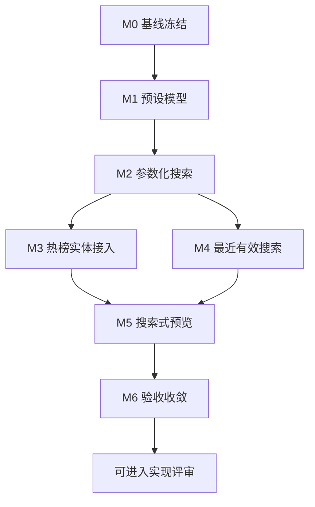

# 搜索启动台精准化优化开发计划

> **目标：** 将搜索页空关键词状态下的“搜索启动台”从泛关键词入口升级为“搜索意图启动器”，让用户在未输入明确关键词时也能通过热榜实体、搜索模板、最近有效搜索和筛选预设发起更精准的聚合搜索。

生成时间：2026-06-14 15:23:08 CST

## 1. 背景

当前搜索页在未输入关键词时展示“搜索启动台”，视觉层面已经具备清晰入口，但内容策略偏概括：

- 推荐关键词主要是 `4K`、`剧集`、`动漫`、`教程`、`软件`、`AI` 等单词级线索。
- 通用线索包含 `电影`、`纪录片`、`前端教程`、`效率工具`、`设计素材`、`音乐合集` 等宽泛词。
- 用户点击后直接以单个关键词进入全源聚合搜索，容易产生大量泛结果。

代码基线：

- 启动台静态线索位于 `frontend/src/components/search/SearchEmptyWorkbench.tsx`。
- 搜索页点击入口由 `frontend/src/pages/SearchPage.tsx` 的 `handleQuickSearch` 处理。
- 搜索参数类型已支持 `cloudTypes`、`source`、`resultType` 和 `filter`。
- 热门榜单已有 `SearchService.buildTrendingSearchActions`，可生成片名、原名、4K、合集等动作。
- 结果页已有统一筛选卡 `SearchUnifiedFilterCard`，可承接启动台发起的筛选上下文。

因此，本次优化的核心不是增加更多关键词，而是让每个入口都能表达明确搜索意图：搜什么实体、限定什么资源形态、优先哪些网盘、排除哪些噪音。

## 2. 当前问题

| 优先级 | 问题 | 影响 |
| --- | --- | --- |
| P0 | 启动台入口只传单个关键词 | 无法携带网盘类型、包含词、排除词、媒体类型等约束 |
| P0 | 推荐词过于概括 | 搜索结果覆盖面过大，用户需要二次筛选 |
| P1 | 未复用热门榜单实体 | 用户没有真实片名、剧名、动漫名可直接搜索 |
| P1 | 最近搜索只恢复关键词 | 无法恢复上次成功搜索的筛选上下文 |
| P1 | 启动台文案提示“宽泛线索开始” | 产品策略默认鼓励泛搜，而不是精准搜 |
| P2 | 缺少搜索式预览 | 用户点击前不知道即将搜索哪些条件 |
| P2 | 缺少结果质量反馈闭环 | 无法判断哪些启动台入口真正有效 |

## 3. 开发目标

- 将“推荐关键词”改为“精准搜索模板”，默认减少孤立泛词。
- 支持启动台入口携带完整 `SearchParams`，而不是只携带 `keyword`。
- 接入热门榜单实体，展示真实资源标题并提供可执行搜索动作。
- 将最近搜索升级为最近有效搜索，恢复关键词、网盘筛选和高级筛选条件。
- 增加搜索式预览，让用户在触发前看到将使用的关键词和筛选条件。
- 保持现有结果页筛选、登录跳转、URL 同步和搜索历史能力不被破坏。
- 补齐前端单元测试，覆盖启动台精准模板、热榜入口、历史恢复和匿名登录保留意图。

## 4. 范围

### 4.1 范围内

- 重构 `SearchEmptyWorkbench` 的数据结构和展示内容。
- 新增搜索启动台预设类型，例如 `SearchLaunchPreset`。
- 调整 `SearchPage` 中启动台点击处理函数，支持完整搜索参数。
- 复用热门榜单接口，为启动台提供真实实体线索。
- 复用 `SearchService.buildTrendingSearchActions` 生成热榜实体搜索动作。
- 扩展搜索历史结构，保存最近有效搜索的关键上下文。
- 新增或更新启动台相关测试。
- 更新必要的中文文案、测试描述和开发记录。

### 4.2 范围外

- 不改造搜索后端插件抓取逻辑。
- 不调整搜索结果排序算法。
- 不新增新的 UI 组件库。
- 不重做首页搜索框。
- 不改变登录权限策略。
- 不改造热门榜单页面主体能力。
- 不引入外部推荐系统或个性化算法。

## 5. 产品设计方案

### 5.1 信息架构调整

建议将启动台从当前的三块内容调整为四块：

1. **最近有效搜索**
   - 展示上次搜索词、命中结果数、命中的网盘类型。
   - 点击后恢复完整搜索参数。

2. **热榜直搜**
   - 展示来自热门榜单的真实影视条目。
   - 每个条目提供 `搜片名`、`搜 4K`、`搜合集`、`搜原名` 等动作。

3. **精准模板**
   - 按场景提供可编辑模板，而不是静态泛词。
   - 例如：`片名 + 4K`、`剧名 + S01`、`考试名 + 真题`、`软件名 + Mac`。

4. **高级入口**
   - 提供“只搜夸克”“只搜阿里”“包含 4K”“排除 预告/枪版”等一键条件。
   - 用户可先选择条件，再点击搜索。

### 5.2 推荐内容策略

#### 影视娱乐

将 `4K`、`剧集`、`动漫` 改为模板化入口：

- `热榜片名 + 4K`
- `热榜片名 + 合集`
- `热榜剧名 + S01`
- `热榜动漫名 + 简中`
- `片名 + 国语中字`

建议默认排除词：

- `预告`
- `花絮`
- `枪版`
- `TC`

建议默认网盘偏好：

- 夸克
- 阿里
- 百度

#### 学习资料

将 `教程`、`考研`、`网课` 改为模板化入口：

- `课程名 + 完整版`
- `考试名 + 真题`
- `教材名 + PDF`
- `技术栈 + 项目实战`
- `讲师名 + 课程`

建议默认包含词：

- `完整版`
- `资料`
- `PDF`
- `课件`

#### 实用软件

将 `软件`、`AI`、`源码` 改为模板化入口：

- `软件名 + Mac`
- `软件名 + Win`
- `插件名 + 教程`
- `项目名 + 源码`
- `模型名 + 部署`

建议默认排除词：

- `广告`
- `失效`
- `试用`

## 6. 技术设计方案

### 6.1 新增启动台预设类型

建议新增文件：

- `frontend/src/components/search/searchLaunchpadPresets.ts`
- `frontend/src/components/search/searchLaunchpadTypes.ts`

建议类型：

```ts
import type { SearchParams } from "@/types/search";

export interface SearchLaunchPreset {
  id: string;
  title: string;
  description: string;
  category: "recent" | "trending" | "media" | "learning" | "software";
  params: SearchParams;
  labels?: string[];
  resultHint?: string;
}
```

设计约束：

- `params.keyword` 必须非空。
- `params.cloudTypes` 可选，用于表达网盘偏好。
- `params.filter.include` 和 `params.filter.exclude` 用于表达结果收敛条件。
- 预设对象必须不可变，点击时创建新的 `SearchParams` 对象。

### 6.2 调整启动台点击接口

当前接口：

```ts
onKeywordSearch: (keyword: string) => void;
```

建议调整为：

```ts
onPresetSearch: (preset: SearchLaunchPreset) => void;
onKeywordSearch?: (keyword: string) => void;
```

迁移策略：

- 第一阶段保留 `onKeywordSearch` 兼容最近搜索旧数据。
- 第二阶段统一用 `onPresetSearch`。
- 测试全部迁移后再删除旧入口。

### 6.3 调整搜索页参数生成

当前 `handleQuickSearch` 会清空筛选条件。优化后应由预设决定是否清空或带入：

```ts
const nextParams = {
  ...emptySearchDefaults,
  ...preset.params,
  keyword: preset.params.keyword.trim(),
};
```

要求：

- 新关键词搜索默认不继承上一轮筛选，避免旧筛选污染。
- 预设显式提供的 `cloudTypes` 和 `filter` 必须保留。
- 匿名用户跳转登录时，`pendingSearch` 需要保存完整预设参数，而不是只保存关键词。
- URL 同步必须继续使用 `SearchService.buildSearchUrl`。

### 6.4 复用热门榜单实体

启动台可请求热门榜单第一页，例如：

- `mode=trend`
- `period=day`
- `category=all`
- `page_size=6`

处理策略：

- 加载中展示骨架屏。
- 请求失败时回退到本地精准模板。
- 热榜条目使用 `SearchService.buildTrendingSearchActions` 生成动作。
- 每个动作映射为 `SearchLaunchPreset`。

### 6.5 最近有效搜索结构

当前搜索历史只保存关键词。建议新增本地快照结构：

```ts
export interface RecentEffectiveSearch {
  id: string;
  keyword: string;
  params: SearchParams;
  total: number;
  cloudTypes: string[];
  searchedAt: string;
}
```

写入条件：

- 搜索完成。
- `keyword` 非空。
- `total > 0`。
- 最多保留 5 条。

展示文案：

- `沙丘 2 4K`
- `18 条结果 · 夸克 / 阿里`

### 6.6 搜索式预览

建议在启动台顶部增加可编辑预览行：

- 当前关键词：`沙丘 2 4K`
- 网盘：`夸克、阿里`
- 包含：`4K`
- 排除：`预告、枪版`

交互策略：

- 用户点击某个模板后，先写入预览态。
- 点击“按此条件搜索”后真正执行搜索。
- 对最近有效搜索可允许一键直接搜索，减少重复操作。

## 7. 文件责任图

### 7.1 前端页面与组件

- `frontend/src/pages/SearchPage.tsx`：搜索启动台参数编排、登录跳转、URL 同步。
- `frontend/src/components/search/SearchEmptyWorkbench.tsx`：启动台主体布局和交互。
- `frontend/src/components/SearchBox.tsx`：保持搜索框行为不变。
- `frontend/src/components/SearchUnifiedFilterCard.tsx`：承接启动台传入的筛选条件。
- 建议新增 `frontend/src/components/search/SearchLaunchPresetCard.tsx`：预设卡片组件。
- 建议新增 `frontend/src/components/search/SearchLaunchPreview.tsx`：搜索式预览组件。
- 建议新增 `frontend/src/components/search/searchLaunchpadPresets.ts`：本地精准模板。
- 建议新增 `frontend/src/components/search/searchLaunchpadTypes.ts`：启动台类型。

### 7.2 前端服务、状态与工具

- `frontend/src/services/hotRankingService.ts`：获取热榜实体。
- `frontend/src/services/searchService.ts`：复用热榜搜索动作和 URL 构建。
- `frontend/src/stores/searchStore.ts`：搜索历史和最近有效搜索写入。
- `frontend/src/types/search.ts`：搜索参数契约。
- `frontend/src/utils/searchFilters.ts`：筛选条件规范化。

### 7.3 测试入口

- `frontend/src/pages/__tests__/SearchPage.test.tsx`
- `frontend/src/components/__tests__/SearchBox.test.tsx`
- `frontend/src/services/__tests__/searchService.test.ts`
- `frontend/src/stores/__tests__/searchStore.test.ts`
- 建议新增 `frontend/src/components/search/__tests__/SearchEmptyWorkbench.test.tsx`

## 8. 里程碑计划

| 里程碑 | 建议周期 | 目标 | 退出条件 |
| --- | --- | --- | --- |
| M0 基线冻结 | 0.5 天 | 固化现有启动台行为和测试基线 | 当前相关测试可重复运行 |
| M1 预设模型 | 0.5 天 | 定义 `SearchLaunchPreset` 与本地精准模板 | 类型测试和模板快照测试通过 |
| M2 参数化搜索 | 1 天 | 启动台支持完整 `SearchParams` | 点击预设能携带筛选条件搜索 |
| M3 热榜实体接入 | 1 天 | 启动台展示真实热榜条目 | 热榜加载、失败回退和动作测试通过 |
| M4 最近有效搜索 | 1 天 | 保存并恢复有效搜索上下文 | 搜索完成写入、点击恢复测试通过 |
| M5 搜索式预览 | 1 天 | 用户可先确认搜索条件再执行 | 预览编辑和执行测试通过 |
| M6 验收收敛 | 0.5 天 | 完成视觉、无障碍和本地验证 | 测试、构建、验证报告通过 |

## 9. 阶段详细计划

### M0：基线冻结

**目标：** 明确当前行为，避免优化过程中破坏搜索页主流程。

任务：

- [x] 记录当前 Git 状态。
- [x] 运行搜索页、搜索框、搜索服务和搜索状态测试。
- [x] 记录当前启动台文案和点击行为。
- [x] 确认匿名用户点击启动台后仍能跳转登录并保留搜索意图。

本地命令：

```bash
cd frontend
pnpm test -- SearchPage SearchBox searchService searchStore
```

### M1：预设模型

**目标：** 建立启动台搜索意图的数据结构。

任务：

- [x] 新增 `searchLaunchpadTypes.ts`。
- [x] 新增 `searchLaunchpadPresets.ts`。
- [x] 将泛词替换为模板化预设。
- [x] 为预设生成函数补充测试。

验收：

- 每个预设都能生成非空 `keyword`。
- 每个预设的 `filter` 经过规范化后仍合法。
- 不再默认展示单独的 `4K`、`剧集`、`软件` 作为主入口。

### M2：参数化搜索

**目标：** 启动台点击支持完整搜索参数。

任务：

- [x] 将 `SearchEmptyWorkbench` 的点击回调升级为 `onPresetSearch`。
- [x] 调整 `SearchPage` 的启动台处理逻辑。
- [x] 匿名登录跳转保存完整 `pendingSearch`。
- [x] URL 同步保留 `cloudTypes` 和 `filter`。

验收：

- 点击“热榜片名 + 4K”后，搜索关键词包含片名和 `4K`。
- 点击“只搜夸克”类入口后，`cloudTypes` 包含 `quark`。
- 点击带排除词入口后，`filter.exclude` 被保留。

### M3：热榜实体接入

**目标：** 让启动台展示真实资源实体，而不是只展示抽象分类。

任务：

- [x] 调用 `hotRankingService.getHotRankings` 获取热榜数据。
- [x] 取前 6 个有效条目生成热榜直搜卡。
- [x] 复用 `SearchService.buildTrendingSearchActions` 生成动作。
- [x] 增加加载中、空数据和失败回退状态。

验收：

- 热榜成功时展示真实片名或剧名。
- 热榜失败时仍展示本地精准模板。
- 热榜动作点击后能携带 `fromTrending` 或等价来源信息。

### M4：最近有效搜索

**目标：** 让最近搜索恢复有效上下文，而不是只恢复关键词。

任务：

- [x] 扩展搜索状态，新增最近有效搜索快照。
- [x] 搜索完成且结果数大于 0 时写入快照。
- [x] 启动台展示结果数和命中网盘类型。
- [x] 点击最近有效搜索恢复完整 `SearchParams`。
- [x] 支持单条删除最近有效搜索。
- [x] 支持一键清空最近有效搜索。

验收：

- 无结果搜索不写入最近有效搜索。
- 重复关键词更新到最新位置。
- 最多保留 5 条。
- 点击历史项后恢复关键词、网盘类型和筛选条件。
- 单条删除与一键清空只管理记录，不触发搜索恢复。

### M5：搜索式预览

**目标：** 降低误搜成本，让用户先看条件再执行。

任务：

- [ ] 新增 `SearchLaunchPreview`。
- [ ] 模板点击先写入预览态。
- [ ] 支持清除预览。
- [ ] 支持执行预览搜索。

验收：

- 预览区展示关键词、网盘、包含词、排除词。
- 用户可以清除预览并回到默认启动台。
- 执行后搜索参数和 URL 一致。

### M6：验收收敛

**目标：** 完成本地验证和交付说明。

任务：

- [x] 运行相关前端测试。
- [x] 运行前端构建。
- [x] 检查中文文案和无障碍标签。
- [x] 更新 `.Codex/operations-log.md` 和 `.Codex/verification-report.md`。

本地命令：

```bash
cd frontend
pnpm test -- SearchPage SearchBox searchService searchStore SearchEmptyWorkbench
```

```bash
cd frontend
pnpm build
```

### M6.1：隐藏媒体筛选修复

**目标：** 去掉启动台默认注入的隐藏 `mediaTypes`，避免用户在筛选面板无入口时被过窄条件卡住。

任务：

- [x] 移除精准模板默认注入的 `filter.mediaTypes`。
- [x] 移除热榜直搜默认注入的 `filter.mediaTypes`。
- [x] 保留 `include` / `exclude` 收敛词，避免结果再次泛化。
- [x] 让已生效但 facet 未返回的媒体类型仍可在高级筛选中看到并清理。
- [x] 更新搜索页与统一筛选卡相关测试。

验收：

- 启动台点击后地址中不再自动带入 `mediaTypes`。
- 老链接或旧状态里若仍存在 `mediaTypes`，用户可以在高级筛选中看到并移除。
- 顶部已生效条件中的媒体标签显示中文，而不是 `movie`、`tv` 这类原始值。

## 10. 验收标准

### 10.1 功能验收

- 无关键词搜索页仍展示启动台。
- 启动台默认入口不再以孤立泛词为主。
- 热榜实体可直接触发片名、原名、4K、合集搜索。
- 启动台预设可携带 `cloudTypes` 和 `filter`。
- 最近有效搜索可恢复完整上下文。
- 匿名用户触发启动台搜索后仍跳转登录，并保留搜索意图。
- 搜索页结果筛选卡能正确展示启动台带入的条件。

### 10.2 体验验收

- 用户能在首屏理解每个入口会搜什么。
- 每个入口都有明确场景，不再只给抽象名词。
- 搜索式预览不遮挡搜索框和结果入口。
- 移动端按钮文本不溢出。
- 加载、失败、空状态都有可继续操作的入口。

### 10.3 测试验收

- 搜索页测试覆盖启动台新结构。
- 搜索状态测试覆盖最近有效搜索写入和恢复。
- 搜索服务测试继续覆盖热榜动作去重。
- 热榜失败回退测试通过。
- 构建通过。

## 11. 风险与应对

| 风险 | 影响 | 应对 |
| --- | --- | --- |
| 热榜接口加载慢 | 启动台首屏延迟 | 使用骨架屏和本地模板回退 |
| 预设条件过强导致结果少 | 用户误以为无资源 | 提供“放宽条件再搜”入口 |
| 历史结构变更影响旧数据 | 旧用户历史不可用 | 兼容旧字符串历史并迁移为基础预设 |
| URL 参数过长 | 分享链接复杂 | 只序列化必要筛选字段 |
| 入口过多造成视觉负担 | 用户选择困难 | 首屏只展示高置信入口，更多模板折叠 |

## 12. 回滚方案

- 保留旧 `onKeywordSearch` 入口一个版本周期。
- 如果热榜接入异常，可关闭热榜直搜区，仅保留本地精准模板。
- 如果最近有效搜索出现兼容问题，可只读取旧 `searchHistory`。
- 如果搜索式预览影响转化，可回退为点击即搜，但保留预设参数。

## 13. 任务依赖图



## 14. 建议实施顺序

推荐先做 M1 和 M2，因为这两步能直接解决“泛词直接全源搜索”的核心问题；M3 到 M5 属于质量提升和体验增强，可分批上线。

首批最小可交付范围：

- 新增 `SearchLaunchPreset`。
- 替换泛词为精准模板。
- 启动台点击携带完整 `SearchParams`。
- 更新 `SearchPage.test.tsx`。

首批完成后，即使不接入热榜，也能明显降低泛结果比例。
