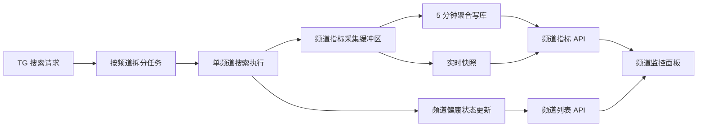
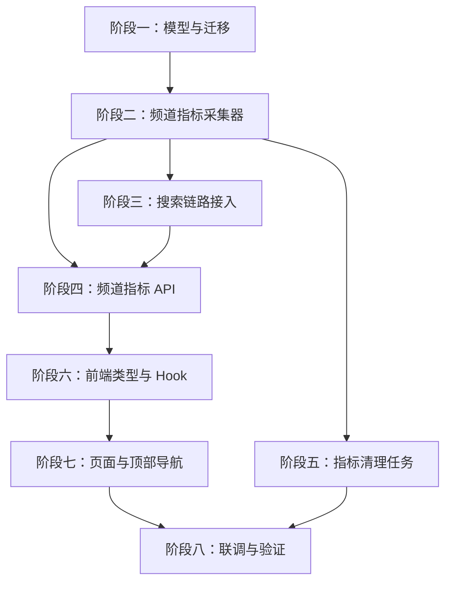

# UniSearch 频道性能监控开发计划

## 1. 文档目标

本文基于 `docs/channel-observability-plan.md`，将「频道性能监控」拆解为可执行开发计划。计划覆盖后端模型、指标采集、搜索链路接入、管理端 API、前端页面、测试验证、迁移回滚和交付顺序，作为后续实现、排期与验收依据。

## 2. 背景与现状

### 2.1 已有能力

- 插件性能监控已经落地，参考 `frontend/src/components/admin/PluginPerformanceDashboard.tsx`、`frontend/src/hooks/usePluginMetricsController.ts`、`backend/service/plugin_metrics_collector.go`。
- 管理后台已有「性能监控」侧边栏入口，当前视图为 `plugin_observability`。
- 系统设置页已有顶部导航分组实现，参考 `frontend/src/components/admin/system-settings/SystemSettingsSectionNav.tsx`。
- 频道管理页已有频道配置、启停、标签、健康状态和快速测试能力，参考 `frontend/src/components/admin/ChannelManagementView.tsx` 与 `backend/api/tg_channel_handler.go`。
- 频道健康状态已有持久化模型和服务，参考 `backend/model/tg_channel_health_status.go` 与 `backend/service/tg_channel_health_service.go`。
- TG 搜索执行链路已有频道级并发执行器，参考 `backend/service/search_executor.go` 中的 `tgSearchExecutor`。

### 2.2 当前缺口

- TG 搜索只记录整体 `tg` 搜索指标，没有单频道响应时间、错误率和超时率。
- 没有频道性能聚合表和频道错误日志表，无法展示历史趋势和排查线索。
- 频道健康状态只保存最近一次结果，不能替代请求级性能观测。
- 性能监控页缺少「插件监控 / 频道监控」顶部切换。
- 前端没有频道指标类型、频道指标 Hook 和频道监控面板。

## 3. 总体原则

- 复用插件监控的数据结构与交互模式，降低实现风险。
- 频道管理页继续负责配置与批量操作，频道监控页只负责观测、定位和快速测试。
- 指标采集不能阻塞用户搜索主链路，采用内存缓冲和批量写入。
- 第一阶段保持频道采集器与插件采集器分离，避免重构影响已上线插件监控。
- 所有新增接口返回空数据时必须保持稳定结构，不能让管理后台出现空指针式失败。
- 所有文档、注释、错误提示和测试描述使用简体中文。

## 4. 交付范围

### 4.1 后端交付

- 新增频道性能指标模型 `TGChannelPerformanceMetric`。
- 新增频道错误日志模型 `TGChannelErrorLog`。
- 更新数据库迁移。
- 新增 `TGChannelMetricsCollector`。
- 将频道指标采集接入 `tgSearchExecutor`。
- 将真实搜索结果同步到 `TGChannelHealthService`。
- 新增频道指标管理 API。
- 扩展指标清理任务，清理频道指标和频道错误日志。

### 4.2 前端交付

- 新增频道指标类型定义。
- 新增频道指标数据控制 Hook。
- 新增性能监控顶部分组导航。
- 将现有插件监控拆为插件面板。
- 新增频道性能监控面板。
- 管理后台 `plugin_observability` 视图加载统一性能观测容器。

### 4.3 测试交付

- 后端采集器单元测试。
- 后端搜索执行器集成点测试。
- 后端 API handler 测试。
- 后端清理任务测试。
- 前端 Hook 测试。
- 前端页面组件测试。
- 管理后台导航回归测试。

## 5. 架构设计

### 5.1 数据流



### 5.2 核心集成点

| 集成点 | 计划动作 | 验收重点 |
| --- | --- | --- |
| `backend/model` | 新增频道指标与错误日志模型 | 自动迁移、索引完整 |
| `backend/service/tg_channel_metrics_collector.go` | 新增采集器 | 环形缓冲、聚合、实时快照、查询稳定 |
| `backend/service/search_executor.go` | 包装单频道任务 | 成功、失败、缓存、超时均记录事件 |
| `backend/service/tg_channel_health_service.go` | 复用健康状态记录 | 搜索结果能更新最近健康状态 |
| `backend/api/router_admin.go` | 注册频道指标 API | 管理员路由结构与插件指标一致 |
| `frontend/src/hooks` | 新增频道指标 Hook | 合并频道列表、实时指标、历史指标、错误日志 |
| `frontend/src/components/admin` | 新增统一性能观测容器和频道面板 | 顶部导航切换、视图不回归 |

## 6. 阶段计划

### 阶段一：数据模型与迁移，P0，预计 1 个工作日

#### 6.1 开发任务

- [x] 在 `backend/model` 新增频道指标模型文件，建议命名为 `tg_channel_metrics.go`。
- [x] 定义 `TGChannelPerformanceMetric`，表名 `tg_channel_performance_metrics`。
- [x] 定义 `TGChannelErrorLog`，表名 `tg_channel_error_logs`。
- [x] 在 `backend/database/migration.go` 注册新增模型。
- [x] 明确索引：
  - `channel_name + bucket_started_at`
  - `bucket_started_at`
  - `channel_name + occurred_at`
  - `keyword_hash`
  - `error_type`

#### 6.2 验收条件

- [x] 本地测试库可自动迁移新增表。
- [x] 模型 JSON 字段与方案文档一致。
- [x] 表名不影响现有插件指标表。
- [x] 字段类型可满足 30 天聚合指标和 7 天错误日志保留。

#### 6.3 测试建议

```bash
cd backend && go test ./database ./model
```

### 阶段二：频道指标采集器，P0，预计 2 个工作日

#### 6.4 开发任务

- [x] 新增 `backend/service/tg_channel_metrics_collector.go`。
- [x] 定义 `TGChannelMetricEvent`。
- [x] 实现 `NewTGChannelMetricsCollector`。
- [x] 实现 `Start(ctx)` 和 `Flush(ctx)`。
- [x] 实现 `BeginChannelRequest(channelName)` 与实时并发计数。
- [x] 实现 `RecordEvent(event)`，支持环形缓冲容量裁剪。
- [x] 实现 `RealtimeSnapshot()`。
- [x] 实现 `ListMetrics(query)`。
- [x] 实现 `ListErrorLogs(query)`。
- [x] 复用插件采集器的百分位算法与关键词哈希思路。

#### 6.5 验收条件

- [x] 成功、失败、超时、缓存命中事件能正确聚合。
- [x] P50、P95、P99 计算结果稳定。
- [x] `Duration == 0` 的缓存命中不污染响应时间分位。
- [x] 错误事件写入 `TGChannelErrorLog`。
- [x] 空采集器、空数据库、空事件均返回空结构而非错误。

#### 6.6 测试建议

新增 `backend/service/tg_channel_metrics_collector_test.go`，覆盖：

- [x] 聚合多频道事件。
- [x] 写入错误日志。
- [x] 环形缓冲容量裁剪。
- [x] 实时快照成功率、超时率、错误数。
- [x] `ListMetrics` 时间范围和频道名过滤。
- [x] `ListErrorLogs` 分页。

```bash
cd backend && go test ./service -run TGChannelMetrics
```

### 阶段三：搜索链路接入，P0，预计 2 个工作日

#### 6.7 开发任务

- [x] 扩展 `tgSearchExecutor` 字段，注入 `channelMetrics *TGChannelMetricsCollector`。
- [x] 注入 `channelHealth *TGChannelHealthService`，用于真实搜索结果更新健康状态。
- [x] 调整构造函数，保留无采集器时的兼容路径。
- [x] 每个频道任务执行前调用 `BeginChannelRequest`。
- [x] 单频道成功时记录：
  - `Success: true`
  - `Duration`
  - `ResultCount`
  - `ConcurrentRequests`
  - `OccurredAt`
- [x] 单频道失败时记录：
  - `Success: false`
  - `ErrorType: search_failure`
  - `ErrorMessage`
- [x] 批量超时时，按已完成频道集合和提交频道集合计算差集，对未完成频道记录 `timeout`。
- [x] TG 缓存命中时，对请求频道集合记录 `CacheHit: true` 和 `Success: true`。
- [x] 搜索成功、失败和超时同步调用 `TGChannelHealthService.RecordResult`。
- [x] 在 `SearchService` 或 bootstrap 中完成采集器注入与启动。

#### 6.8 验收条件

- [x] 不启用频道采集器时，现有 TG 搜索行为不变。
- [x] 频道搜索成功后实时快照出现该频道指标。
- [x] 频道搜索失败后错误日志和健康状态同步更新。
- [x] 缓存命中不会发起真实 TG 请求，但会记录缓存命中指标。
- [x] 全局超时能定位未完成频道并记录超时事件。

#### 6.9 测试建议

扩展 `backend/service/search_executor_test.go`：

- [x] `TestTGSearchExecutorRecordsChannelMetricsOnSuccess`
- [x] `TestTGSearchExecutorRecordsChannelMetricsOnFailure`
- [x] `TestTGSearchExecutorRecordsChannelMetricsOnCacheHit`
- [x] `TestTGSearchExecutorRecordsChannelTimeoutForUnfinishedTasks`
- [x] `TestTGSearchExecutorUpdatesChannelHealthStatus`

```bash
cd backend && go test ./service -run 'TGSearchExecutor|TGChannelMetrics'
```

### 阶段四：频道指标 API，P0，预计 1 个工作日

#### 6.10 开发任务

- [x] 新增 `backend/api/channel_metrics_handler.go`。
- [x] 实现 `ChannelMetricsRealtimeHandler`。
- [x] 实现 `ChannelMetricsListHandler`。
- [x] 实现 `ChannelMetricsErrorLogsHandler`。
- [x] 注册路由：
  - `GET /api/admin/channel-metrics/realtime`
  - `GET /api/admin/channel-metrics`
  - `GET /api/admin/channel-metrics/errors`
- [x] 在 `backend/api/router_deps.go` 增加频道指标采集器依赖。
- [x] 在 bootstrap 初始化并传入依赖。

#### 6.11 验收条件

- [x] API 响应结构与方案文档一致。
- [x] `channel_name` 支持频道名过滤。
- [x] `from` 和 `to` 使用 RFC3339，非法格式返回 400。
- [x] `limit` 最大值受控，默认 200。
- [x] `page_size` 最大值受控，默认 20。
- [x] 采集器为空时返回空结构，不能 500。

#### 6.12 测试建议

新增 `backend/api/channel_metrics_handler_test.go`：

- [x] 实时快照。
- [x] 聚合指标查询。
- [x] 错误日志分页。
- [x] 非法时间参数。
- [x] 空采集器兜底。

```bash
cd backend && go test ./api -run ChannelMetrics
```

### 阶段五：指标清理任务，P1，预计 0.5 个工作日

#### 6.13 开发任务

- [x] 扩展 `backend/service/plugin_metrics_cleaner.go`，或新增通用指标清理服务。
- [x] 清理 30 天前 `tg_channel_performance_metrics`。
- [x] 清理 7 天前 `tg_channel_error_logs`。
- [x] 保留现有插件指标清理逻辑不变。

#### 6.14 验收条件

- [x] 只删除过期频道指标。
- [x] 不影响插件指标和插件错误日志。
- [x] 清理结果包含频道指标删除数量，方便日志排查。

#### 6.15 测试建议

扩展清理测试：

```bash
cd backend && go test ./service -run MetricsCleaner
```

### 阶段六：前端类型与 Hook，P0，预计 1.5 个工作日

#### 6.16 开发任务

- [x] 新增 `frontend/src/types/channelMetrics.ts`。
- [x] 定义实时快照、实时项、聚合指标、错误日志、观测行、趋势点、状态筛选类型。
- [x] 新增 `frontend/src/hooks/useChannelMetricsController.ts`。
- [x] 并行请求：
  - `/api/admin/channel-metrics/realtime`
  - `/api/admin/channel-metrics?limit=200`
  - `/api/admin/channel-metrics/errors?page=1&page_size=20`
  - `/api/admin/channels`
- [x] 合并频道配置、健康状态、实时指标、历史指标和错误日志。
- [x] 实现 30 秒自动刷新。
- [x] 实现实时快照为空时的聚合兜底。
- [x] 实现搜索、状态筛选、趋势点生成、选中行和选中错误日志。

#### 6.17 验收条件

- [x] 缺少管理员登录状态时返回中文错误提示。
- [x] 数据合并以频道名归一化值为主键。
- [x] 异常频道和错误多的频道优先展示。
- [x] 空实时窗口可用历史聚合指标展示指标卡。
- [x] 组件卸载后不会继续更新状态。

#### 6.18 测试建议

新增 `frontend/src/hooks/__tests__/useChannelMetricsController.test.tsx`：

- [x] 并行拉取成功并合并行。
- [x] 实时数据为空时使用聚合指标兜底。
- [x] 状态筛选和关键词搜索。
- [x] 选中频道错误日志。
- [x] 接口失败时显示错误信息。

```bash
cd frontend && pnpm test -- --run src/hooks/__tests__/useChannelMetricsController.test.tsx
```

### 阶段七：前端页面与顶部导航，P0，预计 2 个工作日

#### 6.19 开发任务

- [x] 新增 `frontend/src/components/admin/PerformanceSectionNav.tsx`。
- [x] 新增 `frontend/src/components/admin/PerformanceObservabilityView.tsx`。
- [x] 将 `PluginPerformanceDashboard` 拆为插件面板，建议命名 `PluginPerformancePanel`。
- [x] 新增 `ChannelPerformancePanel`。
- [x] 顶部导航使用 `Tabs`、`TabsList`、`TabsTrigger`，`ariaLabel` 为「性能监控分组」。
- [x] 保持默认分组为「插件监控」。
- [x] 在 `frontend/src/pages/Admin.tsx` 将 `plugin_observability` 懒加载入口改为统一性能观测容器。
- [x] 频道面板复用 `AdminWorkspacePageFrame`、`AdminMetricGrid`、`AdminDataTable`、`AdminDetailDrawer`。

#### 6.20 验收条件

- [x] 性能监控页默认显示插件监控。
- [x] 顶部导航可切换频道监控。
- [x] 切换不改变侧边栏选中项。
- [x] 频道监控展示指标卡、趋势、表格、详情抽屉和错误日志。
- [x] 移动端文本不溢出，表格有移动卡片展示。
- [x] 原插件监控测试不回归。

#### 6.21 测试建议

新增或调整：

- `frontend/src/components/admin/__tests__/PerformanceObservabilityView.test.tsx`
- `frontend/src/components/admin/__tests__/ChannelPerformancePanel.test.tsx`
- `frontend/src/components/admin/__tests__/PluginPerformanceDashboard.test.tsx`
- `frontend/src/pages/__tests__/Admin.test.tsx`
- `frontend/src/pages/__tests__/AdminNavigation.test.tsx`

```bash
cd frontend && pnpm test -- --run \
  src/components/admin/__tests__/PerformanceObservabilityView.test.tsx \
  src/components/admin/__tests__/ChannelPerformancePanel.test.tsx \
  src/components/admin/__tests__/PluginPerformanceDashboard.test.tsx \
  src/pages/__tests__/Admin.test.tsx \
  src/pages/__tests__/AdminNavigation.test.tsx
```

### 阶段八：联调、质量验证与文档，P0，预计 1 个工作日

#### 6.22 开发任务

- [x] 运行后端服务测试。
- [x] 运行前端 Hook 与组件测试。
- [x] 运行前端 lint。
- [ ] 使用本地开发服务手动检查管理后台性能监控页。
- [x] 更新 `docs/readme_YYMM.md` 开发记录。
- [x] 更新 `.Codex/verification-report.md`。

#### 6.23 验收条件

- [x] 后端测试通过。
- [x] 前端测试通过。
- [x] 前端静态检查通过。
- [ ] 插件监控和频道监控均可在本地管理后台打开。
- [ ] 频道搜索后能在频道监控看到实时指标。
- [x] 方案文档、开发计划和验证报告保持一致。

#### 6.25 联调记录

- 2026-07-05 12:10：已启动前端开发服务并确认 `/admin?view=plugin_observability` 返回前端页面。
- 受当前本地后端未启动、无管理员登录态和无真实 TG 搜索配置影响，真实管理后台页面打开与频道搜索实时指标仍保留为待联调项。

#### 6.24 建议完整验证命令

```bash
cd backend && go test ./service ./api ./database ./model
cd frontend && pnpm test -- --run \
  src/hooks/__tests__/useChannelMetricsController.test.tsx \
  src/components/admin/__tests__/PerformanceObservabilityView.test.tsx \
  src/components/admin/__tests__/ChannelPerformancePanel.test.tsx \
  src/components/admin/__tests__/PluginPerformanceDashboard.test.tsx \
  src/pages/__tests__/Admin.test.tsx \
  src/pages/__tests__/AdminNavigation.test.tsx
cd frontend && pnpm lint
```

## 7. 任务依赖顺序



## 8. 里程碑

| 里程碑 | 完成标准 | 预计耗时 |
| --- | --- | --- |
| M1 后端指标可写入 | 新模型、采集器、搜索接入测试通过 | 5 个工作日 |
| M2 API 可查询 | 频道实时、聚合、错误日志 API 测试通过 | 1 个工作日 |
| M3 前端可展示 | 顶部导航、频道面板、Hook 和组件测试通过 | 3.5 个工作日 |
| M4 完整验证 | 后端、前端、lint 和本地页面检查完成 | 1 个工作日 |

总预计：约 10.5 个工作日。

## 9. 回滚计划

### 9.1 前端回滚

- 隐藏 `PerformanceSectionNav` 中的「频道监控」分组。
- `plugin_observability` 视图恢复为只渲染插件监控面板。
- 保留频道指标类型和 Hook 文件不影响用户侧搜索。

### 9.2 后端回滚

- 停止在 bootstrap 中启动 `TGChannelMetricsCollector`。
- 停止向 `tgSearchExecutor` 注入频道采集器。
- `/api/admin/channel-metrics/*` 可保留空结构返回，避免前端缓存页面报错。
- 新增表可保留，等待后续迁移清理，不影响现有搜索链路。

### 9.3 数据回滚

如必须清理新增表：

```sql
DROP TABLE IF EXISTS tg_channel_error_logs;
DROP TABLE IF EXISTS tg_channel_performance_metrics;
```

执行前必须确认前端已隐藏频道监控入口，后端已停止写入。

## 10. 风险清单

| 风险 | 等级 | 影响 | 缓解 |
| --- | --- | --- | --- |
| 全局超时后无法识别未完成频道 | 高 | 超时日志漏记 | 在任务结果中记录完成频道集合，对提交集合做差集 |
| 缓存命中无法精确归因 | 中 | 缓存统计和结果数不够精确 | 第一期按请求频道集合记录缓存命中，第二期按结果频道回推 |
| 采集器重复代码增加维护成本 | 中 | 后续指标逻辑需要双处修改 | 第一期保守复制，稳定后抽象通用 collector |
| 频道管理与频道监控职责混淆 | 中 | 页面功能变重 | 监控页仅观测和快速测试，配置编辑仍在频道管理页 |
| 写库压力增加 | 中 | 数据库负载升高 | 保持 10000 条缓冲和 5 分钟批量写入，保留清理任务 |
| 插件监控回归 | 高 | 已有监控不可用 | 拆组件时保留原测试，先保持插件面板行为不变 |

## 11. 交付清单

### 后端文件

- `backend/model/tg_channel_metrics.go`
- `backend/service/tg_channel_metrics_collector.go`
- `backend/api/channel_metrics_handler.go`
- `backend/database/migration.go`
- `backend/api/router_deps.go`
- `backend/api/router_admin.go`
- `backend/cmd/bootstrap/app.go`
- `backend/cmd/bootstrap/server.go`
- `backend/service/search_executor.go`
- `backend/service/search_service.go`
- `backend/service/plugin_metrics_cleaner.go` 或新增通用清理服务

### 前端文件

- `frontend/src/types/channelMetrics.ts`
- `frontend/src/hooks/useChannelMetricsController.ts`
- `frontend/src/components/admin/PerformanceSectionNav.tsx`
- `frontend/src/components/admin/PerformanceObservabilityView.tsx`
- `frontend/src/components/admin/PluginPerformancePanel.tsx`
- `frontend/src/components/admin/ChannelPerformancePanel.tsx`
- `frontend/src/pages/Admin.tsx`

### 测试文件

- `backend/service/tg_channel_metrics_collector_test.go`
- `backend/service/search_executor_test.go`
- `backend/api/channel_metrics_handler_test.go`
- `backend/service/plugin_metrics_cleaner_test.go`
- `frontend/src/hooks/__tests__/useChannelMetricsController.test.tsx`
- `frontend/src/components/admin/__tests__/PerformanceObservabilityView.test.tsx`
- `frontend/src/components/admin/__tests__/ChannelPerformancePanel.test.tsx`
- `frontend/src/components/admin/__tests__/PluginPerformanceDashboard.test.tsx`
- `frontend/src/pages/__tests__/Admin.test.tsx`
- `frontend/src/pages/__tests__/AdminNavigation.test.tsx`

## 12. 完成定义

- 频道搜索产生的成功、失败、超时和缓存命中均能形成可查询指标。
- 频道健康状态能从真实搜索链路自动更新。
- 管理后台性能监控页可通过顶部导航切换插件监控与频道监控。
- 频道监控页具备指标卡、趋势图、性能列表、详情抽屉和错误日志。
- 所有新增后端和前端测试通过。
- 本地验证命令和验证结果写入 `.Codex/verification-report.md`。
- 开发记录追加到当月 `docs/readme_YYMM.md`。
