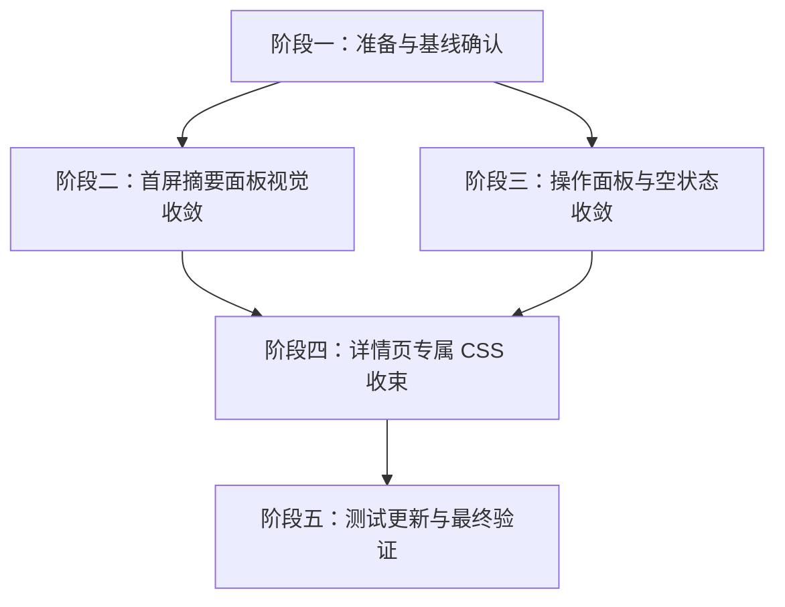

# 资源详情页 Soft UI 视觉收敛开发计划

## 1. 文档目标

本文基于 `docs/resource-detail-page-soft-ui-redesign-plan.md`，将资源详情页 Soft UI 视觉收敛方案拆解为可执行开发计划。计划覆盖首屏摘要面板、操作面板、空状态、资源详情页专属样式、测试更新、验证命令和回滚策略，作为后续实现、排期、勾选进度和验收依据。

本文只规划开发，不直接修改业务代码。后续开发应按阶段逐步执行，每完成一个任务后同步勾选本文件对应条目，并补充本地验证结果。

## 2. 背景与现状

### 2.1 已有能力

- 资源详情页入口集中在 `frontend/src/pages/ResourceDetailPage.tsx`。
- 首屏资源展示已拆为 `frontend/src/components/resource-detail/ResourceDetailHero.tsx`。
- 右侧操作区已拆为 `frontend/src/components/resource-detail/ResourceDetailActionPanel.tsx`。
- 空状态已拆为 `frontend/src/components/resource-detail/ResourceDetailEmptyState.tsx`。
- 详情页专属样式主要集中在 `frontend/src/index.css` 的 `resource-detail-*` 选择器。
- 资源打开、复制、密码弹层、扫码转存和快照恢复逻辑已经在页面层稳定存在。
- `frontend/src/pages/__tests__/ResourceDetailPage.test.tsx` 已覆盖详情页主要结构、按钮、空状态和当前“不渲染全部链接 / 图库”的产品语义。

### 2.2 当前缺口

- `ResourceDetailHero` 仍是暗色海报式 Hero，包含深色背景、海报模糊、径向渐变、底部渐变遮罩和较重阴影。
- 资源标题和多个区块标题使用衬线字体，与当前产品 UI 的系统 sans 字体不一致。
- 多个详情页容器使用 `2rem+` 圆角、重玻璃态、强 blur 和多层渐变，和 `DESIGN.md` 中“克制检索工作台”的方向冲突。
- 操作面板文案存在“跟随显示”等实现语言。
- 空状态视觉语言仍偏重，包含大面积渐变、玻璃和 blur 装饰。
- 当前方案已确认只做视觉收敛，不能顺手恢复全部链接、元数据、图库或新增移动端底部 sticky 操作条。

## 3. 总体原则

- 只做视觉收敛，不改变当前页面信息结构和产品行为。
- 不恢复 `ResourceDetailLinksSection`、`ResourceDetailMetaSection`、`ResourceDetailGallery`。
- 不改变外部打开、复制、密码弹层、扫码转存、快照恢复、系统开关和路由回退逻辑。
- 保留现有 `data-testid`，除非文案变化导致测试必须更新。
- 使用项目现有 React、Tailwind、lucide-react、framer-motion 和本地 UI 组件，不引入新的 UI 依赖。
- Node 包管理统一使用 `pnpm`。
- 视觉语言遵守 `DESIGN.md`：浅灰工作台、白色面板、稀有行动色、轻边界、低阴影、12px-20px 圆角。
- Soft UI 的柔和感来自清晰留白、轻色面板、低饱和状态和稳定触控尺寸，不来自重玻璃、发光、强渐变或过大圆角。

## 4. 交付范围

### 4.1 前端代码交付

- 将 `ResourceDetailHero` 从暗色海报 Hero 改为浅色资源摘要面板。
- 移除详情页标题和区块标题的衬线字体覆盖，统一使用系统 sans 字体。
- 保留首图预览，但降级为辅助判断材料，放入独立浅色预览框。
- 将“打开前速览”固定为四个指标：链接数量、访问方式、资源体积、发布时间。
- 将详情页面板圆角收敛为：常规面板 16px，首屏摘要大面板 20px，按钮 12px 或轻 pill。
- 大部分移除详情页玻璃态、blur、多层渐变和发光阴影。
- 微调 `ResourceDetailActionPanel` 文案：标题改为“资源操作”，移除“跟随显示”，保留按钮数量和行为。
- 收敛 `ResourceDetailEmptyState` 外观，保留返回、重试搜索、回首页动作。
- 更新 `frontend/src/pages/__tests__/ResourceDetailPage.test.tsx` 中因文案或类名变化导致的断言。

### 4.2 不在本计划范围内

- 不新增或恢复“全部链接”区块。
- 不新增或恢复“元数据”区块。
- 不新增或恢复“相关图片”图库。
- 不新增移动端底部 sticky 操作条。
- 不改搜索结果到详情页的路由状态。
- 不改资源对象、后端接口、缓存快照、密码弹层、扫码转存或外链打开策略。
- 不重构全站卡片、按钮或公共页面壳。

## 5. 核心集成点

| 集成点 | 计划动作 | 验收重点 |
| --- | --- | --- |
| `frontend/src/components/resource-detail/ResourceDetailHero.tsx` | 改为浅色资源摘要面板，移除暗色背景和衬线标题 | 首屏判断信息更清楚，首图成为辅助预览 |
| `frontend/src/components/resource-detail/ResourceDetailActionPanel.tsx` | 收敛面板视觉和文案，保留行为 | 按钮数量、禁用态、复制和打开逻辑不变 |
| `frontend/src/components/resource-detail/ResourceDetailEmptyState.tsx` | 移除大面积渐变、玻璃和 blur 装饰 | 空状态与正常详情页视觉一致 |
| `frontend/src/pages/ResourceDetailPage.tsx` | 保持数据流和布局语义，必要时只调整 className | 不接入 Links / Meta / Gallery，不改业务逻辑 |
| `frontend/src/index.css` | 整理 `resource-detail-*` 样式，降低强渐变、blur、圆角和阴影 | 深浅色模式可读，移动端无横向滚动 |
| `frontend/src/pages/__tests__/ResourceDetailPage.test.tsx` | 更新视觉收敛导致的文本和 class 断言 | 保持当前产品语义，测试不误要求新功能 |

## 6. 阶段计划

### 阶段一：准备与基线确认，P0，预计 0.5 个工作日

#### 6.1 开发任务

- [x] 阅读 `docs/resource-detail-page-soft-ui-redesign-plan.md`，确认本阶段只做视觉收敛。
- [x] 阅读 `DESIGN.md` 中 Resource Detail、颜色、圆角、阴影、组件规则。
- [x] 阅读 `ResourceDetailPage.tsx`、`ResourceDetailHero.tsx`、`ResourceDetailActionPanel.tsx`、`ResourceDetailEmptyState.tsx`。
- [x] 阅读 `ResourceDetailPage.test.tsx`，标记当前必须保留的产品语义断言。
- [x] 记录当前详情页在深色 / 浅色、桌面 / 移动端的主要视觉问题。

#### 6.2 验收条件

- [x] 明确本阶段不会接入 `ResourceDetailLinksSection`、`ResourceDetailMetaSection`、`ResourceDetailGallery`。
- [x] 明确哪些测试断言需要保留，哪些只因视觉文案变化需要更新。
- [x] 明确首屏四个指标：链接数量、访问方式、资源体积、发布时间。

#### 6.3 测试建议

```bash
cd frontend && pnpm test -- --run src/pages/__tests__/ResourceDetailPage.test.tsx
```

### 阶段二：首屏摘要面板视觉收敛，P0，预计 1-2 个工作日

#### 6.4 开发任务

- [x] 将 `ResourceDetailHero` 外层从暗色 Hero 改为浅色 `section` 面板。
- [x] 移除 Hero 内部海报背景层、模糊背景层、径向渐变层和底部渐变遮罩。
- [x] 移除标题 `style={{ fontFamily: ... }}`，统一使用系统 sans 字体。
- [x] 将标题尺寸收敛到 H1 28px-36px 范围，字距设为 0，保留 `overflow-wrap` 和 `text-wrap`。
- [x] 将首图放入独立浅色预览框，桌面宽度约 240px-320px，移动端不占满首屏。
- [x] 保留 `object-contain`，避免海报或截图被裁切。
- [x] 无图状态保留 `ImageIcon`、“暂无预览图”和判断提示，但移除深色容器。
- [x] 将标签样式改为浅底 pill，主云盘类型使用蓝 / 青弱底色，媒体类型和目标类型使用灰底。
- [x] 将“打开前速览”改为四个浅灰指标卡：链接数量、访问方式、资源体积、发布时间。
- [x] 收敛 Hero 圆角到 20px，内部指标卡 / 图片框圆角控制在 16px。

#### 6.5 验收条件

- [x] 首屏不再出现暗色沉浸背景、海报模糊背景或大面积渐变。
- [x] 资源标题使用系统 sans 字体，中文和英文标题在窄屏下不溢出。
- [x] 首图仍可帮助判断资源，但不与标题和指标争主视觉。
- [x] 打开前速览只包含四个确认过的指标。
- [x] 深色模式下仍可读，但不使用重发光和大面积玻璃态建立层级。

#### 6.6 测试建议

```bash
cd frontend && pnpm test -- --run src/pages/__tests__/ResourceDetailPage.test.tsx
```

### 阶段三：操作面板与空状态收敛，P0，预计 1 个工作日

#### 6.7 开发任务

- [x] 将 `ResourceDetailActionPanel` 标题从“资源操作台”改为“资源操作”。
- [x] 移除“跟随显示”标签。
- [x] 增加或保留简短用户语言说明，例如“打开外部资源前，请确认访问方式和提取码状态。”
- [x] 保留主链接状态、提取码状态和确认后的核心按钮。
- [x] 保留按钮行为：打开主资源、复制主链接、复制提取码。
- [x] 移除“查看原始详情”入口，不展示原始详情按钮。
- [x] 将主按钮改为项目蓝或青色纯色，不使用渐变。
- [x] 将次按钮改为白底轻边界，保留 focus-visible、disabled、active 状态。
- [x] 将操作面板圆角收敛到 16px，sticky 行为保持不变。
- [x] 将 `ResourceDetailEmptyState` 改为浅色空状态面板。
- [x] 移除空状态的大面积渐变、blur 装饰和 2rem+ 常规圆角。
- [x] 保留空状态图标、标题、描述、返回、重试搜索和回首页动作。

#### 6.8 验收条件

- [x] 操作面板文案不再出现实现语言。
- [x] 操作按钮仅保留确认后的核心动作，不再展示原始详情入口。
- [x] 空状态和正常详情页视觉语言一致。
- [x] 禁用态、复制态和打开弹层逻辑无回归。
- [x] 移动端按钮高度不低于 44px，无横向滚动。

#### 6.9 测试建议

```bash
cd frontend && pnpm test -- --run src/pages/__tests__/ResourceDetailPage.test.tsx
```

### 阶段四：详情页专属 CSS 收束，P1，预计 0.5-1 个工作日

#### 6.10 开发任务

- [x] 清理 `frontend/src/index.css` 中详情页相关的强渐变背景。
- [x] 移除或弱化 `resource-detail-*` 样式中的 `backdrop-filter` / `blur` / 大面积透明玻璃。
- [x] 将详情页默认面板圆角控制在 16px，首屏摘要容器控制在 20px。
- [x] 将详情页静态面板阴影收敛到轻阴影或轻边界。
- [x] 保留可访问的 `focus-visible` ring，不只依赖阴影表示焦点。
- [x] 检查深色模式文本颜色，避免次级文字低对比。
- [x] 保留 `prefers-reduced-motion` 下内容可见，不让动画决定内容是否出现。

#### 6.11 验收条件

- [x] 详情页不再依赖重玻璃、强 blur、强发光和多层渐变建立主层级。
- [x] 常规面板不再使用 32px+ 圆角。
- [x] 深浅色模式下标题、正文、辅助说明和按钮文字均可读。
- [x] hover / active / focus-visible 不导致布局跳动。

#### 6.12 测试建议

```bash
cd frontend && pnpm lint
cd frontend && pnpm test -- --run src/pages/__tests__/ResourceDetailPage.test.tsx
```

### 阶段五：测试更新与最终验证，P0，预计 0.5-1 个工作日

#### 6.13 开发任务

- [x] 更新 `ResourceDetailPage.test.tsx` 中因文案变化导致的断言，例如“资源操作台”“跟随显示”。
- [x] 保留“不渲染全部链接”“不渲染相关图片图库”“不渲染元数据条”的断言语义。
- [x] 若 className 断言因视觉收敛变化，改为更稳定的结构或行为断言。
- [x] 检查空状态、详情页关闭状态、无图状态、提取码链接、磁力链接、扫码转存相关测试。
- [ ] 手动或用 Playwright 检查 375px / 390px 移动端和桌面布局。
- [x] 记录未验证项和原因。

验证记录：`pnpm test -- --run src/pages/__tests__/ResourceDetailPage.test.tsx`、`pnpm exec vitest run src/pages/__tests__/ResourceDetailPage.test.tsx --pool=forks --testTimeout=10000`、`pnpm lint`、`pnpm check`、`pnpm build` 在当前环境中均长时间无输出挂起，已手动中断；本轮完成了静态文件审查和范围残留搜索，最终机器验证仍需在可正常运行前端工具链的环境中补跑。

#### 6.14 验收条件

- [ ] `ResourceDetailPage` 单测通过。
- [ ] `pnpm lint` 通过。
- [ ] `pnpm build` 通过。
- [ ] 移动端无横向滚动，首屏判断信息清楚。
- [x] 当前信息结构保持不变，没有新增全部链接、元数据、图库或底部 sticky 操作条。

#### 6.15 测试建议

```bash
cd frontend && pnpm test -- --run src/pages/__tests__/ResourceDetailPage.test.tsx
cd frontend && pnpm lint
cd frontend && pnpm build
```

## 7. 依赖关系与执行顺序



阶段二和阶段三可在确认阶段一后并行开发，但都需要在阶段四前合并视觉样式边界，避免 CSS 反复覆盖。

## 8. 风险与对策

| 风险 | 影响 | 对策 |
| --- | --- | --- |
| 测试过度依赖 className | 视觉收敛导致大量测试失败 | 优先保留 test id；将纯视觉 class 断言改为结构、文本或行为断言 |
| 浅色 Hero 信息密度过高 | 首屏变拥挤，移动端阅读困难 | 固定四个指标，图片降级为辅助，标题允许自然换行 |
| 移除暗色 Hero 后页面变平 | Soft UI 变成普通白卡 | 使用轻边界、浅灰指标区、蓝 / 青弱底标签和稳定间距建立层级 |
| 深色模式对比不足 | 夜间模式可读性下降 | 使用 `#F8FAFC` / `#CBD5E1` 等高对比文本，不使用过浅 slate |
| 文案改动影响测试 | 单测断言失败 | 在阶段五集中更新文案断言，并确认按钮行为不变 |
| 顺手恢复隐藏组件 | 范围膨胀，测试语义改变 | 明确禁止接入 Links / Meta / Gallery，后续单独立项 |

## 9. 回滚策略

- 若 Hero 改造导致布局严重回归，可单独回滚 `ResourceDetailHero.tsx` 与对应 CSS。
- 若操作面板行为出现回归，优先回滚 `ResourceDetailActionPanel.tsx`，保留 CSS 收敛中不影响行为的部分。
- 若空状态测试或可访问性回归，可单独回滚 `ResourceDetailEmptyState.tsx`。
- 若 CSS 收束影响其他页面，应缩小选择器作用域到 `resource-detail-*`，避免改动全局 `surface-*`、`button` 或公共 `glass-*`。
- 若测试断言调整误删产品语义，应恢复“不渲染全部链接 / 图库 / 元数据”等断言。

## 10. 最终验收清单

- [x] 暗色海报 Hero 已移除。
- [x] 详情页衬线标题已移除。
- [x] 玻璃态、blur、多层渐变和发光阴影已大幅收敛。
- [x] 常规面板 16px，首屏摘要面板 20px，按钮 12px 或轻 pill。
- [x] 首图保留为辅助预览，不再承担主视觉。
- [x] “打开前速览”只展示链接数量、访问方式、资源体积、发布时间。
- [x] 操作面板标题为“资源操作”，不再显示“跟随显示”。
- [x] 空状态视觉已与正常详情页统一。
- [x] 当前信息结构保持不变。
- [ ] `ResourceDetailPage` 单测通过。
- [ ] `pnpm lint` 通过。
- [ ] `pnpm build` 通过。
