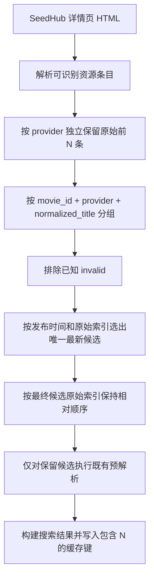

# SeedHub 每类资源限量与同名最新去重 Implementation Plan

> **For agentic workers:** REQUIRED SUB-SKILL: Use superpowers:subagent-driven-development (recommended) or superpowers:executing-plans to implement this plan task-by-task. Steps use checkbox (`- [ ]`) syntax for tracking.

**Goal:** 为 SeedHub 详情资源增加“每种资源类型只读取原始前 N 条、同名只保留最新一条”的规则，并允许管理员在插件详情窗口将 N 配置为 1–40 的整数，默认 10。

**Architecture:** 在 SeedHub 详情解析边界按归一化资源类型执行早期限量，再在单个 `movie_id + provider + normalized_title` 范围内选择最新候选。配置约束由插件 manifest 声明，后端保存入口作为最终校验边界，前端复用同一 schema 做即时提示；搜索缓存键纳入新配置，确保修改后立即使用新的结果集合。

**Tech Stack:** Go 1.25、Gin、GORM、goquery、`golang.org/x/text/unicode/norm`、React 18、TypeScript、Vitest、Testing Library、pnpm。

---

## 1. 已确认需求

| 主题 | 结论 |
| --- | --- |
| 限量维度 | SeedHub 页面中每种已识别资源类型分别限量 |
| 默认值 | 每种类型读取原始前 10 条 |
| 配置范围 | 1–40，只允许整数 |
| 配置入口 | 管理后台插件详情窗口 |
| 去重范围 | 同一 `movie_id`、同一资源类型内部 |
| 同名规则 | 忽略空格、括号样式、全角/半角和英文大小写；保留集数、年份、清晰度、大小和版本信息 |
| 最新规则 | 排除已知 `invalid`，有时间时取发布时间最新；时间缺失或相同则取原始索引更小的条目 |
| 结果顺序 | 保持最终入选资源在 SeedHub 中的相对顺序 |
| 补位策略 | 前 N 条去重后不足 N 条时，不读取第 N+1 条补位 |
| 跨类型行为 | 不同资源类型之间不合并 |
| 跨影片行为 | 不同 `movie_id` 之间不合并 |
| 失效治理 | 本次不新增链接探测、负缓存或可用性预热；仅用前 N 条降低陈旧失效结果比例 |
| 预解析约束 | `0 <= pre_resolved_link_start_per_type <= max_resource_entries_per_type` |

## 2. 当前实现基线

当前链路为：

```text
详情页完整 HTML
  -> parseDetailLinkEntriesAt 解析全部可识别条目
  -> resolveLinkStartEntries 按类型预解析
  -> limitExpandedSidHubEntries 全局截断到 240 条
  -> groupSidHubEntries 将同名候选放入同一结果的多个 links
  -> 搜索响应与缓存
```

现有行为与目标的差距：

- `backend/plugin/sidhub/sidhub.go` 只提供每部影片最多 240 条的全局保护，没有每种资源类型独立上限。
- 同名候选当前全部保存在 `sidHubResultGroup.Entries`，并按“已解析优先于待解析”排序，可能让更旧但已解析的候选成为主候选。
- `normalizeSidHubGroupTitle` 只移除部分空格和括号，没有完整覆盖 Unicode 全角/半角及英文大小写。
- 插件配置 schema 只有字段类型和默认值，不能声明数值上下限、整数约束和字段间关系。
- SeedHub 搜索缓存键尚未包含每类资源数量配置。

## 3. 非目标与残余风险

- 不在搜索阶段逐条访问 SeedHub `/link_start/` 或网盘地址验证有效性。
- 不新增永久失效缓存，不改变 resolver 的错误合同和限流策略。
- 不删除前端通用的“主候选失效后尝试一个备用候选”能力；本改动只让 SeedHub 同名组不再产生多个候选。
- 不改变 SeedHub 搜索卡片数量、详情并发、详情超时和域名策略。
- SeedHub 详情页是一次性返回的完整 HTML，因此“前 N 条”限制的是解析后保留、预解析和输出的资源条目，不能减少详情页 HTML 的网络传输体积。
- 前 N 条本身仍可能失效；本计划降低陈旧资源出现概率，但不承诺结果全部有效。

## 4. 目标数据流



关键顺序不能调换：限量必须早于预解析，去重必须早于预解析。否则配置为 10 时仍可能对第 11 条之后的资源发起请求，或对最终会被去掉的重复候选做无效预解析。

## 5. 文件结构与职责

| 文件 | 动作 | 职责 |
| --- | --- | --- |
| `backend/model/plugin_manifest.go` | 修改 | 为数字配置声明 `minimum`、`maximum`、`integer` 和字段间小于等于关系 |
| `backend/service/plugin_runtime_config_service.go` | 修改 | 在保存配置前执行通用 schema 约束校验 |
| `backend/service/plugin_runtime_config_service_test.go` | 修改 | 覆盖范围、整数和字段关系校验 |
| `backend/api/plugin_runtime_config_handler_test.go` | 修改 | 证明非法配置返回 `400 PLUGIN_CONFIG_INVALID` 且不落库 |
| `backend/plugin/sidhub/sidhub.go` | 修改 | 新配置、缓存键、每类限量、标题归一化和最新候选选择 |
| `backend/plugin/sidhub/sidhub_test.go` | 修改 | 覆盖配置、限量、不补位、去重、顺序与缓存行为 |
| `backend/go.mod` | 修改 | 将已经间接存在的 `golang.org/x/text` 声明为直接依赖 |
| `backend/go.sum` | 可能机械更新 | 由 `go mod tidy` 保持模块元数据一致 |
| `frontend/src/types/plugin.ts` | 修改 | 同步插件配置 schema 新字段 |
| `frontend/src/components/admin/pluginRuntimeConfig.ts` | 新建 | 从 schema 构建并验证提交载荷，供两个插件详情入口复用 |
| `frontend/src/components/admin/pluginRuntimeConfig.test.ts` | 新建 | 覆盖前端范围、整数和字段关系校验 |
| `frontend/src/hooks/usePluginManageController.ts` | 修改 | 保存前调用通用验证器，非法时提示且不发送请求 |
| `frontend/src/components/admin/PluginManageDialog.tsx` | 修改 | 数字输入透传 `min/max/step` |
| `frontend/src/components/admin/PluginManagementView.tsx` | 修改 | 页面级插件详情数字输入透传同一约束 |
| `frontend/src/components/admin/__tests__/PluginManageDialog.test.tsx` | 修改 | 覆盖默认值、合法保存与非法拦截 |
| `frontend/src/components/admin/__tests__/PluginManagementView.test.tsx` | 修改 | 覆盖页面级详情输入约束与保存载荷 |

## 6. 配置合同

新增 SeedHub 字段：

```json
{
  "key": "max_resource_entries_per_type",
  "label": "每类资源获取数量",
  "type": "number",
  "default": 10,
  "minimum": 1,
  "maximum": 40,
  "integer": true,
  "description": "SeedHub 每种资源类型只读取原始列表前 N 条；同名去重后不补位。",
  "group": "解析性能"
}
```

现有预解析字段增加关系约束：

```json
{
  "key": "pre_resolved_link_start_per_type",
  "minimum": 0,
  "maximum": 20,
  "integer": true,
  "less_than_or_equal_to": "max_resource_entries_per_type"
}
```

兼容策略：旧数据库记录没有 `max_resource_entries_per_type` 时读取默认值 10。若旧记录的预解析数量大于 10，读取和搜索不能失败；运行时有效预解析数量取两者较小值，插件详情窗口展示现有值并在下一次保存时要求管理员修正。保存接口绝不把非法值静默写成另一个值。

---

### Task 1: 扩展通用插件数字配置约束

**Files:**
- Modify: `backend/model/plugin_manifest.go`
- Modify: `backend/service/plugin_runtime_config_service.go`
- Test: `backend/service/plugin_runtime_config_service_test.go`
- Test: `backend/api/plugin_runtime_config_handler_test.go`

- [x] **Step 1: 为 service 写范围、整数和字段关系失败测试**

在测试 manifest 中声明两个数字字段：

```go
func numberPtr(value float64) *float64 {
	return &value
}

func testRuntimeConfigManifest() model.PluginManifest {
	return model.PluginManifest{
		ConfigSchema: []model.PluginConfigField{
			{
				Key:     "max_resource_entries_per_type",
				Label:   "每类资源获取数量",
				Type:    "number",
				Default: float64(10),
				Minimum: numberPtr(1),
				Maximum: numberPtr(40),
				Integer: true,
			},
			{
				Key:                   "pre_resolved_link_start_per_type",
				Label:                 "每类完整解析数量",
				Type:                  "number",
				Default:               float64(0),
				Minimum:               numberPtr(0),
				Maximum:               numberPtr(20),
				Integer:               true,
				LessThanOrEqualTo:     "max_resource_entries_per_type",
			},
		},
	}
}
```

新增表驱动测试，分别提交 `0`、`41`、`10.5` 和“预解析 11、每类数量 10”，断言 `SaveConfig` 返回包含字段标签的错误。另加一个合法用例：每类数量 10、预解析 10 能保存并原样读取。

- [x] **Step 2: 运行 service 测试并确认失败**

Run:

```bash
cd backend
go test ./service -run 'TestPluginRuntimeConfigService.*(Range|Integer|Relation|Valid)' -v
```

Expected: FAIL，编译器提示 `PluginConfigField` 尚无约束字段，或非法配置尚未被拒绝。

- [x] **Step 3: 扩展 manifest 配置字段合同**

将 `PluginConfigField` 扩展为：

```go
type PluginConfigField struct {
	Key                   string      `json:"key" sonic:"key"`
	Label                 string      `json:"label" sonic:"label"`
	Type                  string      `json:"type" sonic:"type"`
	Required              bool        `json:"required" sonic:"required"`
	Default               interface{} `json:"default,omitempty" sonic:"default,omitempty"`
	Description           string      `json:"description,omitempty" sonic:"description,omitempty"`
	Secret                bool        `json:"secret" sonic:"secret"`
	Group                 string      `json:"group,omitempty" sonic:"group,omitempty"`
	Minimum               *float64    `json:"minimum,omitempty" sonic:"minimum,omitempty"`
	Maximum               *float64    `json:"maximum,omitempty" sonic:"maximum,omitempty"`
	Integer               bool        `json:"integer,omitempty" sonic:"integer,omitempty"`
	LessThanOrEqualTo     string      `json:"less_than_or_equal_to,omitempty" sonic:"less_than_or_equal_to,omitempty"`
}
```

- [x] **Step 4: 在保存边界执行通用约束校验**

保留 `normalizePluginRuntimeConfig` 负责类型归一化；新增保存专用校验，避免旧记录在读取阶段因新增关系规则导致插件配置整体不可用：

```go
func validatePluginRuntimeConfig(schema []model.PluginConfigField, config map[string]interface{}) error {
	fieldsByKey := make(map[string]model.PluginConfigField, len(schema))
	for _, field := range schema {
		fieldsByKey[field.Key] = field
		value, ok := config[field.Key].(float64)
		if !ok || strings.ToLower(strings.TrimSpace(field.Type)) != "number" {
			continue
		}
		if math.IsNaN(value) || math.IsInf(value, 0) {
			return fmt.Errorf("%s 必须是有限数字", field.Label)
		}
		if field.Integer && math.Trunc(value) != value {
			return fmt.Errorf("%s 必须是整数", field.Label)
		}
		if field.Minimum != nil && value < *field.Minimum {
			return fmt.Errorf("%s 不能小于 %v", field.Label, *field.Minimum)
		}
		if field.Maximum != nil && value > *field.Maximum {
			return fmt.Errorf("%s 不能大于 %v", field.Label, *field.Maximum)
		}
	}

	for _, field := range schema {
		otherKey := strings.TrimSpace(field.LessThanOrEqualTo)
		if otherKey == "" {
			continue
		}
		left, leftOK := config[field.Key].(float64)
		right, rightOK := config[otherKey].(float64)
		if !leftOK || !rightOK || left <= right {
			continue
		}
		otherLabel := fieldsByKey[otherKey].Label
		return fmt.Errorf("%s不能大于%s", field.Label, otherLabel)
	}
	return nil
}
```

在 `SaveConfig` 中先归一化，再调用该函数，校验通过后才能执行数据库写入。`GetConfig` 继续只做归一化，以兼容旧记录。

- [x] **Step 5: 增加 API 400 合同测试**

扩展 `runtimeConfigTestPlugin` 的 manifest，向 PUT 接口提交：

```json
{
  "config": {
    "max_resource_entries_per_type": 10,
    "pre_resolved_link_start_per_type": 11
  }
}
```

断言 HTTP 状态为 400、响应 `code` 为 `PLUGIN_CONFIG_INVALID`，随后 GET 仍返回旧配置，证明非法请求没有落库。

- [x] **Step 6: 运行后端配置测试**

Run:

```bash
cd backend
go test ./service ./api -run 'TestPluginRuntimeConfig' -v
```

Expected: PASS。

- [x] **Step 7: 提交通用配置合同**

```bash
git add backend/model/plugin_manifest.go backend/service/plugin_runtime_config_service.go backend/service/plugin_runtime_config_service_test.go backend/api/plugin_runtime_config_handler_test.go
git commit -m "feat(plugins): validate numeric runtime config constraints"
```

---

### Task 2: 接入 SeedHub 每类数量配置与缓存隔离

**Files:**
- Modify: `backend/plugin/sidhub/sidhub.go`
- Test: `backend/plugin/sidhub/sidhub_test.go`

- [x] **Step 1: 写 manifest、默认值、范围和关联约束测试**

先在测试文件中增加字段查找辅助函数：

```go
func findPluginConfigField(t *testing.T, fields []model.PluginConfigField, key string) model.PluginConfigField {
	t.Helper()
	for _, field := range fields {
		if field.Key == key {
			return field
		}
	}
	t.Fatalf("plugin config field %q not found", key)
	return model.PluginConfigField{}
}
```

更新 `TestSidHubPluginManifest`，断言：

```go
field := findPluginConfigField(t, manifest.ConfigSchema, "max_resource_entries_per_type")
if field.Default != float64(10) || field.Minimum == nil || *field.Minimum != 1 || field.Maximum == nil || *field.Maximum != 40 || !field.Integer {
	t.Fatalf("unexpected per-type entry config: %#v", field)
}

preResolve := findPluginConfigField(t, manifest.ConfigSchema, "pre_resolved_link_start_per_type")
if preResolve.LessThanOrEqualTo != "max_resource_entries_per_type" {
	t.Fatalf("pre-resolve relation missing: %#v", preResolve)
}
```

扩展运行时配置测试，覆盖：缺失字段得到 10、合法值 5 原样生效、0 回退 10、41 截到 40，以及直接绕过保存层传入“预解析 20、每类数量 10”时有效预解析数为 10。

- [x] **Step 2: 运行 SeedHub 配置测试并确认失败**

Run:

```bash
cd backend
go test ./plugin/sidhub -run 'TestSidHubPluginManifest|TestResolveSidHubRuntimeConfig' -v
```

Expected: FAIL，新字段和运行时值尚不存在。

- [x] **Step 3: 增加常量、manifest 字段和运行时字段**

新增常量和结构字段：

```go
const (
	defaultMaxResourceEntriesPerType = 10
	maxResourceEntriesPerType        = 40
)

type sidHubRuntimeConfig struct {
	PreResolvedLinkStartPerType int
	MaxResourceEntriesPerType   int
	MaxSearchCards              int
	BaseURLStrategy             string
	DetailConcurrency           int
	DetailTimeout               time.Duration
	DetailTotalBudget           time.Duration
}

func configNumber(value float64) *float64 {
	return &value
}
```

在 manifest 中加入 `max_resource_entries_per_type`，并为预解析字段声明 `Minimum=0`、`Maximum=20`、`Integer=true`、`LessThanOrEqualTo="max_resource_entries_per_type"`。

- [x] **Step 4: 解析配置并提供运行时防御**

新增：

```go
func clampSidHubResourceEntryLimit(value int) int {
	if value < 1 {
		return defaultMaxResourceEntriesPerType
	}
	if value > maxResourceEntriesPerType {
		return maxResourceEntriesPerType
	}
	return value
}
```

`resolveSidHubRuntimeConfig` 先读取 `max_resource_entries_per_type`，再读取预解析数量，最后执行：

```go
if config.PreResolvedLinkStartPerType > config.MaxResourceEntriesPerType {
	config.PreResolvedLinkStartPerType = config.MaxResourceEntriesPerType
}
```

保存 API 已负责拒绝新非法配置；这里仅用于旧记录和内部测试直接注入配置时的运行安全。

- [x] **Step 5: 将新配置加入缓存键并写隔离测试**

把内联 `fmt.Sprintf` 提取为可测试函数：

```go
func buildSidHubSearchCacheKey(keyword string, config sidHubRuntimeConfig, baseURLs []string) string {
	return fmt.Sprintf(
		"v2:%s:%d:%d:%d:%s:%d:%s:%s:%s",
		strings.ToLower(strings.TrimSpace(keyword)),
		config.PreResolvedLinkStartPerType,
		config.MaxResourceEntriesPerType,
		config.MaxSearchCards,
		config.BaseURLStrategy,
		config.DetailConcurrency,
		config.DetailTimeout,
		config.DetailTotalBudget,
		strings.Join(baseURLs, ","),
	)
}
```

测试相同关键词、相同其他配置但每类数量分别为 5 和 10 时缓存键不同；相同配置重复调用时缓存键相同。

- [x] **Step 6: 运行 SeedHub 配置与缓存测试**

Run:

```bash
cd backend
go test ./plugin/sidhub -run 'TestSidHubPluginManifest|TestResolveSidHubRuntimeConfig|TestBuildSidHubSearchCacheKey' -v
```

Expected: PASS。

- [x] **Step 7: 提交 SeedHub 配置接线**

```bash
git add backend/plugin/sidhub/sidhub.go backend/plugin/sidhub/sidhub_test.go
git commit -m "feat(sidhub): add configurable per-type result limit"
```

---

### Task 3: 在预解析之前执行每类原始条目限量

**Files:**
- Modify: `backend/plugin/sidhub/sidhub.go`
- Test: `backend/plugin/sidhub/sidhub_test.go`

- [x] **Step 1: 写每类独立限量测试**

构造一个详情页 fixture：夸克 12 条、百度 12 条、磁力 3 条。调用带限制的解析入口并断言夸克 10、百度 10、磁力 3，且第 11 条夸克和百度 URL 均不存在：

```go
func TestParseDetailLinkEntriesLimitsEachTypeIndependently(t *testing.T) {
	var html strings.Builder
	html.WriteString(`<div class="quark-list">`)
	for index := 1; index <= 12; index++ {
		fmt.Fprintf(&html, `<a href="/link_start/?redirect_to=quark_%02d">夸克 %02d</a>`, index, index)
	}
	html.WriteString(`</div><div class="baidu-list">`)
	for index := 1; index <= 12; index++ {
		fmt.Fprintf(&html, `<a href="/link_start/?redirect_to=baidu_%02d">百度 %02d</a>`, index, index)
	}
	html.WriteString(`</div><div class="seed-list">`)
	for index := 1; index <= 3; index++ {
		fmt.Fprintf(&html, `<a href="magnet:?xt=urn:btih:%040d">磁力 %02d</a>`, index, index)
	}
	html.WriteString(`</div>`)

	entries, err := parseDetailLinkEntriesAtWithLimit(
		strings.NewReader(html.String()),
		"https://www.seedhub.cc",
		"凡人修仙传",
		time.Date(2026, 7, 14, 12, 0, 0, 0, sidHubLocation),
		10,
	)
	if err != nil {
		t.Fatal(err)
	}

	counts := countSidHubEntryTypes(entries)
	if counts["quark"] != 10 || counts["baidu"] != 10 || counts["magnet"] != 3 {
		t.Fatalf("unexpected per-type counts: %#v", counts)
	}
	for _, entry := range entries {
		if strings.Contains(entry.Link.URL, "_11") || strings.Contains(entry.Link.URL, "_12") {
			t.Fatalf("entry outside original limit leaked: %#v", entry)
		}
	}
}
```

- [x] **Step 2: 写“限量早于预解析”链路测试**

在 `TestSidHubDoSearch...` 风格的注入 fetcher 测试中返回每类 12 条 `/link_start/`，配置 `max_resource_entries_per_type=10`、`pre_resolved_link_start_per_type=10`。记录 fetcher 收到的 URL，断言不存在 `_11` 和 `_12` 的请求。

- [x] **Step 3: 运行限量测试并确认失败**

Run:

```bash
cd backend
go test ./plugin/sidhub -run 'TestParseDetailLinkEntriesLimitsEachTypeIndependently|TestSidHub.*Limit.*Before.*Resolve' -v
```

Expected: FAIL，带限制解析入口尚不存在，或第 11、12 条仍被保留/请求。

- [x] **Step 4: 引入每类型限量层**

在现有统一解析结果之后引入一个限量函数，避免 native list、tab panel、通用 anchor 和文本直链四条路径各自维护限量逻辑：

```go
func limitSidHubEntriesPerType(entries []sidHubLinkEntry, limit int) []sidHubLinkEntry {
	if limit <= 0 {
		return append([]sidHubLinkEntry(nil), entries...)
	}

	counts := make(map[string]int)
	limited := make([]sidHubLinkEntry, 0, len(entries))
	for _, entry := range entries {
		linkType := normalizeLinkType(entry.Link.Type)
		if linkType == "" {
			linkType = strings.TrimSpace(entry.Link.Type)
		}
		if counts[linkType] >= limit {
			continue
		}
		counts[linkType]++
		limited = append(limited, entry)
	}
	return limited
}
```

保留解析器已有“相同类型和 URL 只算一条”的行为；同名但 URL 不同的条目仍分别占用前 N 名额，之后由 Task 4 去重，且不会补位。

- [x] **Step 5: 在详情增强链路接入每类型限量**

保留现有详情页解析入口，避免变更四条 HTML 解析分支；在详情增强链路中对解析结果执行限量：

```go
parsedEntries, parseErr := parseDetailLinkEntriesAt(bytes.NewReader(detailBody), baseURL, card.Title, fetchedAt)
if parseErr != nil {
	outcomes[index] = "parse_failure"
	return
}
perTypeEntries := limitSidHubEntriesPerType(parsedEntries, runtimeConfig.MaxResourceEntriesPerType)
```

该层在详情增强函数中调用一次，所有现有 HTML 解析路径自动受同一限量规则约束。

- [x] **Step 6: 在详情抓取链路把限量放在预解析之前**

将详情处理顺序改为：

```go
parsedEntries, parseErr := parseDetailLinkEntriesAt(bytes.NewReader(detailBody), baseURL, card.Title, fetchedAt)
if parseErr != nil {
	outcomes[index] = "parse_failure"
	return
}
perTypeEntries := limitSidHubEntriesPerType(parsedEntries, runtimeConfig.MaxResourceEntriesPerType)
resolvedEntries := p.resolveLinkStartEntries(
	detailCtx,
	perTypeEntries,
	card.ID,
	runtimeConfig.PreResolvedLinkStartPerType,
)
limitedEntries, _ := limitExpandedSidHubEntries(resolvedEntries)
entriesByCard[index] = limitedEntries
```

Task 4 会把同名最新选择插入 `perTypeEntries` 与 `resolveLinkStartEntries` 之间。

- [x] **Step 7: 运行 SeedHub 插件测试**

Run:

```bash
cd backend
go test ./plugin/sidhub -run 'TestParseDetail|TestSidHub.*Limit|TestSidHubDoSearchFetchesDetailsAndUsesCache' -v
```

Expected: PASS。

- [x] **Step 8: 提交每类早期限量**

```bash
git add backend/plugin/sidhub/sidhub.go backend/plugin/sidhub/sidhub_test.go
git commit -m "fix(sidhub): limit each resource type before resolution"
```

---

### Task 4: 同名组只保留最新候选

**Files:**
- Modify: `backend/plugin/sidhub/sidhub.go`
- Modify: `backend/go.mod`
- Modify: `backend/go.sum`
- Test: `backend/plugin/sidhub/sidhub_test.go`

- [x] **Step 1: 将“保留全部候选”测试改为“只保留最新候选”**

把现有 `TestBuildSidHubGroupsDuplicateCandidatesAndKeepsAllLinks` 替换为：

```go
func TestBuildSidHubGroupsKeepOnlyNewestCandidate(t *testing.T) {
	card := sidHubMovie{ID: "4259", Title: "你的名字。", MediaType: "anime"}
	newer := time.Date(2026, 7, 10, 12, 0, 0, 0, sidHubLocation)
	older := time.Date(2026, 7, 8, 12, 0, 0, 0, sidHubLocation)
	entries := []sidHubLinkEntry{
		{
			Link:             model.Link{Type: "quark", URL: "https://pan.quark.cn/s/older"},
			Title:            "凡人修仙传【4K】",
			Index:            1,
			ResolutionStatus: sidHubResolutionResolved,
			Datetime:         older,
		},
		{
			Link:             model.Link{Type: "quark", URL: "https://www.seedhub.cc/link_start/?redirect_to=newer"},
			Title:            "凡人修仙传 [4k]",
			Index:            2,
			ResolutionStatus: sidHubResolutionDeferred,
			Datetime:         newer,
		},
	}

	results := buildExpandedResults(card, entries)
	if len(results) != 1 || len(results[0].Links) != 1 {
		t.Fatalf("expected one result with one candidate, got %#v", results)
	}
	if results[0].Links[0].URL != entries[1].Link.URL {
		t.Fatalf("newest candidate must win regardless of resolution status: %#v", results[0])
	}
	if results[0].Meta["sid_hub_candidate_count"] != 1 {
		t.Fatalf("candidate count must be one: %#v", results[0].Meta)
	}
}
```

- [x] **Step 2: 增加标题归一化、时间回退、隔离范围和不补位测试**

增加表驱动断言：

```go
func TestNormalizeSidHubGroupTitle(t *testing.T) {
	tests := []struct {
		left, right string
		equal       bool
	}{
		{left: "凡人修仙传【4K】", right: "凡人修仙传 [4k]", equal: true},
		{left: "ＦＡＮＲＥＮ ４Ｋ", right: "fanren4k", equal: true},
		{left: "凡人修仙传 更新176集", right: "凡人修仙传 更新175集", equal: false},
		{left: "凡人修仙传 4K", right: "凡人修仙传 1080P", equal: false},
	}
	for _, test := range tests {
		actual := normalizeSidHubGroupTitle(test.left) == normalizeSidHubGroupTitle(test.right)
		if actual != test.equal {
			t.Fatalf("normalize equality for %q and %q = %v", test.left, test.right, actual)
		}
	}
}
```

另加测试证明：

- 两条都无时间时选 `Index` 更小者。
- 最新候选为 `invalid` 时选择下一条最新的非 invalid 候选。
- provider 不同、集数不同、清晰度不同或 `movie_id` 不同时不合并。
- `movie_id` 为空时保持独立，兼容当前安全策略。
- 每类原始前 10 条中两条同名时最终只有 9 条，不读取 fixture 中第 11 条补位。
- 两个组的胜出候选索引分别为 2 和 5 时，输出按 2、5 排列。

- [x] **Step 3: 运行去重测试并确认失败**

Run:

```bash
cd backend
go test ./plugin/sidhub -run 'TestBuildSidHubGroups|TestNormalizeSidHubGroupTitle|TestSidHub.*DoesNotBackfill' -v
```

Expected: FAIL，当前实现保留多个链接并优先已解析状态。

- [x] **Step 4: 使用 Unicode NFKC 完成标题标准化**

引入：

```go
import "golang.org/x/text/unicode/norm"
```

替换标题归一化函数：

```go
func normalizeSidHubGroupTitle(title string) string {
	normalized := strings.ToLower(norm.NFKC.String(cleanText(title)))
	pairedPunctuation := "【】[]()（）「」『』《》<>"
	return strings.Map(func(value rune) rune {
		if unicode.IsSpace(value) || strings.ContainsRune(pairedPunctuation, value) {
			return -1
		}
		return value
	}, normalized)
}
```

运行 `go mod tidy`，让 `golang.org/x/text` 从间接依赖转为直接依赖：

```bash
cd backend
go mod tidy
```

- [x] **Step 5: 实现唯一最新候选选择**

将 `selectLatestSidHubEntries` 实现为单卡片内的稳定选择：

```go
func selectLatestSidHubEntries(movieID string, entries []sidHubLinkEntry) []sidHubLinkEntry {
	if strings.TrimSpace(movieID) == "" {
		return append([]sidHubLinkEntry(nil), entries...)
	}

	selected := make(map[string]sidHubLinkEntry)
	for _, entry := range entries {
		if entry.ResolutionStatus == "invalid" {
			continue
		}
		provider := normalizeLinkType(entry.Link.Type)
		title := normalizeSidHubGroupTitle(entry.Title)
		if provider == "" || title == "" {
			continue
		}
		key := movieID + "\x00" + provider + "\x00" + title
		current, exists := selected[key]
		if !exists || sidHubEntryIsNewer(entry, current) {
			selected[key] = entry
		}
	}

	result := make([]sidHubLinkEntry, 0, len(selected))
	for _, entry := range selected {
		result = append(result, entry)
	}
	sort.SliceStable(result, func(left, right int) bool {
		return result[left].Index < result[right].Index
	})
	return result
}

func sidHubEntryIsNewer(candidate, current sidHubLinkEntry) bool {
	candidateKnown := !candidate.Datetime.IsZero()
	currentKnown := !current.Datetime.IsZero()
	if candidateKnown != currentKnown {
		return candidateKnown
	}
	if candidateKnown && !candidate.Datetime.Equal(current.Datetime) {
		return candidate.Datetime.After(current.Datetime)
	}
	return candidate.Index < current.Index
}
```

当 `entry.Title` 为空时，先使用现有卡片标题回填逻辑再调用选择函数，确保 key 与最终展示标题一致。删除不再使用的 `sidHubCandidateStatusRank`，并让 `buildSidHubGroupedResultAt` 始终只收到一个 entry。

- [x] **Step 6: 运行 SeedHub 全包测试**

Run:

```bash
cd backend
go test ./plugin/sidhub -count=1
```

Expected: PASS，现有解析、时间、resolver、缓存、超时和并发测试均不回归。

- [x] **Step 7: 提交最新去重行为**

```bash
git add backend/plugin/sidhub/sidhub.go backend/plugin/sidhub/sidhub_test.go backend/go.mod backend/go.sum
git commit -m "fix(sidhub): keep only newest duplicate resource"
```

---

### Task 5: 在两个插件详情入口展示并校验配置

**Files:**
- Modify: `frontend/src/types/plugin.ts`
- Create: `frontend/src/components/admin/pluginRuntimeConfig.ts`
- Create: `frontend/src/components/admin/pluginRuntimeConfig.test.ts`
- Modify: `frontend/src/hooks/usePluginManageController.ts`
- Modify: `frontend/src/components/admin/PluginManageDialog.tsx`
- Modify: `frontend/src/components/admin/PluginManagementView.tsx`
- Test: `frontend/src/components/admin/__tests__/PluginManageDialog.test.tsx`
- Test: `frontend/src/components/admin/__tests__/PluginManagementView.test.tsx`

- [x] **Step 1: 写前端 schema 验证器测试**

定义包含新字段的测试 schema，覆盖：

```ts
it.each([
  [{ max_resource_entries_per_type: 0, pre_resolved_link_start_per_type: 0 }, '每类资源获取数量不能小于 1'],
  [{ max_resource_entries_per_type: 41, pre_resolved_link_start_per_type: 0 }, '每类资源获取数量不能大于 40'],
  [{ max_resource_entries_per_type: 10.5, pre_resolved_link_start_per_type: 0 }, '每类资源获取数量必须是整数'],
  [{ max_resource_entries_per_type: 10, pre_resolved_link_start_per_type: 11 }, '每类完整解析数量不能大于每类资源获取数量'],
])('rejects invalid plugin config %o', (values, expectedError) => {
  expect(buildPluginRuntimeConfig(seedHubSchema, values)).toEqual({ error: expectedError });
});

it('builds a valid numeric config payload', () => {
  expect(buildPluginRuntimeConfig(seedHubSchema, {
    max_resource_entries_per_type: '10',
    pre_resolved_link_start_per_type: '3',
  })).toEqual({
    config: {
      max_resource_entries_per_type: 10,
      pre_resolved_link_start_per_type: 3,
    },
  });
});
```

- [x] **Step 2: 运行验证器测试并确认失败**

Run:

```bash
cd frontend
pnpm exec vitest run src/components/admin/pluginRuntimeConfig.test.ts
```

Expected: FAIL，模块尚不存在。

- [x] **Step 3: 同步 TypeScript schema 类型并实现通用验证器**

扩展类型：

```ts
export interface PluginConfigField {
  key: string;
  label: string;
  type: string;
  required: boolean;
  default?: unknown;
  description?: string;
  secret?: boolean;
  group?: string;
  minimum?: number;
  maximum?: number;
  integer?: boolean;
  less_than_or_equal_to?: string;
}
```

新建纯函数模块：

```ts
import type { PluginConfigField } from '@/types/plugin';

type BuildResult =
  | { config: Record<string, unknown>; error?: never }
  | { config?: never; error: string };

export function buildPluginRuntimeConfig(
  schema: PluginConfigField[],
  values: Record<string, unknown>,
): BuildResult {
  const config: Record<string, unknown> = {};
  const fieldsByKey = new Map(schema.map((field) => [field.key, field]));

  for (const field of schema) {
    const rawValue = values[field.key] ?? field.default;
    if (field.type !== 'number') {
      config[field.key] = rawValue;
      continue;
    }
    const value = Number(rawValue);
    if (!Number.isFinite(value)) return { error: `${field.label}必须是数字` };
    if (field.integer && !Number.isInteger(value)) return { error: `${field.label}必须是整数` };
    if (field.minimum !== undefined && value < field.minimum) return { error: `${field.label}不能小于 ${field.minimum}` };
    if (field.maximum !== undefined && value > field.maximum) return { error: `${field.label}不能大于 ${field.maximum}` };
    config[field.key] = value;
  }

  for (const field of schema) {
    const otherKey = field.less_than_or_equal_to;
    if (!otherKey) continue;
    const left = config[field.key];
    const right = config[otherKey];
    if (typeof left === 'number' && typeof right === 'number' && left > right) {
      const otherLabel = fieldsByKey.get(otherKey)?.label || otherKey;
      return { error: `${field.label}不能大于${otherLabel}` };
    }
  }

  return { config };
}
```

- [x] **Step 4: 在 controller 保存前拦截非法配置**

用验证器替换 controller 内联的 `Object.fromEntries`：

```ts
const result = buildPluginRuntimeConfig(plugin.config_schema, pluginConfigValues);
if (result.error) {
  toast.error(result.error);
  return;
}
const config = result.config;
```

保持后端错误处理不变，服务端仍是最终可信边界。

- [x] **Step 5: 让两个插件详情输入框透传约束**

在 `PluginManageDialog.tsx` 和 `PluginManagementView.tsx` 的数字 input 上同时增加：

```tsx
min={field.type === 'number' ? field.minimum : undefined}
max={field.type === 'number' ? field.maximum : undefined}
step={field.type === 'number' && field.integer ? 1 : undefined}
```

不要只改其中一个入口；管理页和复用对话框都使用同一 manifest 合同。

- [x] **Step 6: 扩展两个管理界面测试 fixture 与保存断言**

在 SeedHub `config_schema` fixture 中加入 `max_resource_entries_per_type` 及约束。测试：

- 默认输入值为 10，HTML 属性为 `min=1`、`max=40`、`step=1`。
- 合法保存请求体包含 `max_resource_entries_per_type: 10`。
- 将预解析改为 11、每类数量保持 10 时，显示错误提示且没有发送 PUT。
- 将每类数量改为 5、预解析改为 5 时可以保存。

- [x] **Step 7: 运行前端聚焦测试**

Run:

```bash
cd frontend
pnpm exec vitest run \
  src/components/admin/pluginRuntimeConfig.test.ts \
  src/components/admin/__tests__/PluginManageDialog.test.tsx \
  src/components/admin/__tests__/PluginManagementView.test.tsx
```

Expected: PASS。

- [x] **Step 8: 运行类型检查**

Run:

```bash
cd frontend
pnpm check
```

Expected: PASS，无 schema 字段或 controller 返回值类型错误。

- [x] **Step 9: 提交插件详情配置体验**

```bash
git add frontend/src/types/plugin.ts frontend/src/components/admin/pluginRuntimeConfig.ts frontend/src/components/admin/pluginRuntimeConfig.test.ts frontend/src/hooks/usePluginManageController.ts frontend/src/components/admin/PluginManageDialog.tsx frontend/src/components/admin/PluginManagementView.tsx frontend/src/components/admin/__tests__/PluginManageDialog.test.tsx frontend/src/components/admin/__tests__/PluginManagementView.test.tsx
git commit -m "feat(admin): configure SeedHub per-type result limit"
```

---

### Task 6: 全链路回归与真实源验收

**Files:**
- Verify only; no production file changes are expected in this task.

- [x] **Step 1: 运行后端相关包全量测试**

Run:

```bash
cd backend
go test ./plugin/sidhub ./service ./api -count=1
```

Expected: PASS。

- [x] **Step 2: 运行后端完整测试**

Run:

```bash
cd backend
go test ./... -count=1
```

Expected: PASS。

- [x] **Step 3: 运行前端测试、类型检查和 lint**

Run:

```bash
cd frontend
pnpm test -- --run
pnpm check
pnpm lint
```

Expected: 三条命令均 PASS。

- [x] **Step 4: 通过插件详情自动化测试验证默认配置和保存**

在 `PluginManageDialog` 与 `PluginManagementView` 自动化测试中验证：

1. “每类资源获取数量”默认显示 10，并有 `min=1`、`max=40`、`step=1`。
2. 0、41、10.5 和“预解析数量大于每类数量”会被通用验证器拒绝。
3. 保持每类数量 10、预解析数量为 5 时，请求体包含两个数值并允许保存。
4. 服务端 API 测试确认非法请求返回 `PLUGIN_CONFIG_INVALID` 且不会覆盖已保存配置。

- [x] **Step 5: 使用真实 SeedHub 源执行基础 smoke**

先启动本地后端，然后运行：

```bash
UNISEARCH_SMOKE_KEYWORD='凡人修仙传' \
UNISEARCH_SMOKE_PLUGINS='sidhub' \
bash scripts/tests/real-search-smoke.sh
```

Expected: 搜索返回资源或可解释 warning，不出现请求失败或插件崩溃。

- [x] **Step 6: 以 fixture 合同测试和真实 smoke 验证结果边界**

公开搜索响应不会暴露足以重建内部 `movie_id + provider + normalized_title` 分组的元数据，因此以下稳定合同由 fixture 单元测试覆盖；真实“凡人修仙传” smoke 用于验证当前源码构建的上游搜索链路：

- 每个类型进入去重前的原始候选不超过当前配置 N。
- 同一 `movie_id + link_type + normalized_title` 最终只有一个结果。
- 同名胜出结果是发布时间最新者；时间缺失时是原始索引更小者。
- 不同资源类型、集数、清晰度和 `movie_id` 没有被误合并。
- 去重后数量可以小于 N，且没有使用第 N+1 条补位。

真实 smoke 在 `http://localhost:8889` 的当前源码实例完成，返回 123 条资源且没有 warning；一次性测试账号已清理。

- [x] **Step 7: 检查工作区与提交边界**

Run:

```bash
git status --short
git log -5 --oneline
```

Expected: 工作区干净，最近五个提交依次覆盖通用配置校验、SeedHub 配置、每类限量、最新去重和管理界面；若执行时合并了相邻 TDD 步骤，提交数可以更少，但每个提交必须可独立通过其聚焦测试。

## 7. 回滚策略

按提交逆序回滚：

1. 前端配置界面回滚后，新字段仍可由后端默认值 10 工作，但管理员暂时不能修改。
2. 最新去重回滚后，会恢复同名组多个候选，不影响 resolver 基础合同。
3. 每类限量回滚后，会恢复全详情解析与 240 条全局保护。
4. SeedHub 配置接线回滚后，缓存键版本也必须一并回滚，避免同一进程混用两种结果合同。
5. 通用 schema 约束最后回滚；旧客户端会忽略新增 JSON 字段，因此该合同本身向后兼容。

数据库无需迁移：插件运行配置继续存储 JSON。回滚时即使记录中保留 `max_resource_entries_per_type`，旧 manifest 会在归一化时忽略未知字段。

## 8. 完成定义

- [x] 默认每种 SeedHub 资源类型最多保留原始前 10 条。
- [x] 管理员可以在插件详情窗口配置 1–40 的整数。
- [x] 前后端同时拒绝越界、小数和预解析数量大于每类数量的配置。
- [x] 限量发生在 `/link_start/` 预解析之前。
- [x] 同一影片、同一类型、同一标准化标题最终只输出最新一条。
- [x] 不同集数、清晰度、类型和影片不会误合并。
- [x] 去重后不从限制范围外补位。
- [x] 配置值进入搜索缓存键，修改配置后新搜索立即生效。
- [x] 后端全量测试、前端测试、类型检查和 lint 通过。
- [x] 真实“凡人修仙传”搜索完成一次人工验收，并明确记录前 N 限制不能保证链接有效。
