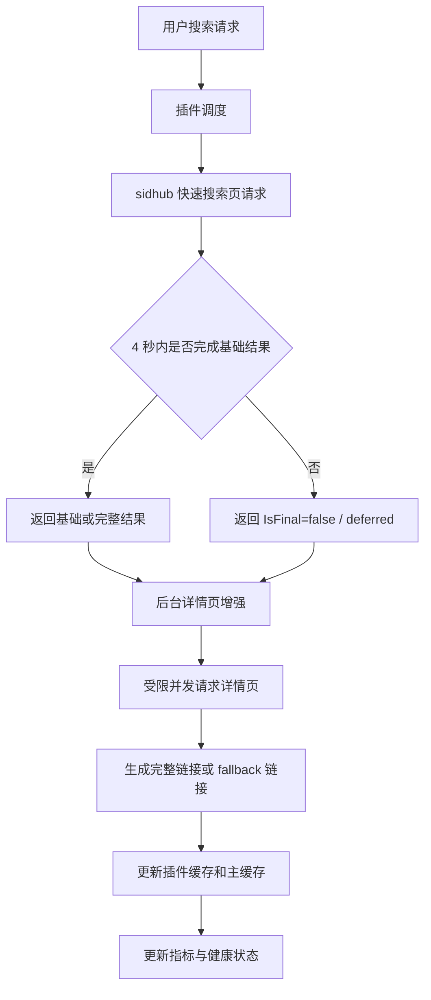

# sidhub 插件超时优化开发计划

## 1. 文档目标

本文基于 `docs/sidhub-timeout-optimization-plan.md`，将 sidhub 插件超时优化拆解为可执行开发计划。计划覆盖后端插件改造、服务层指标语义、运行时配置、测试验证、上线顺序和回滚策略，作为后续实现和验收依据。

## 2. 背景与问题边界

### 2.1 直接现象

- 管理后台性能监控显示 `sidhub` 插件多次出现 `插件搜索超时`。
- 最近错误耗时约 `4001 ms`，与 4 秒响应窗口一致。
- 超时后 sidhub 容易连续失败，表现为“总是超时”。

### 2.2 已确认根因

- sidhub 搜索链路较重：搜索页、最多 5 个详情页、可选 `/link_start/` 解析、主备域名 fallback。
- sidhub 当前没有复用 `BaseAsyncPlugin.AsyncSearchWithResult` 的快速返回和后台续跑能力。
- sidhub 内部使用 `context.Background()` 和 `cloudscraper.Get`，外层超时不能有效取消内部请求。
- 服务层对同一插件有互斥锁，超时后内部请求仍运行会阻塞下一次 sidhub 搜索。
- 自适应超时可能把高超时率插件的等待时间压缩到基准超时的 40%，进一步稳定命中约 4 秒超时。

### 2.3 不在本次范围内

- 不重写 cloudscraper 依赖。
- 不移除 sidhub 插件。
- 不改变全局插件熔断、指标、优先级系统的整体架构。
- 不在搜索阶段默认解析大量 `/link_start/`。

## 3. 总体原则

- 优先解决连续超时和锁阻塞问题，再提升结果完整度。
- 优先复用现有 `BaseAsyncPlugin`、插件运行时配置和指标采集体系。
- 搜索主链路不等待所有详情页完成；慢详情页转为后台增强。
- 超时语义要更精确，避免把“后台处理中”错误计为硬失败。
- 每个阶段都必须有聚焦测试和人工验证路径。

## 4. 交付范围

### 4.1 后端交付

- 改造 sidhub 搜索入口，接入异步快速返回模型。
- 为 sidhub 搜索链路传递 context，并缩短取消后的锁占用时间。
- 拆分搜索页基础结果和详情页增强结果。
- 将详情页解析改为受限并发。
- 保持搜索阶段 `/link_start/` 预解析默认关闭。
- 增加 sidhub 专项运行时配置。
- 扩展指标或事件语义，区分 timeout、deferred、partial_success 和 success。

### 4.2 前端交付

- 管理后台插件配置中展示 sidhub 专项配置。
- 性能监控中可识别 sidhub 的 deferred / partial_success 状态。
- 如后端已返回详情增强状态，前端以现有 warning 或状态文案承接。

### 4.3 测试交付

- sidhub 插件单元测试。
- 搜索执行器和渐进式搜索服务测试。
- 指标采集或健康状态语义测试。
- 管理后台配置展示测试。
- 人工搜索验证记录。

## 5. 核心数据流



## 6. 涉及文件

### 6.1 后端插件

| 文件 | 计划动作 |
| --- | --- |
| `backend/plugin/sidhub/sidhub.go` | 主体改造：异步入口、context 传递、部分结果、详情并发、运行时配置 |
| `backend/plugin/sidhub/sidhub_test.go` | 增加超时、取消、部分结果、详情并发、缓存行为测试 |
| `backend/plugin/baseasyncplugin.go` | 如现有接口不足，最小扩展后台完成或非最终结果语义 |
| `backend/model/plugin_manifest.go` | 如配置字段类型不足，扩展插件配置描述能力 |

### 6.2 后端服务

| 文件 | 计划动作 |
| --- | --- |
| `backend/service/search_executor.go` | 区分 sidhub deferred / partial_success 与硬 timeout |
| `backend/service/search_progressive.go` | 慢源调度、后台增强、避免 deferred 被计为硬失败 |
| `backend/service/plugin_metrics_collector.go` | 如需要，增加 event source 或 error type 语义 |
| `backend/service/plugin_health_service.go` | 避免 deferred 直接增加 timeout_count |
| `backend/service/plugin_runtime_config_service.go` | 读取 sidhub 新增配置并应用默认值 |

### 6.3 前端管理后台

| 文件 | 计划动作 |
| --- | --- |
| `frontend/src/types/plugin.ts` | 补充 sidhub 配置字段类型，如现有类型不足 |
| `frontend/src/types/pluginMetrics.ts` | 补充 deferred / partial_success 展示字段，如后端返回 |
| `frontend/src/components/admin/PluginManageDialog.tsx` | 确认运行时配置可展示和保存 |
| `frontend/src/components/admin/PluginPerformanceDashboard.tsx` | 展示 sidhub 新状态或错误类型 |

## 7. 阶段计划

### 阶段一：快速止血，P0，预计 1 个工作日

目标：让 sidhub 不再以同步完整搜索阻塞服务层。

任务：

- [x] 将 `SidHubAsyncPlugin.SearchWithResult` 改为复用 `BaseAsyncPlugin.AsyncSearchWithResult`。
- [x] 梳理 sidhub 本地 `searchCache` 与 BaseAsyncPlugin 缓存关系，确保不重复写入冲突数据。
- [x] 保持 `pre_resolved_link_start_per_type = 0` 默认不变。
- [x] 增加慢 fetcher 测试，覆盖快速窗口超时后返回非最终结果。
- [x] 增加后台完成后缓存可命中的测试。

验收条件：

- [x] sidhub 慢请求不会直接让用户请求等待完整链路结束。
- [x] 同关键词第二次搜索可以命中后台完成后的缓存。
- [x] 现有 sidhub 解析测试全部通过。

验证命令：

```bash
cd backend
go test ./plugin/sidhub
go test ./service -run 'Test.*Plugin.*Timeout|Test.*Progressive'
```

回滚点：

- 保留原 `SearchWithResult -> doSearch` 同步路径，可通过小改动恢复。

### 阶段二：取消传播与锁释放，P0，预计 1-2 个工作日

目标：外层超时后，sidhub 内部搜索尽快停止或降级，避免长期占用同插件锁。

任务：

- [x] 为 sidhub 增加内部搜索上下文入口，例如 `doSearchWithContext(ctx, client, keyword, ext)`。
- [x] 将 `searchBaseURL(context.Background(), ...)` 改为传入调用方 ctx。
- [x] 在搜索页、详情页循环、link_start 解析前后检查 `ctx.Err()`。
- [x] 保留 `cloudscraper.Get` goroutine 包装，确保 ctx 完成后函数能及时返回。
- [x] 在响应体读取和 ctx 取消路径关闭 `resp.Body`。
- [x] 增加阻塞 fetcher 测试，确认 ctx cancel 后不会卡住。

验收条件：

- [x] 模拟卡住的详情页请求时，sidhub 能在 ctx 超时后释放调用栈。
- [x] 连续两次 sidhub 搜索不会因为第一次超时长期等待插件锁。
- [ ] goroutine 数不会随连续超时明显增长。

验证命令：

```bash
cd backend
go test ./plugin/sidhub -run 'TestSidHub.*Context|TestSidHub.*Timeout'
go test ./service -run 'Test.*Timeout'
```

回滚点：

- 可将 context 化入口保留但使用 `context.Background()` 调用，恢复旧行为。

### 阶段三：搜索页基础结果与详情增强拆分，P0，预计 2 个工作日

目标：搜索页可用时先返回候选结果，详情页慢不阻塞首轮返回。

任务：

- [x] 拆出 `searchCardsOnly` 或等价函数，只负责搜索页请求和卡片解析。
- [x] 为卡片生成 fallback 结果，至少包含标题、封面、媒体信息、详情页来源。
- [x] 拆出 `enhanceSidHubCardsWithDetails`，负责详情页资源链接补全。
- [x] 搜索页成功但详情页超时时返回 `partial_success`。
- [x] 后台详情增强完成后更新插件缓存和主缓存。
- [x] 增加搜索页成功、详情页超时的回归测试。

验收条件：

- [x] SeedHub 搜索页返回正常时，即使详情页全部超时也有可展示结果。
- [x] 详情页增强完成后，缓存中的结果包含真实资源链接。
- [x] 前端搜索结果不会因为没有链接而错误丢弃必要的候选状态；如当前前端只展示有链接结果，则后端必须返回可点击 fallback 链接。

验证命令：

```bash
cd backend
go test ./plugin/sidhub -run 'TestSidHub.*Fallback|TestSidHub.*Partial|TestSidHub.*Cache'
go test ./service -run 'Test.*Plugin'
```

回滚点：

- 可保留拆分函数，但让主流程等待详情增强完成，恢复旧完整结果模式。

### 阶段四：详情页受限并发，P1，预计 1-2 个工作日

目标：降低串行详情页导致的总耗时，同时避免对 SeedHub 造成过高压力。

任务：

- [x] 增加 sidhub 详情页并发配置，默认值为 `2`。
- [x] 增加单详情页超时配置，默认值为 `2s` 或 `3s`。
- [x] 增加详情增强总预算，默认值为 `4s`。
- [x] 用 worker / semaphore 控制详情页并发。
- [x] 每个详情页失败只影响当前卡片，其他卡片继续解析。
- [x] 增加并发上限测试和部分失败测试。

验收条件：

- [x] 5 个详情页不会串行累加到明显超过 4 秒。
- [x] 并发数不超过配置值。
- [x] 单详情页失败不会导致整次 sidhub 搜索失败。

验证命令：

```bash
cd backend
go test ./plugin/sidhub -run 'TestSidHub.*Detail'
```

回滚点：

- 将详情并发配置设为 `1`，即可接近旧串行行为。

### 阶段五：指标语义调整，P1，预计 1 个工作日

目标：让监控能区分硬失败和后台增强，避免 sidhub 因 deferred 被持续降级。

任务：

- [x] 明确插件执行结果语义：`success`、`partial_success`、`deferred`、`timeout`。
- [x] 服务层收到 sidhub `IsFinal=false` 且后台继续处理时，记录为 deferred 而非硬 timeout。
- [x] 搜索页有结果但详情未完成时，记录为 partial_success。
- [x] 只有硬超时或后台最终失败时增加 timeout_count。
- [x] 更新指标测试和健康状态测试。

验收条件：

- [x] sidhub deferred 不会直接推高 timeout_rate。
- [x] 后台最终成功后健康状态能恢复。
- [x] 管理后台错误日志中能看出 sidhub 是 deferred、partial_success 还是 timeout。

验证命令：

```bash
cd backend
go test ./service -run 'Test.*Plugin.*Metric|Test.*Plugin.*Health|Test.*Timeout'
go test ./api -run 'Test.*PluginMetrics'
```

回滚点：

- 保留旧 `timeout` 字段语义，新增字段只做展示；若前端不兼容，可先隐藏新增状态。

### 阶段六：运行时配置与管理后台，P2，预计 1-2 个工作日

目标：允许管理员按实际部署环境调节 sidhub 性能策略。

任务：

- [x] 在 sidhub manifest 中增加配置字段：
  - `max_search_cards`
  - `detail_concurrency`
  - `detail_timeout_seconds`
  - `detail_total_budget_seconds`
  - `pre_resolved_link_start_per_type`
  - `base_url_strategy`
- [x] 在后端解析配置并做边界限制。
- [x] 确认管理后台插件配置弹窗能展示并保存新增字段。
- [x] 性能面板展示 sidhub 的详情成功数、fallback 数、deferred 数。
- [x] 增加前端组件测试或复用现有配置弹窗测试。

验收条件：

- [x] 修改 sidhub 配置后无需重新部署即可生效。
- [x] 非法配置会被后端 clamp 到安全范围。
- [x] 管理后台展示字段清晰，不影响其他插件配置。

验证命令：

```bash
cd backend
go test ./plugin/sidhub ./service ./api

cd frontend
pnpm test -- PluginManageDialog PluginPerformanceDashboard
```

回滚点：

- 新增配置字段保留默认值；前端可暂时不展示高级配置。

## 8. 任务依赖关系


阶段一和阶段二必须优先完成。阶段三完成后，sidhub 的用户体验会明显改善。阶段四、五、六可以按风险和排期拆分发布。

## 9. 验收清单

后端验收：

- [x] `go test ./plugin/sidhub` 通过。
- [x] `go test ./service` 中插件超时、渐进式搜索、健康状态相关测试通过。
- [x] `go test ./api` 中插件指标或配置相关测试通过。
- [x] 连续触发 sidhub 慢请求时，没有持续锁阻塞。
- [x] sidhub 后台完成后能写入缓存，二次搜索响应明显变快。

前端验收：

- [x] 插件配置弹窗能展示 sidhub 配置字段。
- [x] 性能监控中 sidhub 状态能区分 deferred、partial_success 和 timeout。
- [x] 错误、空数据、加载态不回归。

人工验收：

- [ ] 冷关键词搜索：首次响应不再被 sidhub 拖到硬失败。
- [ ] 热门关键词搜索：能看到部分结果或缓存结果。
- [ ] 连续搜索同一关键词 3 次，第二次或第三次命中缓存。
- [ ] 管理后台 sidhub timeout 数下降，deferred 或 partial_success 指标可解释。

## 10. 上线策略

### 10.1 推荐发布顺序

1. 发布阶段一和阶段二，先解决锁阻塞和连续超时。
2. 观察 24 小时 sidhub timeout 率、成功率、平均响应和 goroutine 情况。
3. 发布阶段三，开启部分结果和后台详情增强。
4. 观察搜索结果质量和缓存命中情况。
5. 发布阶段四到六，逐步开放配置和指标展示。

### 10.2 观测指标

- sidhub 请求数。
- sidhub timeout_count 和 timeout_rate。
- sidhub deferred_count。
- sidhub partial_success_count。
- sidhub 平均响应、P95、P99。
- sidhub 连续失败次数。
- 插件后台任务数量。
- 搜索整体首响耗时。

### 10.3 预期变化

- timeout_count 下降。
- deferred 或 partial_success 在冷搜索中短期上升。
- 同关键词二次搜索耗时下降。
- 其他插件结果返回不再被 sidhub 影响。

## 11. 风险与缓解

| 风险 | 影响 | 缓解 |
| --- | --- | --- |
| 异步快速返回导致 sidhub 首次结果为空 | 用户误以为无资源 | 返回非最终状态和后台处理中 warning，后台完成后缓存补齐 |
| 部分结果缺少真实资源链接 | 前端可能过滤掉结果 | 生成详情页 fallback 或扫码转存 fallback，保证有可展示链接 |
| 详情页并发过高 | 增加 SeedHub 压力 | 默认并发 2，配置上限 clamp |
| cloudscraper 取消不彻底 | goroutine 堆积 | 外层快速释放等待，限制后台任务数量，增加 goroutine 观测 |
| 指标语义调整影响历史趋势 | 图表解释变化 | 保留旧 timeout 字段，新增 deferred / partial_success 字段 |

## 12. 回滚策略

- 代码回滚：恢复 sidhub 同步 `SearchWithResult` 路径。
- 配置回滚：将详情并发设为 `1`，将详情增强关闭或将 `max_search_cards` 降低。
- 功能回滚：隐藏前端新增状态展示，仅保留旧 timeout 展示。
- 运营回滚：临时从 `ENABLED_PLUGINS` 移除 `sidhub`，保留其他插件搜索能力。

## 13. 完成定义

本开发计划完成的标准：

- sidhub 不再稳定出现约 4 秒硬超时。
- 连续搜索不会因为上一次超时导致下一次排队超时。
- sidhub 能返回部分结果、缓存结果或后台处理中状态。
- 监控能解释 sidhub 当前处于 deferred、partial_success、success 还是 timeout。
- 所有新增或影响路径都有聚焦测试覆盖。
